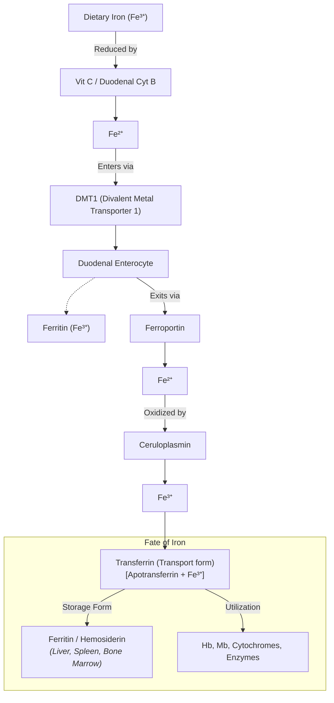
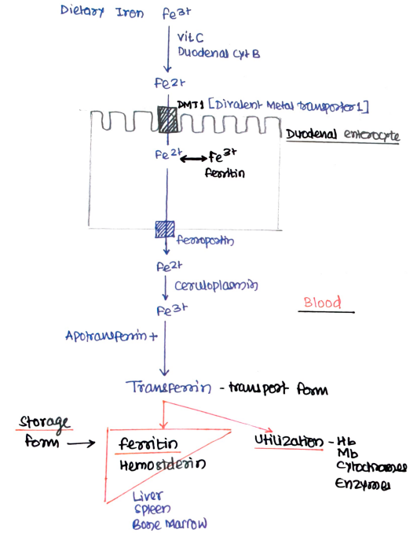
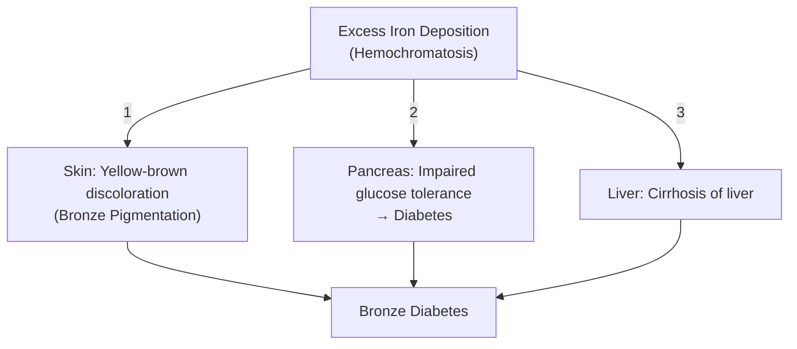

# IRON METABOLISM

* **Trace element**
* **Total body content :—** 3 to 5 gm (75% $\longrightarrow$ Hb)

---

### PROTEINS CONTAINING IRON

* **Heme & Non-Heme Proteins :—**
  * Hemoglobin
  * Myoglobin
  * Cytochromes
  * Iron-sulfur proteins
  * Cyt P450
* **Enzymes :—**
  * Catalase
  * Xanthine oxidase
  * Tryptophan pyrrolase
  * NOS (Nitric oxide synthase)
  * Aconitase

---

### FUNCTIONS

* a. **Transport of $\text{O}_2$ to tissues** and $\text{CO}_2$ to lungs
* b. **Important constituent of myoglobin** in muscle
* c. **Electron transport chain** (Cytochrome & Fe-S proteins)
* d. **Detoxification** (Cyt P450)
* e. **Antioxidant**
* f. **Purine degradation** (Xanthine oxidase)
* g. **Tyrosine metabolism**

---

### RECOMMENDED DIETARY ALLOWANCE (RDA)

* **Adult male :—** 10 mg
* **Female :—** 20 mg
* **Pregnancy and lactation :—** 40 mg

---

### SOURCES

* **Green leafy vegetables :—** 20 mg / 100 gm
* **Pulses :—** 10 mg / 100 gm
* **Cereals :—** 5 mg / 100 gm
* **Liver :—** 5 mg / 100 gm
* **Meat :—** 2 mg / 100 gm
* **Others :—** Jaggery, dry fruits, beetroots, etc.

---

## ABSORPTION, TRANSPORT AND STORAGE

| Factors $\uparrow\uparrow$ Iron Absorption | Factors $\downarrow\downarrow$ Iron Absorption |
| :--- | :--- |
| • Vitamin C • Gastric HCl • Small peptides • Cysteine | • Phytate • Oxalate • Phosphate • Lead |

---

### MECHANISM OF ABSORPTION & TRANSPORT

> 

---

### REGULATION & EXCRETION

* **Hepcidin $\longrightarrow$** Regulate iron level $\longrightarrow$ $\downarrow$ intestinal absorption:
* Peptide produced by liver.
* Blocks ferroportin.
* Causes internalization and degradation of cellular iron exporter [DMT-1 / Ferroportin].

* **Iron is the "One-way Element" :—**
* Utilized and reutilised again & again.
* $< 1\text{ mg/day}$ excreted in $\longrightarrow$ bile, sweat, hair loss.
* **Mucosal Block Theory :—** At mucosal level, regulation of iron level occurs.
* **Almost no iron excreted through urine.** Feces contains unabsorbed & trapped iron in intestinal cells that are desquamated.

---

## CLINICAL SIGNIFICANCE: IRON DEFICIENCY ANEMIA

### Causes:

* $\uparrow$ Demand
* $\downarrow$ Intake
* Chronic blood loss
* Lead
* Repeated pregnancies

### Symptoms:

* a. **Anemia $\longrightarrow$ Microcytic hypochromic anemia:**
* RBCs have less Hb than normal
* Small sized RBCs
* $\downarrow\text{ MCV}$, $\downarrow\text{ MCH}$

* b. **Apathy :—**
* Sluggish, dull child
* Decreased school performance
* Fatigue, weakness

### Lab Diagnosis:

* $\downarrow\text{ Hb}$
* *Normal range:* $14\text{ – }16\text{ gm/dL}$ in males; $13\text{ – }15\text{ gm/dL}$ in females

* $\uparrow\text{ Total Iron Binding Capacity (TIBC)}$
* $\text{Serum Iron } \downarrow$, $\text{Serum Ferritin } \downarrow$
* $\downarrow\text{ MCV}$, $\downarrow\text{ MCH}$

### Treatment:

* Oral iron therapy: $100\text{ – }200\text{ mg/day}$
* Increase consumption of dietary iron
* Treatment of underlying cause
* IV iron in severe cases

---

## IRON OVERLOAD DISORDERS

### 1. Hemosiderosis

* Excess iron due to $\uparrow$ absorption.
* **Iron overload disorder** due to accumulation of **hemosiderin**.
* The pigment does not damage the parenchymal cells.
* Found in **Bantu tribe of South Africa** *(also called **Bantu siderosis**)*.

---

### 2. Hemochromatosis

* **Excess iron deposited in:** Skin, bone marrow, liver, spleen, pancreas.

> **Bronze Diabetes :—** Triad of bronze pigmentation of skin (1), diabetes due to pancreatic damage (2), and cirrhosis of liver (3).
