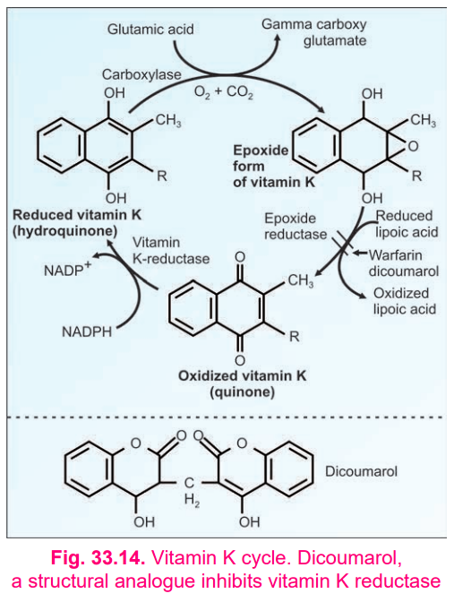

# VITAMIN E

* **Introduction**

  * Vitamin E is a **fat-soluble vitamin**.
  * It is mainly important as a **natural antioxidant**.

* **Chemical Nature**

  * Vitamin E consists of:

    * **Chromane ring (tocol)**
    * **Isoprenoid side chain**
  * Eight naturally occurring tocopherols are known.
  * **α-Tocopherol** has the greatest biological activity.

* **Absorption, Transport and Storage**

  * Absorbed along with **dietary fats**.
  * Requires **bile salts** for absorption.
  * Transported through **chylomicrons**.
  * Stored mainly in **adipose tissue**.
  * Normal blood level: **0.5–1 mg/dL**.

* **Biochemical Functions / Roles**

  * **Powerful natural antioxidant**

    * Scavenges free radicals.
    * Prevents **lipid peroxidation**.
  * **Protects cell membranes** from free-radical damage.
  * Protects **RBCs from haemolysis**.
  * Maintains structural and functional integrity of cells.
  * Helps maintain **immune response**.
  * Reduces oxidation of **LDL** and may reduce risk of atherosclerosis.
 
> 
> 
* **Relationship with Selenium**

  * Selenium is a component of **glutathione peroxidase**.
  * Both vitamin E and selenium prevent **lipid peroxidation**.
  * They act **synergistically**.
  * Selenium decreases the requirement for vitamin E and vice versa.

* **Deficiency**

  * Human deficiency is uncommon.
  * Experimental deficiency may produce:

    * Increased **RBC fragility**
    * **Muscular weakness**
    * **Creatinuria**
  * In animals:

    * Muscular dystrophy
    * Haemolysis
    * Reproductive abnormalities

* **Sources**

  * **Vegetable oils** are rich sources:

    * Wheat germ oil
    * Sunflower oil
    * Safflower oil
    * Cottonseed oil
  * Fish liver oils are poor/devoid of vitamin E.

* **RDA**

  * Males: **10 mg/day**
  * Females: **8 mg/day**
  * Pregnancy: **10 mg/day**
  * Lactation: **12 mg/day**
  * **15 mg vitamin E ≈ 33 IU**

**Chemical nature → Absorption → Biochemical role → Selenium relationship → Deficiency → Sources/RDA**

The **single most important line** to remember:

> **Vitamin E = major lipid-soluble antioxidant → prevents lipid peroxidation → protects cell membranes and RBCs.**
