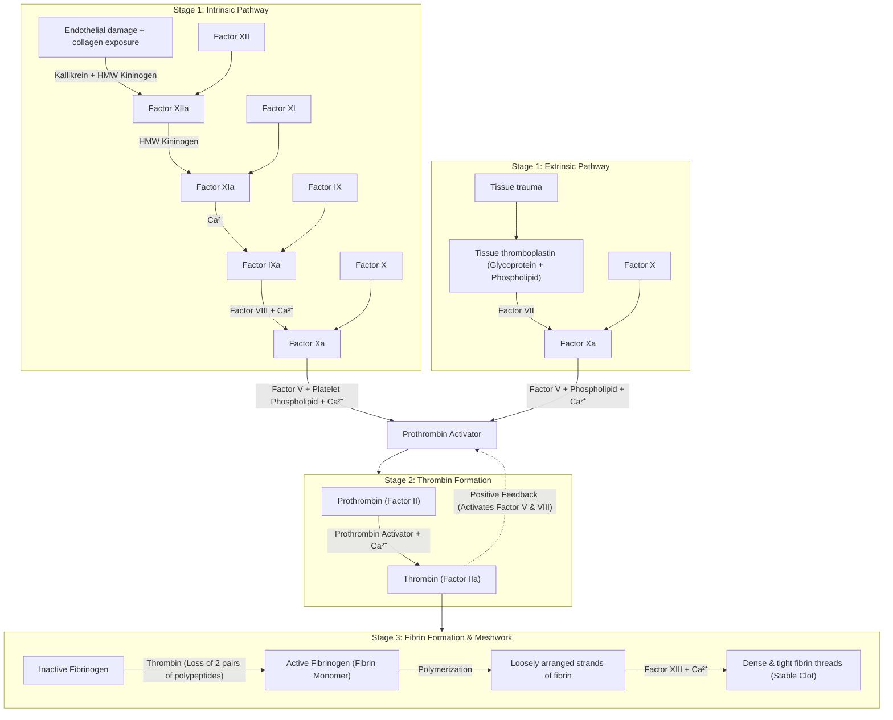
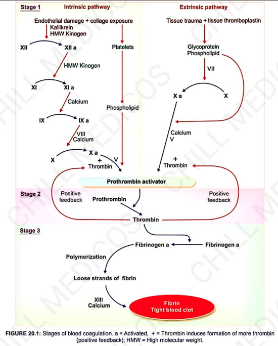
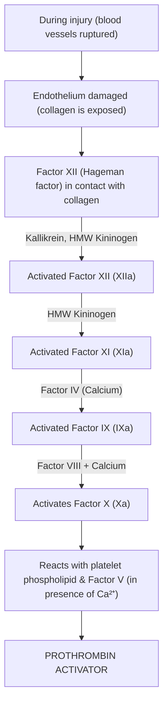
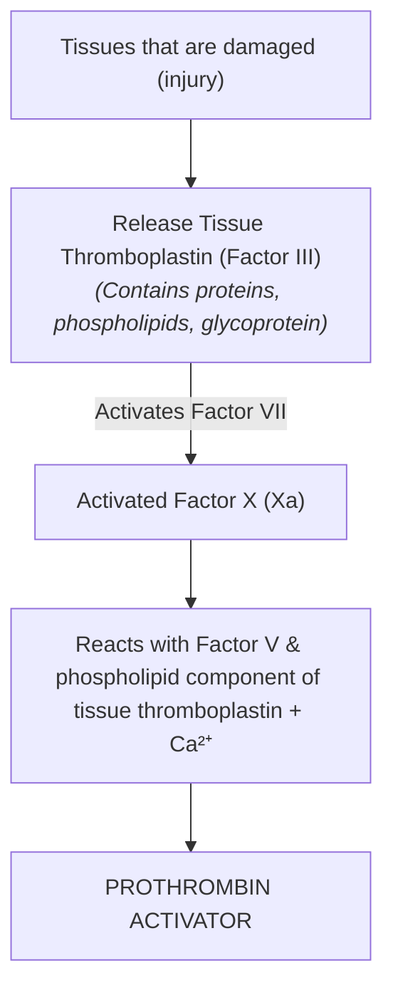

# COAGULATION OF BLOOD

* **Clotting is the process** in which blood loses its fluidity and becomes a jelly-like mass few minutes after it is shed out.

---

## FACTORS INVOLVED IN BLOOD CLOTTING

* Coagulation of blood occurs through a series of reactions due to activation of a group of substances called **clotting factors**.

### Mnemonic for Clotting Factors
> *"Foolish People Try Climbing Long Slopes After Christmas, Some People Have Fallen"*

| Factor | First Letter | Name of Factor |
| :--- | :---: | :--- |
| **Factor I** | **F** | Fibrinogen |
| **Factor II** | **P** | Prothrombin |
| **Factor III** | **T** | Thromboplastin |
| **Factor IV** | **C** | Calcium ($\text{Ca}^{2+}$) |
| **Factor V** | **L** | Labile factor |
| **Factor VII** | **S** | Stable factor |
| **Factor VIII** | **A** | Antihemophilic factor A |
| **Factor IX** | **C** | Christmas factor |
| **Factor X** | **S** | Stuart–Prower factor |
| **Factor XI** | **P** | Plasma thromboplastin antecedent |
| **Factor XII** | **H** | Hageman factor |
| **Factor XIII** | **F** | Fibrin-stabilising factor |

---

## CLOTTING MECHANISM (ENZYME CASCADE THEORY)

* Clotting factors are proteins *(in form of enzymes)*.
* All factors are present in the form of **inactive proenzymes** $\longrightarrow$ converted into **active enzymes** $\longrightarrow$ enforce clot formation.
* **Cascade Process :** Occurs through a series of steps, each step initiating the next until the final step is reached.

---

### 3 STAGES OF BLOOD CLOTTING

* a. **Stage 1 :** Formation of prothrombin activator
* b. **Stage 2 :** Conversion of prothrombin to thrombin
* c. **Stage 3 :** Conversion of fibrinogen to fibrin

---

### COMPREHENSIVE CASCADE (STAGES 1, 2 & 3)

> 

---

## STAGE 1: FORMATION OF PROTHROMBIN ACTIVATOR

Occurs through **two pathways**:

### 1. Intrinsic Pathway

* Initiated by platelets **within blood itself**.

---

### 2. Extrinsic Pathway

* Initiated by **tissue thromboplastin** formed from injured tissues.

---

## STAGE 2: CONVERSION OF PROTHROMBIN TO THROMBIN

* Blood clotting is centered around **thrombin formation**, which triggers clot assembly.

$$\text{Prothrombin} \xrightarrow{\text{Prothrombin Activator} + \text{Ca}^{2+}} \text{Thrombin}$$

* **Positive Feedback Effect :—**
Thrombin accelerates the activation of **Factor V and Factor VIII**, accelerating further prothrombin activator formation.

---

## STAGE 3: CONVERSION OF FIBRINOGEN TO FIBRIN

* Final stage of blood clotting.

$$\text{Inactive Fibrinogen} \xrightarrow[\text{(Loss of 2 pairs of polypeptides)}]{\text{Thrombin}} \text{Active Fibrinogen (Fibrin Monomer)}$$

$$\downarrow$$

$$\text{Polymerization}$$

$$\downarrow$$

$$\text{Loosely arranged strands of Fibrin}$$

$$\downarrow \ \text{Factor XIII (Fibrin-Stabilizing Factor)} + \text{Ca}^{2+}$$

$$\text{Dense \& tight fibrin threads}$$

$$\downarrow$$

$$\text{Aggregate to form a meshwork of \textbf{Stable Clot}}$$

