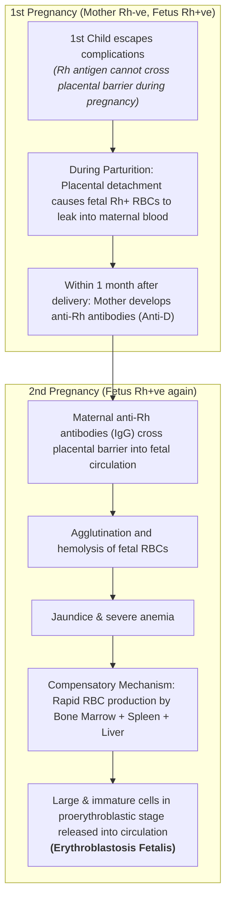

# ERYTHROBLASTOSIS FETALIS
*(Hemolytic Disease of the Fetus and Newborn - HDFN)*

* **Definition :** Hemolytic disease of fetus and newborn characterized by abnormal hemolysis of RBCs.
* **Cause :** Due to **Rh incompatibility** *(difference between Rh blood group of mother and baby)*.
* Characterized by the presence of **erythroblasts in peripheral blood**.

---

### PATHOGENESIS OF Rh INCOMPATIBILITY

---

## SEVERE COMPLICATIONS

* Due to excessive hemolysis, severe complications develop:
* a. **Severe Anemia**
* b. **Hydrops Fetalis**
* c. **Kernicterus**

---

### 1. Severe Anemia

* Excessive hemolysis $\longrightarrow$ Severe anemia $\longrightarrow$ **Infant dies**.

---

### 2. Hydrops Fetalis

* A serious condition in fetus characterized by **generalized edema**.
* Severe condition leading to **intrauterine death of fetus**.

---

### 3. Kernicterus

* Form of brain damage in infants caused by **severe jaundice** *(high unconjugated bilirubin content)*.
* **Blood-Brain Barrier (BBB)** is not well developed in infants compared to adults.

$$\downarrow$$

* Bilirubin enters brain and causes **permanent brain damage**.

#### Commonly Affected Brain Regions :—

* a. Basal ganglia
* b. Hippocampus
* c. Geniculate bodies
* d. Cerebellum
* e. Cranial nerve nuclei

---

## PREVENTION & TREATMENT

### 1. Prophylaxis (Anti-D Administration)

* **During Gestation :** Anti-D immunoglobulin administered to Rh-negative mother at **28ᵗʰ – 34ᵗʰ weeks of gestation**.
* **Postpartum :** If mother delivers an Rh +ve baby, **anti-D is administered within 48 hours**:

$$\text{Anti-D administered}$$

$$\downarrow$$

$$\text{Develops passive immunity}$$

$$\downarrow$$

$$\text{Destroys fetal Rh+ RBCs before mother's immune system reacts}$$

$$\downarrow$$

$$\text{Prevents active formation of Rh antibodies in mother's blood}$$

---

### 2. Treatment of Affected Infant (Exchange Transfusion)

* If baby is born with erythroblastosis fetalis:

$$\text{Treatment given by means of \textbf{Exchange Transfusion}}$$

$$\downarrow$$

$$\text{\textbf{Rh -ve blood} transfused into infant (replacing infant's own Rh +ve blood)}$$

$$\downarrow$$

$$\text{Takes at least \textbf{6 months} for infant's new Rh +ve blood to replace transfused Rh -ve blood}$$

$$\downarrow$$

$$\text{By this time, all maternal anti-Rh antibodies in infant's body are completely destroyed}$$
