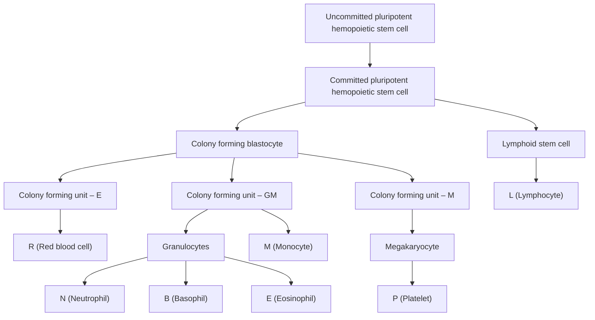
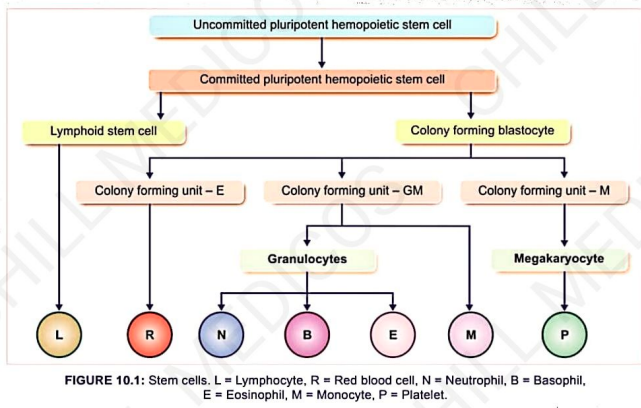
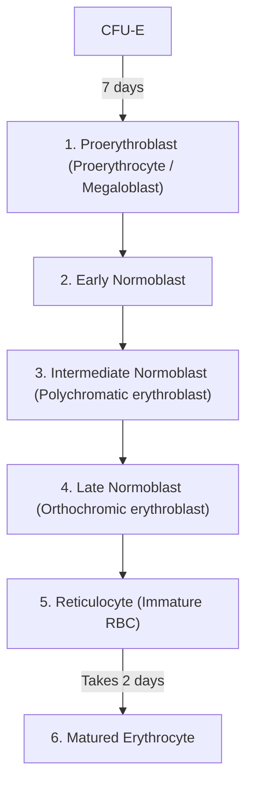
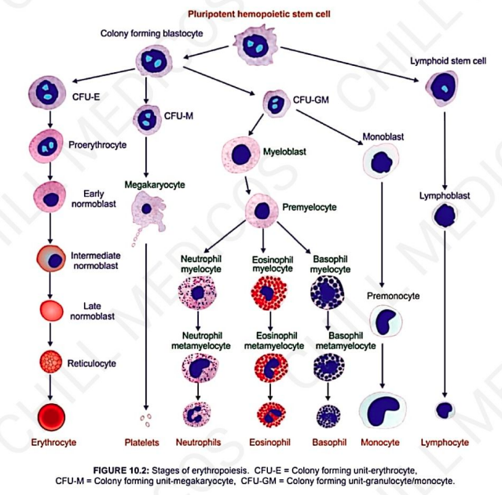

# ERYTHROPOIESIS

* **Erythropoiesis** is the process of origin, development & maturation of erythrocytes.
* **Hemopoiesis / Hematopoiesis $\longrightarrow$** Process of origin, development & maturation of all blood cells.

---

### SITE OF ERYTHROPOIESIS

* a. **In Fetal Life :—**
  * i. **Mesoblastic Stage:** From mesenchyme of yolk sac *(during 1ˢᵗ two months of intrauterine life)*.
  * ii. **Hepatic Stage:** From liver $\longrightarrow$ 3ʳᵈ month of IUL *(spleen & lymphoid organs also involved)*.
  * iii. **Myeloid Stage:** From red bone marrow & liver *(during last 3 months of IUL)*.

* b. **In Newborn Babies, Children & Adults :—**
  * *Only from red bone marrow.*
  * i. **Upto age of 20 years $\longrightarrow$** From red bone marrow of all bones.
  * ii. **After age of 20 years $\longrightarrow$** From membranous bones *(vertebra, sternum, ribs, scapula & ends of long bones)*.

> **The shaft of long bones $\longrightarrow$** Becomes yellow bone marrow due to fat deposition & loses erythropoietic function.

---

### PROCESS OF ERYTHROPOIESIS

#### Stem Cells
* These are primary cells capable of **self-renewal and differentiating** into specialized cells.
* **Hemopoietic stem cells (in bone marrow) $\longrightarrow$** Give rise to blood cells.
* **Uncommitted Pluripotent Hemopoietic Stem Cells (PHSC):** Hemopoietic stem cells in bone marrow which give rise to all types of blood cells.
* **Committed PHSC:** When cells are designed to form a particular type of blood cell.

---

### STEM CELLS LINEAGE & DIFFERENTIATION

> 

---

### CHANGES DURING ERYTHROCYTE FORMATION

* a. Reduction in size of the cell.
* b. Disappearance of nucleoli & nucleus.
* c. Appearance of hemoglobin (Hb).
* d. Change in staining properties of cytoplasm.

---

### STAGES OF ERYTHROPOIESIS

> **Various stages between CFU-E cells and matured RBCs are :—**

> 
---

### IMPORTANT EVENTS DURING ERYTHROPOIESIS

| Stage of Erythropoiesis | Important Event |
| --- | --- |
| **Proerythroblast** | Synthesis of hemoglobin starts |
| **Early normoblast** | Nucleoli disappear |
| **Intermediate normoblast** | Hemoglobin starts appearing |
| **Late normoblast** | Nucleus disappears |
| **Reticulocyte** | • Reticulum is formed 

 • Cell enters capillary from site of production |
| **Matured RBC** | • Reticulum disappears 

 • Cell attains biconcavity |

---

### DETAILED CHARACTERISTICS OF STAGES

* a. **Proerythrocyte / Proerythroblast (Megaloblast):**
  * Very large in size ($0\text{ – }20\ \mu\text{m}$)
  * Nucleus large, occupies cell completely
  * 2 or more nucleoli & reticular network
  * No Hb
  * Cytoplasm is basophilic in nature

* b. **Early Normoblast:**
  * Little smaller ($0\text{ – }15\ \mu\text{m}$)
  * Nucleoli disappear
  * Condensation of chromatin (dense)
  * Hb develops
  * Cytoplasm basophilic

* c. **Intermediate Normoblast (Polychromatic Erythroblast):**
  * Smaller ($10\text{ – }12\ \mu\text{m}$)
  * Nucleus present
  * Hb appears
  * Stains with both acid + base stains *(Hb takes acid stain, basophilic background takes basic stain)*

* d. **Late Normoblast (Orthochromic Erythroblast):**
  * Size decreases ($8\text{ – }10\ \mu\text{m}$)
  * Very much condensed chromatin network *(ink-spot nucleus)*
  * Hb quantity increases
  * Cytoplasm is acidophilic
  * Nucleus disintegrates & disappears

* e. **Reticulocyte (Immature RBC):**
  * Cytoplasm contains reticular network
  * Stains with supravital stain
  * Basophilic *(due to presence of remnants of disintegrated Golgi apparatus & other organelles)*
  * Cell transports through capillary membrane *(diapedesis)*

* f. **Matured Erythrocyte:**
  * Reticular network disappears
  * Attains biconcave shape
  * Size decreases ($7.2\ \mu\text{m}$)
  * No nucleus
  * Takes 2 days for maturation

