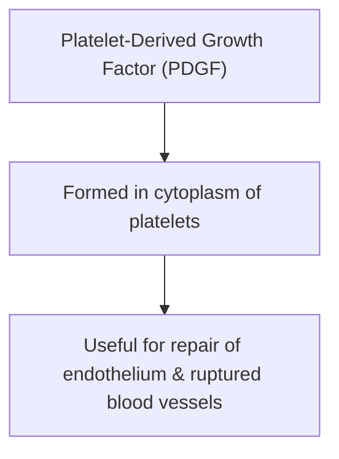

# FUNCTIONS OF PLATELETS

* Platelets are inactive and execute their actions only when **activated**.
* **Platelet Release Reaction :—** Activated platelets release many substances.

---

## 1. ROLE IN BLOOD CLOTTING

* Platelets are responsible for the formation of **intrinsic prothrombin activator**.
  $$\downarrow$$
* Leads to **onset of blood clotting**.

---

## 2. ROLE IN CLOT RETRACTION

* In blood clot, platelets are entrapped between fibrin threads.
* Cytoplasm of platelets contains contractile proteins (**actin, myosin & thrombosthenin**).
  $$\downarrow$$
* Responsible for **clot retraction**.

---

## 3. ROLE IN PREVENTION OF BLOOD LOSS (HEMOSTASIS)

* **Platelets accelerate hemostasis :—**
  * a. Platelets secrete **5-HT (Serotonin)** $\longrightarrow$ Causes constriction of blood vessels (BV).
  * b. Due to **adhesive property**, platelets seal the damage in blood vessels (capillaries).
  * c. By formation of **temporary plug**, platelets seal damage in blood vessels.

---

## 4. ROLE IN DEFENSE MECHANISM

* **Property of agglutination :—**
  * Platelets encircle foreign bodies $\longrightarrow$ **destroy them**.

---

## 5. ROLE IN REPAIR OF RUPTURED BLOOD VESSELS

