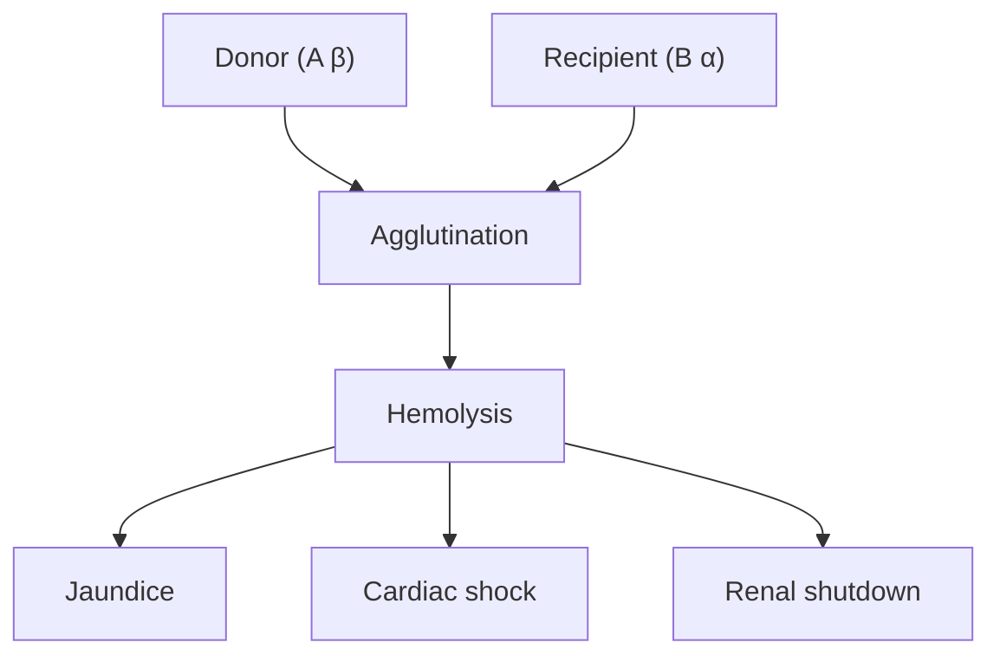
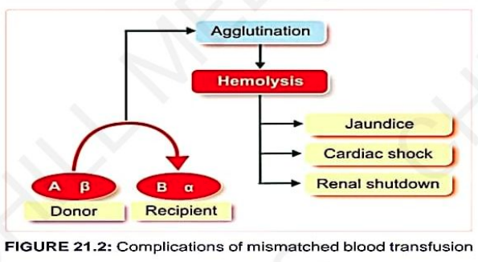

# HAZARDS OF BLOOD TRANSFUSION

* **These are of 4 types :—**
  * a. Reactions due to mismatched (incompatible) blood transfusion *(Transfusion reactions)*
  * b. Reactions due to massive blood transfusion
  * c. Reactions due to faulty techniques during blood transfusion
  * d. Transmission of infections

---

## 1. MISMATCHED BLOOD TRANSFUSION

* **Transfusion reactions due to :—**
  * a. ABO incompatibility
  * b. Rh incompatibility

### Complications of Mismatched Blood Transfusion

> 

---

## 2. MASSIVE BLOOD TRANSFUSION

* **Definition:** Transfusion of blood equivalent or more than patient's own blood volume.
* **Leads to :—**
  * a. **Circulatory shock** *(in patients suffering from chronic anemia, cardiac diseases, renal diseases)*
  * b. **Hyperkalemia** *(increased blood $\text{K}^+$)*
  * c. **Hypocalcemia** *(leading to tetany)*
  * d. **Hemosiderosis** *(increased deposition of iron in the form of hemosiderin)*:
* Deposited on:
  * i. Endocrine glands
  * ii. Heart
  * iii. Liver

  * $\downarrow$
  * Due to **iron overload** after repeated transfusions.

---

## 3. FAULTY TECHNIQUES DURING BLOOD TRANSFUSION

* **This leads to :—**
  * a. **Thrombophlebitis:**
    * Inflammation of vein
    * $\downarrow$
    * Associated with formation of thrombus

  * b. **Air Embolism:**
    * Obstruction of blood vessels due to entrance of air into bloodstream.

---

## 4. TRANSMISSION OF INFECTIONS

* **Blood transfusion without precaution leads to transmission of blood-borne infections such as :—**
  * a. HIV
  * b. Hepatitis A & B
  * c. **Glandular fever (Infectious mononucleosis):**
  * Acute infectious disease caused by **Epstein–Barr virus** & characterised by:
    * i. Fever
    * ii. Swollen lymph nodes
    * iii. Sore throat
    * iv. Abnormal lymphocytes
  * d. **Herpes:** Viral disease with eruption of small blister-like vesicles on skin / membrane.
  * e. **Bacterial infections**

