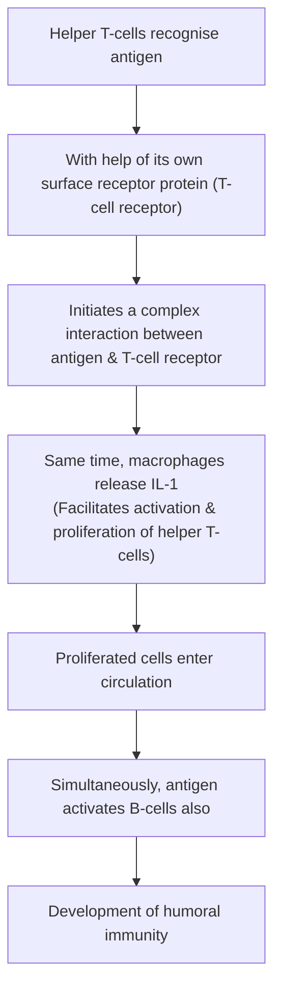
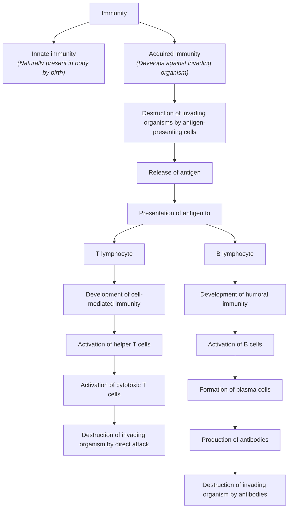

# CELL-MEDIATED IMMUNITY

* **The immunity developed by cell-mediated response.**
* **Also called cellular immunity / T-cell immunity.**
* **Involves several types of cells :—**
  * T-lymphocytes
  * Macrophages
  * Natural killer cells
* **Does not involve antibodies.**
* **Major defense mechanism** against infections by viruses, fungi.
* **Also responsible for:** Delayed allergic reactions & rejection of transplanted tissue.

---

### ANTIGEN-PRESENTING CELLS (APCs)

* Induce the release of antigenic materials from invading organisms & later present these materials to helper T-cells.

#### Types of Antigen-Presenting Cells
* a. **Macrophages (Major APC) $\longrightarrow$** Phagocytic cells
* b. **Dendritic cells $\longrightarrow$** Non-phagocytic cells:
  * i. Dendritic cells of spleen *(in blood)*
  * ii. Follicular dendritic cells *(in lymph)*
  * iii. Langerhans dendritic cells in skin *(body surface)*
* c. **B-lymphocytes :—** B-cells ingest foreign bodies via **pinocytosis**.

---

### MHC (MAJOR HISTOCOMPATIBILITY COMPLEX) & HLA (HUMAN LEUKOCYTE ANTIGEN)

* Large molecule present in **short arm of chromosome 6**.
* Made up of **more than 200 genes** *(HLA genes also)*.
* **HLA $\longrightarrow$** Encodes antigen-presenting proteins on cell surface.

#### MHC is of 2 Types :—
* a. **Class I MHC molecule:**
  * Found on every cell.
  * Responsible for presentation of **endogenous antigens** to helper T-cells.
* b. **Class II MHC molecule:**
  * Found on B-cells, macrophages.
  * Responsible for presenting **exogenous antigens** to helper T-cells.

---

### PRESENTATION OF ANTIGEN

---

### ROLE OF HELPER T-CELLS

* **$\text{CD}_4$ cells enter the circulation** and activate all other T-cells & B-cells.
* **Types :—**
* a. **Helper-1 ($\text{Th}_1$) cells $\longrightarrow$** Concerned with cellular immunity:
* *Secrete:* $\text{IL-2}$, $\gamma\text{-interferon}$

* b. **Helper-2 ($\text{Th}_2$) cells $\longrightarrow$** Concerned with humoral immunity:
* *Secrete:* $\text{IL-4}$, $\text{IL-5}$
* $\downarrow$
* i. Activate B-cells
* ii. Proliferation of plasma cells
* iii. Production of antibodies by plasma cells

---

### ROLE OF CYTOTOXIC T-CELLS (KILLER CELLS)

* Cytotoxic T-cells activated by helper T-cells
* $\downarrow$

* Circulate through blood, lymph, lymphatic tissues
* $\downarrow$

* **Destroy invading organism by attacking them directly.**

#### Mechanism of Action:

$$\text{Receptors on outer membrane bind antigens tightly}$$

$$\downarrow$$

$$\text{Cells enlarge \& release substance (lysosomal enzymes)}$$

$$\downarrow$$

$$\text{Substance destroy invading organism}$$

#### Other Actions:

* a. Also destroy cancer cells.
* b. Destroy body's own tissue *(which are affected by foreign bodies)*.

---

### ROLE OF SUPPRESSOR T-CELLS

* **Also called regulatory T-cells.**
* **Suppress the activities** of killer T-cells / helper T-cells also.
* **Preventing the killer T-cells** from destroying body's own tissues along with invaded organisms.

---

### ROLE OF MEMORY T-CELLS

* T-cells activated by an antigen do not enter circulation but **remain in lymphoid tissue**.
* **When second time organism enters body:**
* $\downarrow$
* Memory cells identify & immediately activate T-cells.

> **Specificity of T-cells :—**
> Each T-cell activated only by one type of antigen, developing immunity against that antigen. This property is called **specificity of T-cells**.

---

### SCHEMATIC DIAGRAM SHOWING DEVELOPMENT OF IMMUNITY

