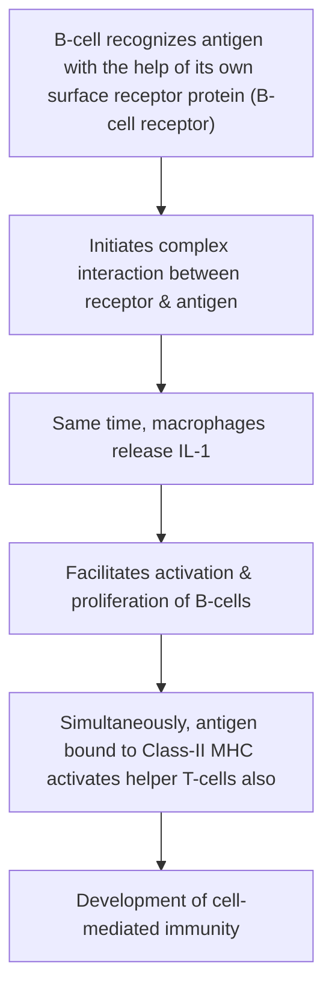

# HUMORAL IMMUNITY

* **The immunity mediated by antibodies** *(by B-lymphocytes)*.
* **Also called B-cell immunity:**
  * $\downarrow$
  * B-lymphocytes provide immunity through humors *(body fluids)*.
* **Antibodies ($\gamma$-globulins)** produced by B-lymphocytes.
* **Major defense mechanism** against bacterial infection.

---

### ROLE OF ANTIGEN PRESENTING CELLS

* **Antigen-presenting cells** present antigenic products:
  * $\downarrow$
  * Bound with HLA to B-cells
  * $\downarrow$
  * **B-cells activated.**

---

### PRESENTATION OF ANTIGEN

---

### TRANSFORMATION OF B-CELLS

* **Transformed into 2 types :—**
* a. Plasma cells
* b. Memory cells

---

### ROLE OF PLASMA CELLS

* **Plasma cells destroy foreign organisms** by producing antibodies *(immunoglobulins)*:
* $\downarrow$
* **$2000\text{ molecules of antibodies / second}$**.

* **Antibodies released into lymph** $\longrightarrow$ into circulation.
* **Antibodies produced until end of lifespan** of each plasma cell *(days – weeks)*.

---

### ROLE OF MEMORY B-CELLS

* These occupy lymphoid tissues throughout the body.
* **Memory cells are in inactive condition:**
* $\downarrow$
* Until body is exposed to same organism for $2^{\text{nd}}$ time.
* $\downarrow$
* **Antibodies produced ($2^{\text{nd}}$ exposure) are more potent than ($1^{\text{st}}$ exposure).**
* $\downarrow$
* Phenomenon forms **basic principle of vaccination**.

---

### ROLE OF HELPER T-CELLS

* **Activated helper T-cells secrete 2 substances:**
* a. $\text{IL-2}$
* b. B-cell growth factor

> **These substances promote :—**
> a. Activation of more number of B-lymphocytes
> b. Proliferation of plasma cells
> c. Production of antibodies
