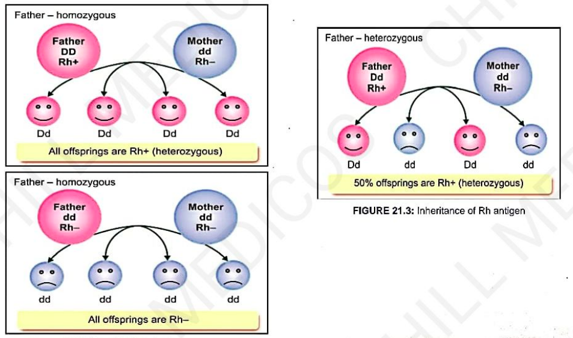
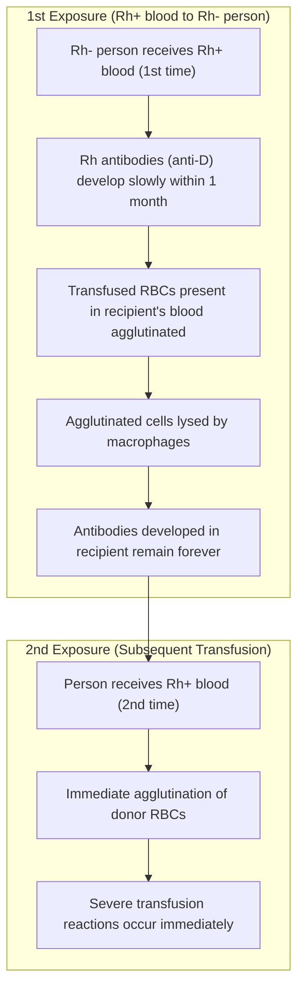

# Rh FACTOR

* **Definition :** Rh factor is an antigen present on RBCs.
* **Discovery :** Discovered by **Landsteiner and Wiener** *(first discovered in Rhesus monkey)*.
* **Antigenicity :** Only **D-antigen** is strongly antigenic in humans.
  * a. **Rh +ve :** 85% of people (D-antigen present)
  * b. **Rh -ve :** 15% of people (D-antigen absent)

> **Difference from ABO Group System :**  
> Antigen D does **not** have a naturally occurring antibody (*anti-D*).  
> If Rh +ve blood is transfused into an Rh -ve person, **anti-D is developed in that person**.

---

### INHERITANCE OF Rh ANTIGEN

* Rhesus factor is an **inherited dominant factor**.

* **Genotypes :—**
  * a. **Homozygous Rhesus +ve :** $\text{DD}$
  * b. **Heterozygous Rhesus +ve :** $\text{Dd}$
  * c. **Homozygous Rhesus -ve :** $\text{dd}$

| Father Genotype | Mother Genotype | Offspring Outcome |
| :--- | :--- | :--- |
| **Father $\text{DD}$ ($\text{Rh}^+$)** *(Homozygous)* | **Mother $\text{dd}$ ($\text{Rh}^-$)** | **100% offspring are $\text{Dd}$ ($\text{Rh}^+$ - Heterozygous)** |
| **Father $\text{Dd}$ ($\text{Rh}^+$)** *(Heterozygous)* | **Mother $\text{dd}$ ($\text{Rh}^-$)** | **50% $\text{Dd}$ ($\text{Rh}^+$)** and **50% $\text{dd}$ ($\text{Rh}^-$)** |
| **Father $\text{dd}$ ($\text{Rh}^-$)** *(Homozygous)* | **Mother $\text{dd}$ ($\text{Rh}^-$)** | **100% offspring are $\text{dd}$ ($\text{Rh}^-$)** |

> 

---

## TRANSFUSION REACTIONS DUE TO Rh INCOMPATIBILITY

