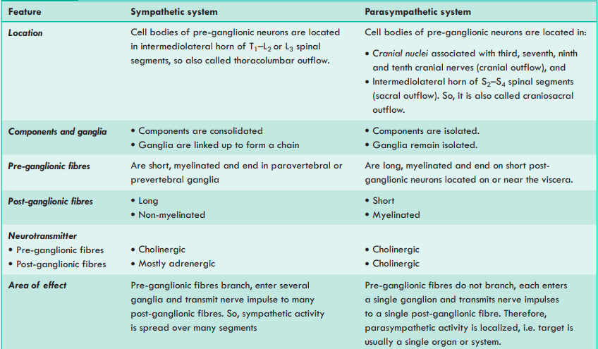

# Sympathetic vs Parasympathetic System

###  The 4 things to NEVER forget

**1. Outflow**

> Sympathetic → **T1–L2/L3 = Thoracolumbar**
> Parasympathetic → **III, VII, IX, X + S2–S4 = Craniosacral**

**2. Fibre length**

> Sympathetic → **Short pre + Long post**
> Parasympathetic → **Long pre + Short post**

**3. Neurotransmitter**

> Both preganglionic → **ACh**
> Sympathetic post → **mostly noradrenaline**
> Parasympathetic post → **ACh**

**4. Effect**

> Sympathetic → **Widespread**
> Parasympathetic → **Localized**

### 🧠 Easy memory

**Sympathetic = S**

* **S**hort preganglionic
* **S**preads widely
* **S**pinal = T1–L2

**Parasympathetic = P**

* **P**reganglionic long
* **P**ostganglionic short
* **P**recise/localized
* **P**arasympathetic = craniosacral

# Functions of Sympathetic Nervous System 

* Mass sympathetic discharge usually occurs in **threatening/emergency situations**.
* It prepares the individual to cope with the emergency → **fight-or-flight reaction**.
* Causes **dilatation of pupil**.
* Causes **increased heart rate**.
* Causes **increased blood pressure**, providing better perfusion to vital organs and muscles.
* Causes **constriction of cutaneous arterioles**, thereby limiting blood loss from wounds.
* Causes **increased alertness and arousal** due to decreased threshold in the reticular formation.
* Causes **increased blood glucose and free fatty acid (FFA) levels**, supplying more energy.
* Hence, sympathetic system is called the **catabolic nervous system**.

# Functions of Parasympathetic Nervous System 

* Its functions are **discrete and separately regulated**.
* It is concerned mainly with the **vegetative aspects of day-to-day living**.
* Favours **digestion and absorption of food**.
* Causes **increased activity of intestinal musculature**.
* Causes **increased gastric secretion**.
* Causes **pyloric relaxation**.
* Favours **micturition**.
* Causes **pupillary constriction**.
* Causes **bradycardia**.
* Decreases the rate of metabolism.
* Hence, parasympathetic system is called the **anabolic nervous system**.

