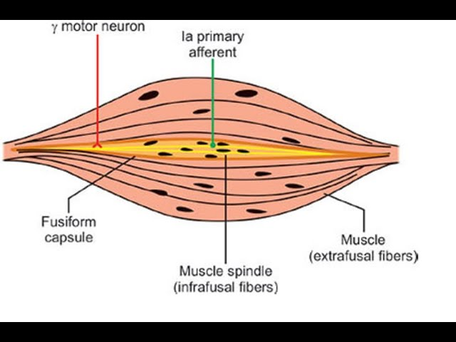
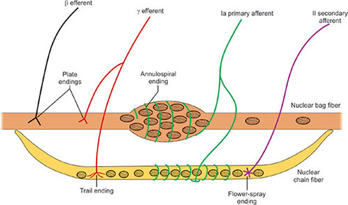
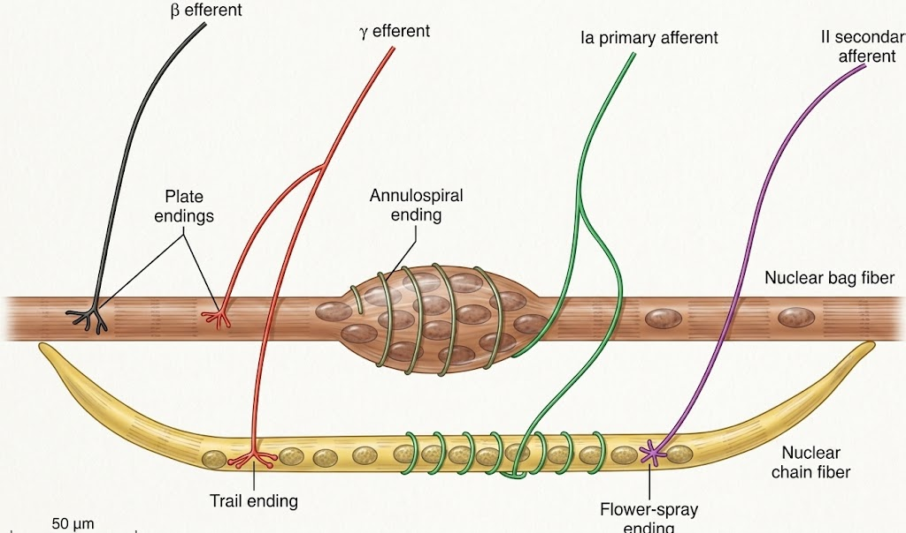

# Muscle Spindle

### Headings

- Definition
- Structure
- Types of intrafusal fibres
- Innervation
- Functions
- Clinical/Applied significance

---

## 1. Definition

- Muscle spindle is a **specialized sensory receptor** present in skeletal muscles.
- It is sensitive to:
  - **Muscle length**
  - **Change in muscle length / velocity of stretching**

- It lies **parallel to extrafusal muscle fibres**.
- The fibres within the spindle are called **intrafusal fibres**.

---

## 2. Structure

- Each spindle is enclosed in a **connective tissue capsule**.
- Contains about **2–12 intrafusal fibres**.
- Size: about **100 μm diameter** and **5–10 mm length**.
- Central part is **non-contractile** and contains sensory receptors.
- Peripheral parts are **contractile**.
 
 
 
### Types of intrafusal fibres

1. **Nuclear bag fibres**
   - Nuclear bag 1 → mainly dynamic response
   - Nuclear bag 2 → mainly static response

2. **Nuclear chain fibres**
   - Nuclei arranged in a chain
   - Mainly responsible for static response

---

## 3. Innervation

### A. Afferent / Sensory

**Type Ia fibres**
- Large and rapidly conducting.
- Form **primary endings / annulospiral endings**.
- Respond to **dynamic stretch** and also static stretch.

**Type II fibres**
- Smaller and slower.
- Form **secondary / flower-spray endings**.
- Mainly respond to **static stretch**.

### B. Efferent / Motor

**γ motor neurons (fusimotor fibres)**
- Supply the contractile peripheral portions of intrafusal fibres.
- Two types:
  - Dynamic γ → nuclear bag 1
  - Static γ → nuclear bag 2 + nuclear chain fibres

- Function: **maintain and adjust sensitivity of the muscle spindle to stretch.**

---

# 4. Functions of Muscle Spindle

1. **Detection of muscle stretch**
   - Muscle spindle detects change in muscle length.
   - Degree of stretch is reflected by the frequency of afferent discharge.

2. **Maintenance of muscle length**
   - Stretch → spindle afferents stimulated → α motor neurons activated → muscle contracts.
   - Thus, spindle acts as a **feedback mechanism for maintaining muscle length**.

3. **Muscle tone**
   - Continuous spindle activity contributes to maintenance of normal muscle tone.

4. **Stretch reflex**
   - Stretching the muscle stimulates spindle afferents → α motor neurons → contraction of the stretched muscle.

5. **Maintenance of posture**
   - Spindle-mediated reflexes help maintain muscle length and therefore contribute to **postural stability**.

6. **Detection of velocity of muscle stretch**
   - Dynamic spindle response detects the **rate/velocity of change in muscle length**.

7. **Adjustment of spindle sensitivity**
   - γ motor neurons regulate spindle sensitivity.
   - They contract the peripheral portions of intrafusal fibres and keep the spindle sensitive during muscle contraction.

---

## 5. Dynamic and Static Response

### Dynamic response
- Mainly associated with **nuclear bag fibres**.
- Responds strongly to the **velocity of muscle stretching**.

### Static response
- Mainly associated with **nuclear chain fibres**.
- Responds to **maintained muscle stretch / muscle length**.

---

## ⭐ Important mechanism

### Stretch reflex

**Muscle stretch**
↓
**Muscle spindle stretched**
↓
**Ia afferent discharge ↑**
↓
**α motor neuron stimulated**
↓
**Same muscle contracts**

**→ Helps maintain muscle length, tone and posture.**

---
