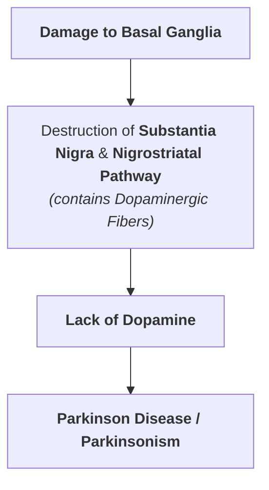
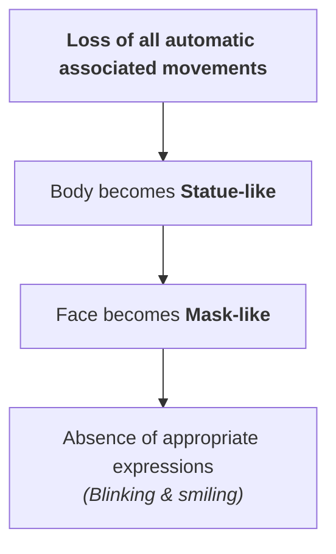
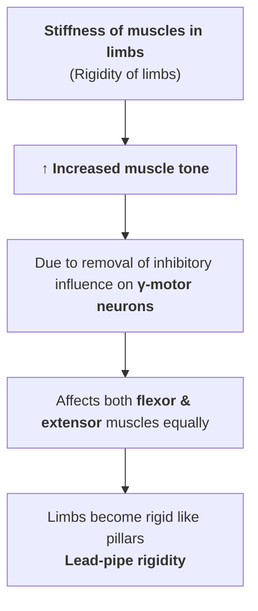
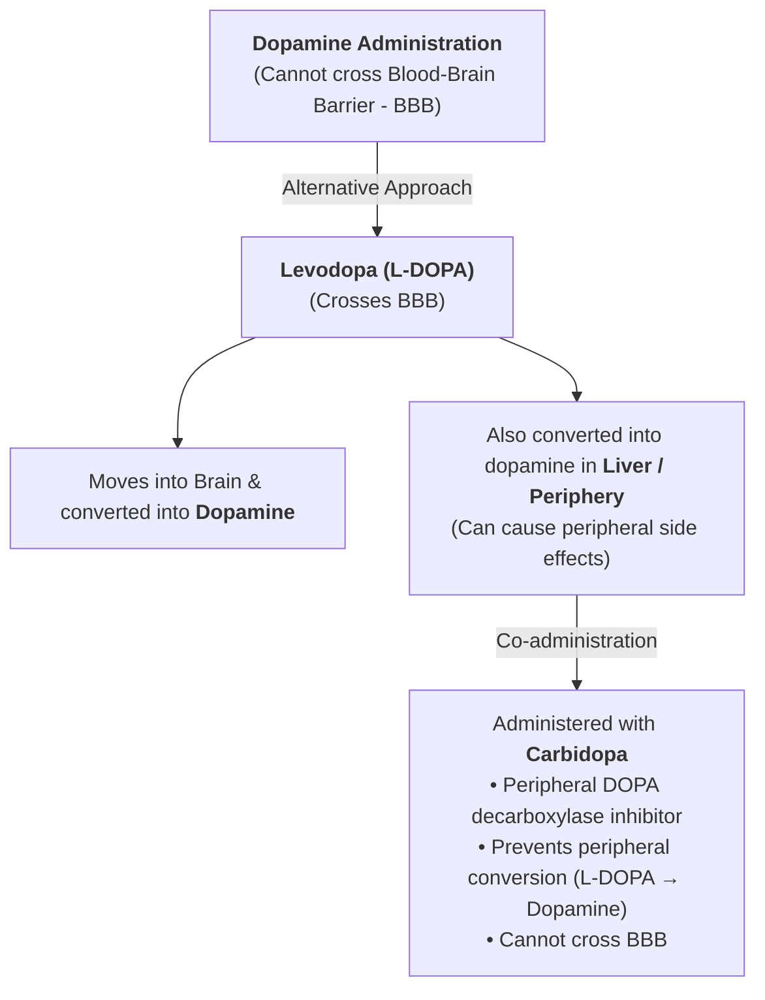

# PARKINSON DISEASE

* **Nature :** Slowly progressing degenerative disease of the nervous system.
* **Pathology :** Destruction of brain cells which produce **dopamine**.
* **Eponym :** Named after **James Parkinson**.
* **Synonyms :** Also called **Parkinsonism** (*Paralysis agitans*).

---

## CAUSES

### Specific Etiologies of Basal Ganglia Damage

* **a) Viral Infection of Brain :** Encephalitis.
* **b) Vascular :** Cerebral arteriosclerosis.
* **c) Trauma :** Injury to basal ganglia.
* **d) Drug-Induced Dopamine Depletion :**

$$\text{Long-term treatment with Antihypertensive drugs (e.g., Reserpine)}$$

$$\downarrow$$

$$\text{Destruction / Damage / Depletion of Dopamine in Basal Ganglia}$$

$$\downarrow$$

$$\mathbf{\text{Drug-Induced Parkinsonism}}$$

* **e) Idiopathic / Unknown Causes :**

$$\text{Unknown Causes} \longrightarrow \mathbf{\text{Idiopathic Parkinsonism}}$$

## SIGNS AND SYMPTOMS OF PARKINSON DISEASE

---

## 1. TREMOR

* **Nature :** Tremor occurs during rest $\longrightarrow$ **Static tremor / Resting tremor**.
* **Synonyms & Characteristics :**
  * Also called **drum-beating tremor** (movements similar to beating a drum).
  * Thumb moves rhythmically over index & middle fingers $\longrightarrow$ **Pill-rolling movements**.

---

## 2. SLOWNESS OF MOVEMENTS

* **Bradykinesia :** Movements start slowing down.
* **Akinesia :** Patient is unable to initiate voluntary activity.
* **Hypokinesia :** Voluntary movements are reduced.
* **Mechanism :** Occurs primarily because of **hypertonicity of muscles**.

---

## 3. POVERTY OF MOVEMENTS

---

## 4. RIGIDITY

---

## 5. GAIT *(Manner of Walking)*
* Patient loses normal gait.
* **Festinant Gait :** In Parkinson disease, the characteristic walking pattern is called festinant gait.
* **Pattern :** Patient walks in short, shuffling steps while bending forward (stooped posture).

---

## 6. SPEECH PROBLEMS
* May speak very softly or sometimes rapidly.
* Words are repeated many times.
* Speech becomes **slurred** and the patient exhibits marked **hesitation to speak**.

---

## 7. EMOTIONAL CHANGES
* Patient is often emotionally upset and prone to mood alterations/depression.

---

## 8. DEMENTIA
* In later stages of the disease, patients frequently develop cognitive decline and **dementia**.

---

## TREATMENT OF PARKINSON DISEASE

---

### Key Therapeutic Approaches

* **Pharmacotherapy (L-DOPA + Carbidopa) :**
* Direct dopamine cannot be used because **dopamine does not cross the BBB**.
* **Levodopa ($\text{L-DOPA}$)** crosses the BBB into the brain, where it is converted into active dopamine.
* To prevent premature peripheral conversion to dopamine in the liver and reduce systemic side effects, **$\text{L-DOPA}$ is combined with Carbidopa** (a peripheral decarboxylase inhibitor that does not cross the BBB).

* **Surgical Management :**
* Tremor and motor symptoms can be abolished or reduced by **surgical destruction (lesioning/ablation) or Deep Brain Stimulation (DBS)** of the **basal ganglia** or **thalamic nuclei**.

