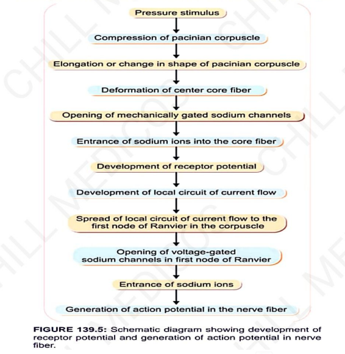

# Properties Of Receptors
### Headings
    - Specificity of Response (Muller's Law)
    - Adaptation 
    - Response to Increase strength of stimulus
    - Sensory Transduction
    - Receptor Potential
    - Law of Projection
 
## Specificity of Response (Muller's Law)
- Refers to a **particular type of response given by specific type of receptor** to a specific sensation
  - Eg.: Pain receptor only give response to pain sensation
- Type of sensation depends on the part of brain in which its fibers terminate
## Adaptation (Sensory Adaptation)
- Adaptation is the **decline in discharge of sensory impulses** when a receptor is stimulated continuously with constant strength of stimulus.
- Depending upon adaptation type, 2 types of receptors:  
  - Phasic receptors - 
    - Adapted rapidly
    - eg: touch and pressure receptors
  - Tonic receptors - 
    - adapt slowly
    - eg: muscle spindle, pain receptors, cold receptors
## Response to Increase strength of stimulus (Weber-Fechner Law)
- The magnitude of sensation felt is proportionate to the log of the intensity of the stimulus. This is called Weber-Fechner law.
  - R = K x logS 
   where R: intensity of response
                       K: constant
                       S: intensity of stimulus
## Sensory Transduction
- Process by which energy (stimulus) in environment is converted into electrical energy (action potential)
- eg: chemorecetor: converts chemical energy into action potential
- eg: touch receptor: converts mechanical energy into action potential
## Receptor Potential
- Receptors **convert environmental energy into action potential** in the sensory nerves.
- On application of stimulus (change in energy), a potential change is observed in the receptor.
- This is usually a **nonpropagated depolarizing potential** that resembles an
EPSP. This is called **receptor potential or generator potential**.
- Properties of Receptor potential: 
  - Non-propagated
  - Do not obey All-or-None law
- Generation of Receptor Potential and Action Potential:
        • Pacinian corpuscles, due to their large size are the best-studied receptors for studying the genesis of receptor potential.
        • It has been experimentally observed that for the generation of receptor
        potential, the lamellae of the Pacinian corpuscles are not required.
        • It is the unmyelinated nerve terminal that generates the receptor
        potential
        
## Law of Projection
- No matter where a specific sensory pathway is stimulated along its course to the cortex, the **sensation formed is referred to the location of the receptors**. This is called the law of projection.
  - • This means, irrespective of the site of application of the stimulus in the pathway, the sensation evoked is felt at the nerve endings (the receptors).
  - • This forms the basis of phantom limb. In phantom limb phenomenon, the limb actually does not exist (as the limb has been amputated), but the patient complains that he feels pain or itch in the limb.
