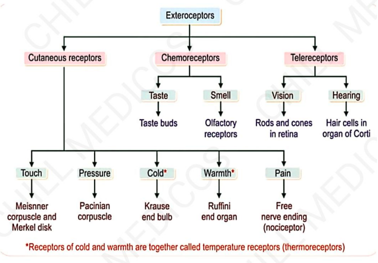
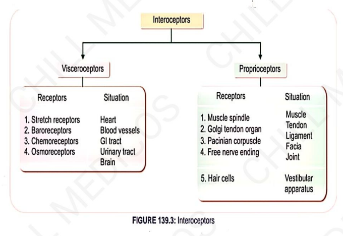

# Classification Of Receptors
### Headings
    - Introduction
    - Classification 
    - Exteroceptors
    - Interoceptors

### Introduction
  - RECEPTORS ARE SENSORY (AFFERENT) NERVE ENDINGS THAT TERMINAT IN PERIPHERY AS FORM of BARE UNMYELINATED ENDINGS OR IN THE SPECIALIZED CAPSULATED STRUCTURES.

   - ACTUALLY RECEPTORS FUNCTION LIKE
       ↓
  TRANSDUCER
       ↓
  CONVERT ONE FORM OF ENERGY ANOTHER
       ↓
  CALLED ACTION POTENTIAL IN NERVE FIBER.

### CLASSIFICATION →
- 2 Types 
  - EXTEROLEPTORS
  - INTEROCEPTORS

 ### Exteroceptors
    ★ WHICH GIVE RESPONSE TO STIMOLI ARISING FROM OUTSIDE BODY.
    1. CUTANEOUS RECEPTORS (MECHANORECEPTORS)
    RECEPTORS SITUATED IN SKIN ARE CALLED COTANEOUS R.
    TOUCH, RESPONSE TO MECHANICAL STIMULI SUCH AS PRESSURE & PAIN.
    2. CHEMORECEPTORS
    WHICH GIVE RESPONSE TO CHEMICAL STIMOLI
    3. TELERECEPTORS
    GIVE RESPONSE TO STIMULI ARISING AWAY FROM BODY.
    ALSO CALLED DISTANCE RECEPTORS.

### Interoceptors
    WHICH GIVE RESPONSE TO STIMULI ARISING FROM WITHIN BODY
    1. VISCEROCEPTORS
    SITUATED IN THE VISCERA
    2. PROPRIOCEPTORS-
    WHICH GIVE RESPONSE TO CHANGE IN THE position DIffERENT PARTS of THE BODY.
