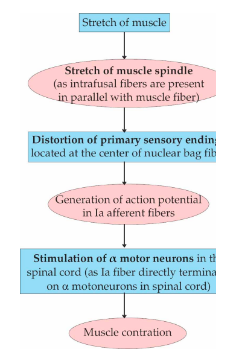
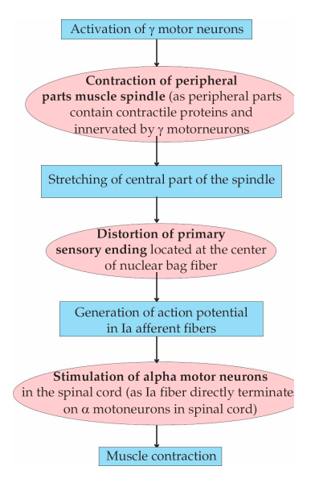

## Functions of Muscle Spindle — 5 marks

**Muscle spindle is a stretch receptor that detects the length of a muscle and the velocity of its lengthening.**

### Functions

1. **Detection of muscle stretch**

   * Stretch of the muscle stretches the muscle spindle.
   * Sensory endings are stimulated and generate afferent impulses.
   * The frequency of impulses is proportional to the degree of stretch.

2. **Maintenance of muscle length**

   * Spindle afferents stimulate **α-motor neurons** in the spinal cord.
   * This produces contraction of the stretched muscle.
   * Thus, the spindle acts as a **feedback mechanism for maintaining muscle length**.

3. **Maintenance of muscle tone**

   * Continuous spindle activity maintains a basal level of α-motor neuron activity.
   * This contributes to **muscle tone**.

4. **Detection of velocity of muscle lengthening**

   * **Dynamic response:** mainly detects the **rate/velocity of stretching**.
   * **Static response:** detects the **maintained muscle length/stretch**.

5. **Regulation of spindle sensitivity**

   * **γ-motor neurons** contract the peripheral portions of intrafusal fibres.
   * This stretches the sensory region and increases spindle sensitivity to stretch.
   * Thus, γ-motor neurons help the spindle remain sensitive during muscle contraction.

### ⭐ One-line flow to remember

**Muscle stretch → spindle stretched → Ia/II afferents → α-motor neurons → muscle contraction → maintenance of muscle length and tone**

**Exam tip:** For a **5-mark “Functions of muscle spindle”** question, this is enough. Don't dump the entire structure/innervation of the spindle—just give **1–2 lines of structural background + these 5 functions**.
