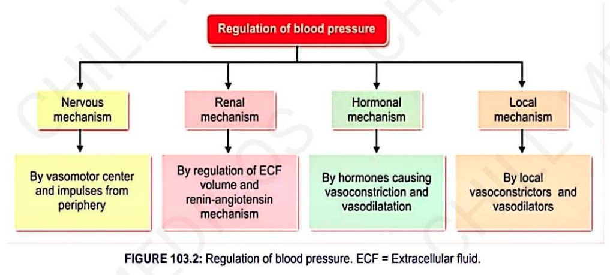

# **Blood Pressure and Its Regulation**
### Headings
 * Definition
 * BP in Terms of:
   * SBP
   * DBP
   * Pulse Pressure
   * MABP
 * Variations in BP
   * Physiological
   * Pathological
 * Regulation of BP
   * Nervous (Short Term)
   * Renal (Long Term) 
   * Hormonal
   * Local
## **Definition**

* **Arterial blood pressure:** The pressure exerted by blood on the **wall of arteries**.

## **Blood Pressure in Terms of**

1. **Systolic BP**
2. **Diastolic BP**
3. **Pulse Pressure**
4. **Mean Arterial Blood Pressure**

---

### **1. Systolic Blood Pressure**

* The **maximum pressure** due to arterial blood during **systole of the heart**.
* **Normal value = 120 mm Hg**

---

### **2. Diastolic Blood Pressure**

* The **minimum pressure** due to arterial blood during **diastole of the heart**.
* **Normal value = 80 mm Hg**

---

### **3. Pulse Pressure**

* The **difference between systolic and diastolic pressure**.
* **Normal value = 40 mm Hg**

**Formula:**

> **Pulse Pressure = Systolic BP − Diastolic BP**

---

### **4. Mean Arterial Blood Pressure**

* The **average pressure in the arteries**.

* **Normal value = 93 mm Hg**

**Formula:**

> **MAP = Diastolic pressure + ⅓ of pulse pressure**

> **MAP = 80 + ⅓(40) = 93.3 mm Hg**

---

## **Variations**

### **A. Physiological Variations**

1. **Age**

   * BP **increases as age advances**.

2. **Body Build**

   * BP is **more in obese persons**.

3. **Exercise**

   * **Systolic BP increases** (maximum — about **200 mm Hg**).
   * **Diastolic BP** may show a smaller change.

4. **Emotion**

   * BP **increases**.

5. **Sleep**

   * BP **decreases**.

6. **Meal**

   * BP shows a **change after meals**.

---

### **B. Pathological Variations**

1. **Hypertension**
2. **Hypotension**

## Regulation of BP: 
* 

### [Short Term/Nervous Mechanism of Regulation of BP](./Nervous%20Reg%20of%20BP.md)

### [Long Term/Renal Mechanism of Regulation of BP](./Renal%20Reg%20of%20BP.md)

### Hormonal Mechanism of Regulation of BP

| **Hormones which ↑se BP** | **Hormones which ↓se BP** |
|---|---|
| **T**hyroxine* | **VIP** — Vasoactive intestinal polypeptide |
| **A**ldosterone | **B**radykinin |
| **N**oradrenaline | **A**cetylcholine |
| **A**drenaline* | **C**-type natriuretic peptide |
| **A**ngiotensin | **H**istamine |
| **V**asopressin | **A**trial natriuretic peptide |
| **S**erotonin | **B**rain natriuretic peptide |
| | **P**rostaglandin |

**↑ BP → TANAAVS**  
**↓ BP → VIP BACHA BP**

### Local Mechanism of Regulation of BP
#### Local Vasoconstrictors (↑se BP)
* **Endothelium-derived constricting factors (EDCF)**
* **Endothelins (ET)**
   - ET₁
   - ET₂
   - ET₃

#### Local Vasodilators (↓se BP)

1. **Vasodilators of metabolic origin**
2. **Vasodilators of endothelial origin**