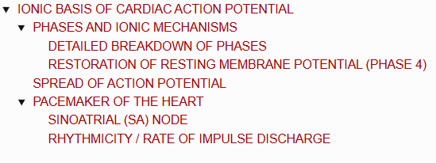
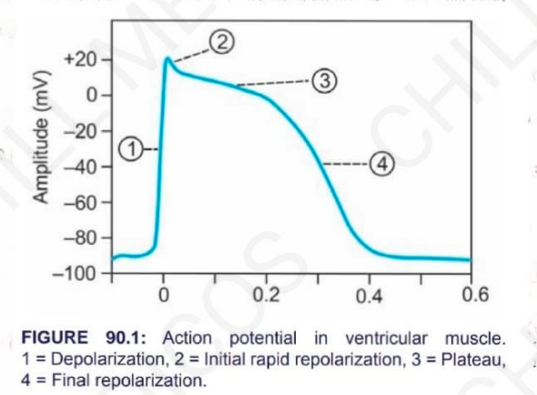
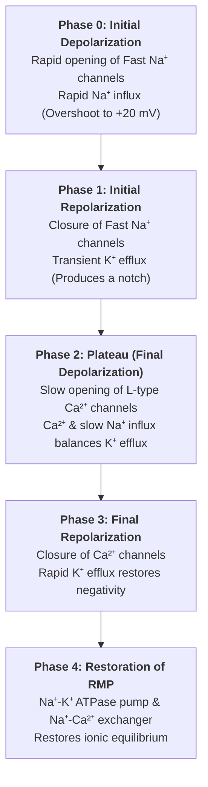

# IONIC BASIS OF CARDIAC ACTION POTENTIAL

> ### Headings 
> 

* **Resting Membrane Potential (RMP) :—**
  * **Single Cardiac Muscle Fiber :** $-85\text{ to } -95\text{ mV}$
  * **Sinoatrial Node (SA Node) :** $-55\text{ to } -60\text{ mV}$
  * **Purkinje Fibers :** $-90\text{ to } -100\text{ mV}$
* **Action Potential Duration :** $250 - 350\text{ ms}$ ($0.25 - 0.35\text{ sec}$).
* **4 Phases of Action Potential :—**
  * Phase 0 : Initial Depolarization
  * Phase 1 : Initial Rapid Repolarization
  * Phase 2 : Plateau / Final Depolarization (Prolonged state)
  * Phase 3 : Final Repolarization

---

> 

## PHASES AND IONIC MECHANISMS

---

### DETAILED BREAKDOWN OF PHASES

---

### RESTORATION OF RESTING MEMBRANE POTENTIAL (PHASE 4)

* **$\text{Na}^+$-$\text{K}^+$ Pump (ATPase) :** Actively pumps $\text{Na}^+$ ions out of the cell and moves $\text{K}^+$ ions back into the cell ($3\text{ Na}^+\text{ out} / 2\text{ K}^+\text{ in}$).
* **$\text{Na}^+$-$\text{Ca}^{2+}$ Exchanger :** Extrudes excess intracellular $\text{Ca}^{2+}$ ions out of the fiber.

---

## SPREAD OF ACTION POTENTIAL

$$\text{Action potential spreads very rapidly across cardiac muscle}$$

$$\downarrow$$

$$\text{Due to presence of \textbf{Gap Junctions} between intercalated discs of cardiac muscle fibers}$$

$$\downarrow$$

$$\text{Gap junctions are highly permeable, allowing free bidirectional movement of ions}$$

$$\downarrow$$

$$\text{Facilitates rapid propagation from fiber to fiber (\textbf{Functional Syncytium})}$$

---

## PACEMAKER OF THE HEART

* **Definition :** Structure of the heart that spontaneously generates electrical impulses responsible for the heartbeat.
* **Cell Type :** Formed by specialized, auto-rhythmic cells called **P-cells (Pacemaker cells)**.
* **Historical Discovery :** **Sir Thomas Lewis** identified and named the SA node as the primary *pacemaker of the heart*.

---

### SINOATRIAL (SA) NODE

* **Anatomy :** A small strip of specialized modified cardiac muscle situated in the **superior part of the lateral wall of the right atrium**, immediately below the opening of the superior vena cava (SVC).
* **Histology :** SA nodal fibers **lack contractile elements (myofibrils)**.
* **Conduction :** Fibers are continuous with ordinary atrial muscle fibers, allowing impulses to spread rapidly throughout both atria.

---

### RHYTHMICITY / RATE OF IMPULSE DISCHARGE

The atrioventricular (AV) node, atria, and Purkinje system can also generate impulses and function as potential/latent pacemakers:

<table>
  <thead>
    <tr>
      <th align="left">Cardiac Structure / Pacemaker Focus</th>
      <th align="center">Rate of Impulse Production</th>
    </tr>
  </thead>
  <tbody>
    <tr>
      <td><b>1. SA Node</b></td>
      <td align="center"><b>70 – 80 / min</b></td>
    </tr>
    <tr>
      <td><b>2. AV Node</b></td>
      <td align="center"><b>40 – 60 / min</b></td>
    </tr>
    <tr>
      <td><b>3. Atrial Muscle</b></td>
      <td align="center"><b>40 – 60 / min</b></td>
    </tr>
    <tr>
      <td><b>4. Ventricular Muscle</b></td>
      <td align="center"><b>20 – 40 / min</b></td>
    </tr>
    <tr>
      <td><b>5. Purkinje Fibers</b></td>
      <td align="center"><b>35 – 40 / min</b></td>
    </tr>
  </tbody>
</table>