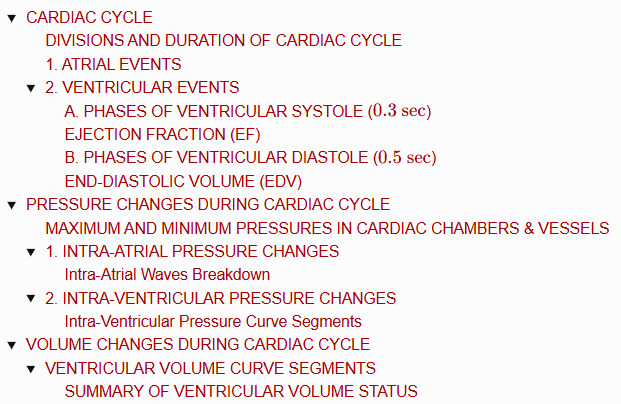
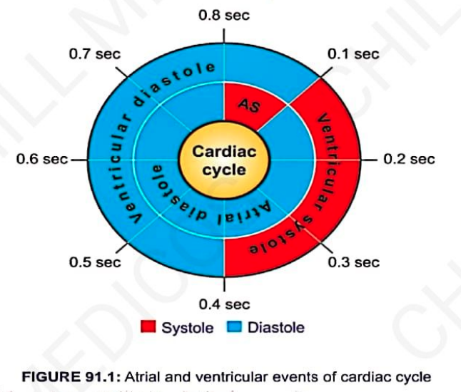
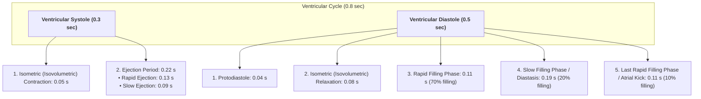
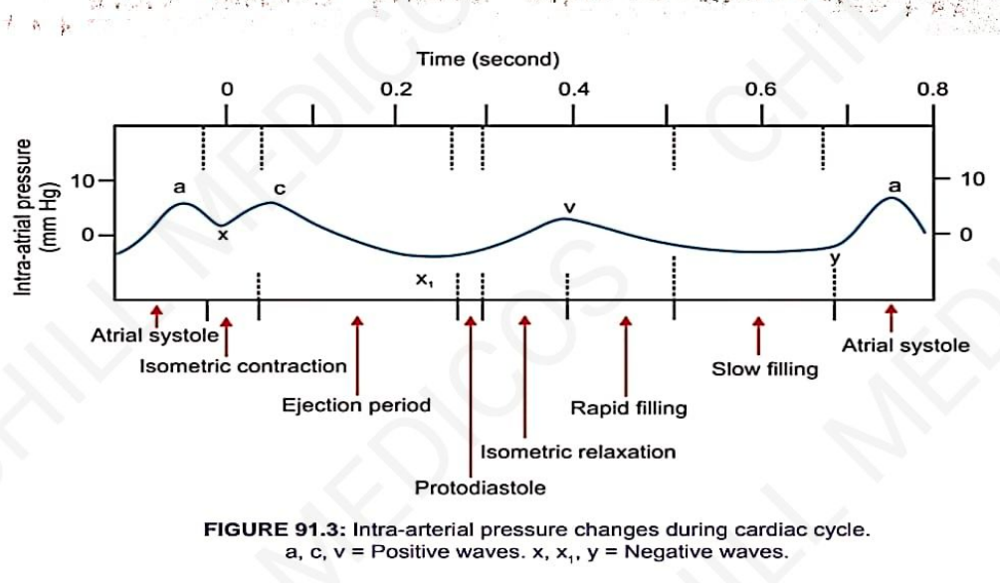
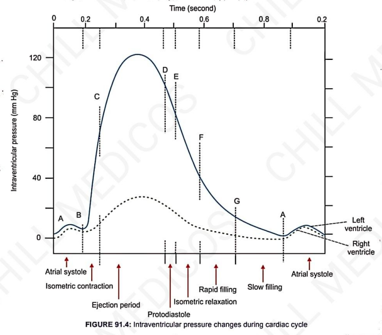
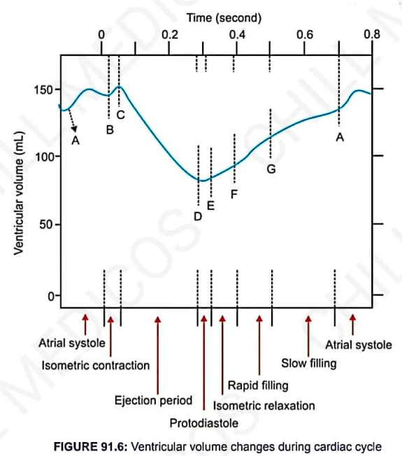
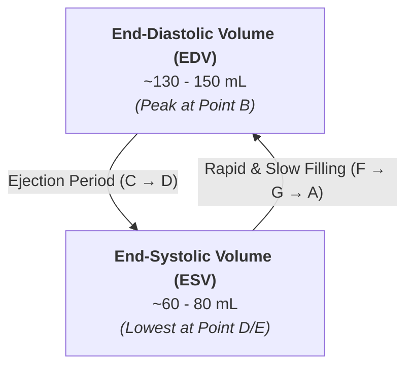

# CARDIAC CYCLE

> ### Headings
> 

* **Definition :** Succession of (sequence of) coordinated mechanical and electrical events taking place in the heart during each beat.
* **Comprises 2 Major Periods :—**
  * **Systole :** Period during which heart muscle contracts.
  * **Diastole :** Period during which heart muscle relaxes.
* These changes repeat cyclically with every heartbeat.

---

## DIVISIONS AND DURATION OF CARDIAC CYCLE

$$\text{Normal Heart Rate} = 72\text{ beats/min} \implies \text{Duration of each Cardiac Cycle} = \frac{60}{72} = \mathbf{0.8\text{ seconds}}$$

> 

<table>
  <thead>
    <tr>
      <th align="left">Division</th>
      <th align="left">Systole Duration</th>
      <th align="left">Diastole Duration</th>
      <th align="center">Total Duration</th>
    </tr>
  </thead>
  <tbody>
    <tr>
      <td><b>Atrial Events</b></td>
      <td>0.1 second</td>
      <td>0.7 second</td>
      <td align="center">0.8 second</td>
    </tr>
    <tr>
      <td><b>Ventricular Events</b></td>
      <td>0.3 second <i>(0.27 s)</i></td>
      <td>0.5 second <i>(0.53 s)</i></td>
      <td align="center">0.8 second</td>
    </tr>
  </tbody>
</table>

> **Complete Cardiac Diastole :** The heart relaxes as a whole (both atria and ventricles in diastole simultaneously) for **0.4 seconds**.

---

## 1. ATRIAL EVENTS

* **A. Atrial Systole ($0.1\text{ sec}$) :—**
  * Also known as the **last rapid filling phase** or **presystole** of ventricular diastole.
  * *Functional Significance:* Not strictly essential for maintenance of basic circulation (a person with atrial fibrillation can survive for years without developing severe circulatory insufficiency).
  * **Pressure & Volume Changes:** Intra-atrial pressure $\uparrow$ increases; intraventricular pressure and volume also $\uparrow$ increase slightly.
  * **Fourth Heart Sound ($\text{S}_4$):** Caused by the contraction of atrial musculature and rapid ventricular inflow.

* **B. Atrial Diastole ($0.7\text{ sec}$) :—**
  * Starts simultaneously as ventricular systole begins.
  * **Necessity of Long Atrial Diastole:** Provides adequate filling time:
    $$\text{Right Atrium receives deoxygenated blood via Superior \& Inferior Venae Cavae}$$
    $$\text{Left Atrium receives oxygenated blood from lungs via Pulmonary Veins}$$

---

## 2. VENTRICULAR EVENTS

---

### A. PHASES OF VENTRICULAR SYSTOLE ($0.3\text{ sec}$)

* **1. Isometric / Isovolumetric Contraction Period ($0.05\text{ sec}$) :—**
  * First phase of ventricular systole.
  * Type of muscular contraction characterized by **$\uparrow$ increase in tension without change in length of muscle fibers**.
  * **Valvular Status:**
    * After atrial systole, **AV valves close** due to rising intraventricular pressure.
    * Semilunar valves are **already closed**.
    * Ventricles contract as **closed cavities** $\longrightarrow$ intraventricular volume remains constant while intraventricular pressure spikes steeply.

  * **First Heart Sound ($\text{S}_1$):** Produced by the closure of AV valves (mitral and tricuspid) at the beginning of this phase.
  * **Significance:** Once intraventricular pressure exceeds aortic/pulmonary pressure, **semilunar valves open**.

* **2. Ejection Period ($0.22\text{ sec}$) :—**
  * **Rapid Ejection Period (1ˢᵗ stage, $0.13\text{ sec}$):** Large amount of blood is rapidly ejected from both ventricles under high pressure.
  * **Slow Ejection Period (2ⁿᵈ stage, $0.09\text{ sec}$):** Blood is ejected slowly with much less force.
  * **End-Systolic Volume (ESV):** Amount of blood remaining in each ventricle at the end of the ejection period ($\approx \mathbf{60 - 80\text{ mL/ventricle}}$).

---

### EJECTION FRACTION (EF)

* **Definition :** Fraction (proportion) of End-Diastolic Volume that is ejected out by each ventricle per beat.
* **Formulas :**

$$\text{EF} = \frac{\text{Stroke Volume (SV)}}{\text{End-Diastolic Volume (EDV)}} = \frac{\text{EDV} - \text{ESV}}{\text{EDV}}$$

* **Normal Value :** $\mathbf{60 - 65\%}$ *(From an EDV of $130 - 150\text{ mL}$, $\approx 70\text{ mL}$ is ejected per beat)*.
* **Clinical Significance :** Best index for assessing **ventricular contractility** ($\text{EF} \downarrow$ decreases in *Myocardial Infarction* and *Cardiomyopathy*).

---

### B. PHASES OF VENTRICULAR DIASTOLE ($0.5\text{ sec}$)

* **1. Protodiastole ($0.04\text{ sec}$) :—**
  * 1ˢᵗ stage of ventricular diastole.
  * Intraventricular pressure drops below aortic / pulmonary artery pressure $\longrightarrow$ **Semilunar valves close abruptly**.
  * **Second Heart Sound ($\text{S}_2$):** Produced by the closure of semilunar valves (aortic and pulmonary).

* **2. Isometric / Isovolumetric Relaxation Period ($0.08\text{ sec}$) :—**
  * Characterized by **$\downarrow$ decrease in muscular tension without change in fiber length**.
  * **All 4 valves remain closed** $\longrightarrow$ intraventricular pressure falls rapidly without volume change.
  * Fall in ventricular pressure below atrial pressure **causes AV valves to open**.

* **3. Rapid Filling Phase ($0.11\text{ sec}$) :—**
  * Opening of AV valves results in a **sudden rush of blood** from atria into relaxed ventricles.
  * Responsible for approximately **70% of total ventricular filling**.
  * **Third Heart Sound ($\text{S}_3$):** Produced by the rushing/turbulent flow of blood into the ventricles during rapid filling.

* **4. Slow Filling Phase / Diastasis ($0.19\text{ sec}$) :—**
  * Ventricular filling slows down as pressures equalize.
  * Responsible for approximately **20% of total ventricular filling**.

* **5. Last Rapid Filling Phase ($0.11\text{ sec}$) :—**
  * Coincides with **Atrial Systole**.
  * Atria contract and push the remaining small volume of blood into ventricles (**Atrial Kick**).
  * Responsible for approximately **10% of total ventricular filling**.

---

### END-DIASTOLIC VOLUME (EDV)

* **Definition :** Total volume of blood remaining/accumulated in each ventricle at the end of diastole.
* **Normal Value :** $\mathbf{130 - 150\text{ mL/ventricle}}$.

---

# PRESSURE CHANGES DURING CARDIAC CYCLE

Pressure changes in the heart during the cardiac cycle are divided into **2 main categories**:
* 1. **Intra-Atrial Pressure Changes**
* 2. **Intra-Ventricular Pressure Changes**

---

## MAXIMUM AND MINIMUM PRESSURES IN CARDIAC CHAMBERS & VESSELS

<table>
  <thead>
    <tr>
      <th align="left">Area / Chamber</th>
      <th align="center">Maximum Pressure</th>
      <th align="center">Minimum Pressure</th>
    </tr>
  </thead>
  <tbody>
    <tr>
      <td><b>Left Atrium</b></td>
      <td align="center">7 to 8 mmHg</td>
      <td align="center">0 to 2 mmHg</td>
    </tr>
    <tr>
      <td><b>Right Atrium</b></td>
      <td align="center">5 to 6 mmHg</td>
      <td align="center">0 to 2 mmHg</td>
    </tr>
    <tr>
      <td><b>Left Ventricle</b></td>
      <td align="center">120 mmHg</td>
      <td align="center">5 mmHg</td>
    </tr>
    <tr>
      <td><b>Right Ventricle</b></td>
      <td align="center">25 mmHg</td>
      <td align="center">2 to 3 mmHg</td>
    </tr>
    <tr>
      <td><b>Systemic Aorta</b></td>
      <td align="center">120 mmHg</td>
      <td align="center">80 mmHg</td>
    </tr>
    <tr>
      <td><b>Pulmonary Artery</b></td>
      <td align="center">25 mmHg</td>
      <td align="center">7 to 8 mmHg</td>
    </tr>
  </tbody>
</table>

---

## 1. INTRA-ATRIAL PRESSURE CHANGES

> 

* **Functional Significance :** Intra-atrial pressure is responsible for the **opening of AV valves** and **ventricular filling**, and is the main factor governing the **development of the jugular venous pulse**.
* **Phlebogram :** The intra-atrial pressure curve resembles the jugular venous pulse tracing (phlebogram).
* **Wave Composition :** Comprises **3 positive waves** ($a, c, v$) and **3 negative waves** ($x, x_1, y$).

---

### Intra-Atrial Waves Breakdown

<table>
  <thead>
    <tr>
      <th align="left">Wave Type</th>
      <th align="left">Wave</th>
      <th align="left">Timing / Cardiac Cycle Event</th>
      <th align="left">Mechanism / Cause</th>
    </tr>
  </thead>
  <tbody>
    <tr>
      <td rowspan="3"><b>Positive Waves</b></td>
      <td><b>'a' wave</b></td>
      <td>Atrial Systole</td>
      <td>Pressure rises up to <b>$5\text{ mmHg}$</b> in Right Atrium and <b>$7\text{ mmHg}$</b> in Left Atrium due to atrial muscular contraction.</td>
    </tr>
    <tr>
      <td><b>'c' wave</b></td>
      <td>Isometric Contraction</td>
      <td>Rising intraventricular pressure forces <b>AV valves to bulge back into the atria</b>, elevating intra-atrial pressure.</td>
    </tr>
    <tr>
      <td><b>'v' wave</b></td>
      <td>Late Ventricular Systole (Atrial Diastole)</td>
      <td>Gradual pressure rise due to continuous <b>venous return filling the closed atria</b> while AV valves remain closed.</td>
    </tr>
    <tr>
      <td rowspan="3"><b>Negative Waves</b></td>
      <td><b>'x' wave</b></td>
      <td>Onset of Atrial Diastole</td>
      <td>Due to atrial relaxation; AV valves close at the end of this wave.</td>
    </tr>
    <tr>
      <td><b>'x₁' wave</b></td>
      <td>Ventricular Ejection Period</td>
      <td>Contraction of ventricular muscle <b>pulls the atrioventricular ring downward</b> toward the apex, expanding atrial volume and lowering pressure.</td>
    </tr>
    <tr>
      <td><b>'y' wave</b></td>
      <td>Rapid Filling Phase</td>
      <td>AV valves open $\longrightarrow$ blood rushes rapidly from atria into ventricles $\longrightarrow$ <b>atrial pressure drops sharply</b>.</td>
    </tr>
  </tbody>
</table>

---

## 2. INTRA-VENTRICULAR PRESSURE CHANGES

> 

* **Physiological Importance :** Essential for the forward propulsion of blood through systemic and pulmonary circulations, which depends on the pressure generated during ventricular contraction.
* **Ventricular Pressure Asymmetry :** Pressure in the **Left Ventricle ($120\text{ mmHg}$)** is **$4 - 5\text{ times higher}$** than in the **Right Ventricle ($25\text{ mmHg}$)** due to the significantly thicker muscular wall of the left ventricle.

---

### Intra-Ventricular Pressure Curve Segments

<table>
  <thead>
    <tr>
      <th align="left">Segment</th>
      <th align="left">Cardiac Cycle Phase</th>
      <th align="left">Pressure Changes & Physiological Events</th>
    </tr>
  </thead>
  <tbody>
    <tr>
      <td><b>A – B Segment</b></td>
      <td>Atrial Systole</td>
      <td>
        • Small volume of blood enters ventricles from atrial contraction. 
        • Pressure rises to <b>$6 - 7\text{ mmHg}$</b> (Right Ventricle) and <b>$7 - 8\text{ mmHg}$</b> (Left Ventricle). 
        • <b>Point 'B'</b> indicates the <b>closure of Atrioventricular (AV) valves</b>.
      </td>
    </tr>
    <tr>
      <td><b>B – C Segment</b></td>
      <td>Isometric Contraction Period</td>
      <td>
        • Sharp, steep rise in intraventricular pressure as ventricles contract as closed cavities. 
        • <b>Point 'C'</b> marks the <b>opening of Semilunar valves</b> when ventricular pressure exceeds arterial pressure.
      </td>
    </tr>
    <tr>
      <td><b>C – D Segment</b></td>
      <td>Ejection Period</td>
      <td>
        • Maximum systolic pressure reaches <b>$25\text{ mmHg}$</b> (Right Ventricle) and <b>$120\text{ mmHg}$</b> (Left Ventricle). 
        • Blood is forcefully ejected into the aorta and pulmonary artery.
      </td>
    </tr>
    <tr>
      <td><b>D – E Segment</b></td>
      <td>Protodiastole</td>
      <td>
        • Pressure decreases slightly as ventricular relaxation begins. 
        • <b>Point 'E'</b> indicates the <b>closure of Semilunar valves</b>.
      </td>
    </tr>
    <tr>
      <td><b>E – F Segment</b></td>
      <td>Isometric Relaxation Period</td>
      <td>
        • Rapid, steep fall in ventricular pressure as muscle relaxes with all valves closed. 
        • Intraventricular pressure falls below intra-atrial pressure. 
        • <b>Point 'F'</b> denotes the <b>opening of Atrioventricular (AV) valves</b>.
      </td>
    </tr>
    <tr>
      <td><b>F – G Segment</b></td>
      <td>Rapid Filling Phase</td>
      <td>Pressure continues to decrease/remain low despite filling due to ongoing ventricular muscle relaxation.</td>
    </tr>
    <tr>
      <td><b>G – A Segment</b></td>
      <td>Slow Filling Phase (Diastasis)</td>
      <td>Continued passive filling with pressure maintained at basal resting levels before the next atrial systole.</td>
    </tr>
  </tbody>
</table>

---

# VOLUME CHANGES DURING CARDIAC CYCLE

* **Ventricular Volume Changes :—**
  * Essential factor to maintain **cardiac output** and proper **blood circulation**.
  * The amount of blood is identical in both the **right and left ventricles**.
* **Ventricular Volume Curve :** Recorded experimentally by using a **Henderson cardiometer**.

---

## VENTRICULAR VOLUME CURVE SEGMENTS

> 

<table>
  <thead>
    <tr>
      <th align="left">Segment</th>
      <th align="left">Cardiac Cycle Phase</th>
      <th align="left">Volume Changes & Valvular Events</th>
    </tr>
  </thead>
  <tbody>
    <tr>
      <td><b>1. A – B Segment</b></td>
      <td>Atrial Systole <i>(Last filling phase)</i></td>
      <td>
        • A small amount of blood enters the ventricles from the atria. 
        • Causes a slight $\uparrow$ increase in ventricular volume (reaches EDV $\approx 130 - 150\text{ mL}$). 
        • <b>Point 'B'</b> indicates the <b>closure of Atrioventricular (AV) valves</b>.
      </td>
    </tr>
    <tr>
      <td><b>2. B – C Segment</b></td>
      <td>Isometric Contraction Period</td>
      <td>
        • Ventricular volume is <b>not altered</b> as the ventricles contract as closed chambers. 
        • Any slight upward deflection seen on tracings is an <b>artifact</b>. 
        • <b>Point 'C'</b> represents the <b>opening of Semilunar valves</b>.
      </td>
    </tr>
    <tr>
      <td><b>3. C – D Segment</b></td>
      <td>Ejection Period</td>
      <td>
        • <b>Rapid Ejection:</b> Sharp, steep fall in ventricular volume. 
        • <b>Slow Ejection:</b> Ventricular volume $\downarrow$ decreases slowly until it reaches ESV ($\approx 60 - 80\text{ mL}$).
      </td>
    </tr>
    <tr>
      <td><b>4. D – E Segment</b></td>
      <td>Protodiastole</td>
      <td>
        • <b>No change</b> in ventricular volume. 
        • <b>Point 'E'</b> denotes the <b>closure of Semilunar valves</b>.
      </td>
    </tr>
    <tr>
      <td><b>5. E – F Segment</b></td>
      <td>Isometric Relaxation Period</td>
      <td>
        • Ventricular volume is <b>not altered</b>. 
        • Any slight upward deflection is an artifact caused by the entrance of blood into coronary arteries from the aorta. 
        • <b>Point 'F'</b> indicates the <b>opening of Atrioventricular (AV) valves</b>.
      </td>
    </tr>
    <tr>
      <td><b>6. F – G Segment</b></td>
      <td>Rapid Filling Phase</td>
      <td>
        • Marked <b>rise in ventricular volume</b> ($\approx 70\%$ of total filling). 
        • Caused by the sudden rush of blood from the atria immediately after AV valves open.
      </td>
    </tr>
    <tr>
      <td><b>7. G – A Segment</b></td>
      <td>Slow Filling Phase <i>(Diastasis)</i></td>
      <td>
        • Ventricular volume $\uparrow$ increases slowly and steadily ($\approx 20\%$ of total filling) due to continuous venous return.
      </td>
    </tr>
  </tbody>
</table>

---

### SUMMARY OF VENTRICULAR VOLUME STATUS

