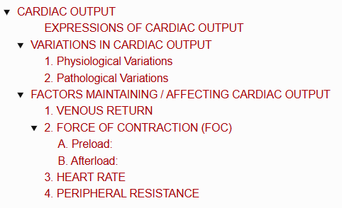
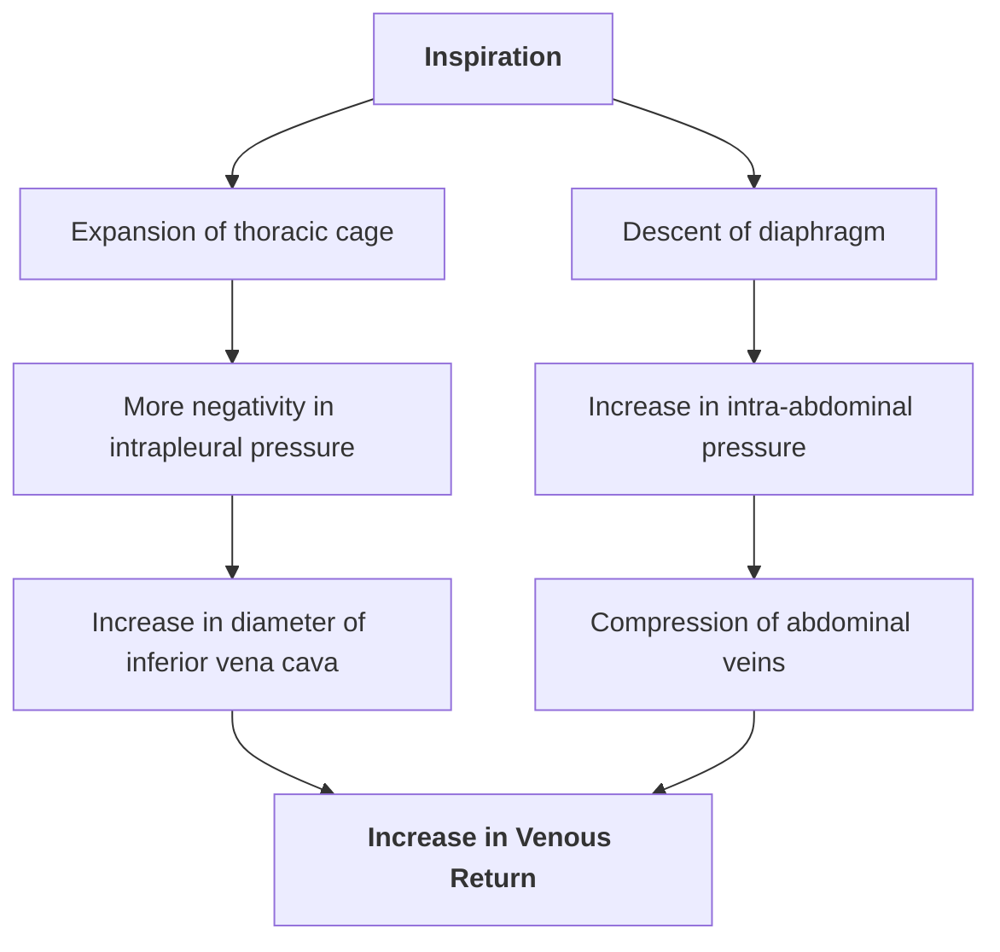
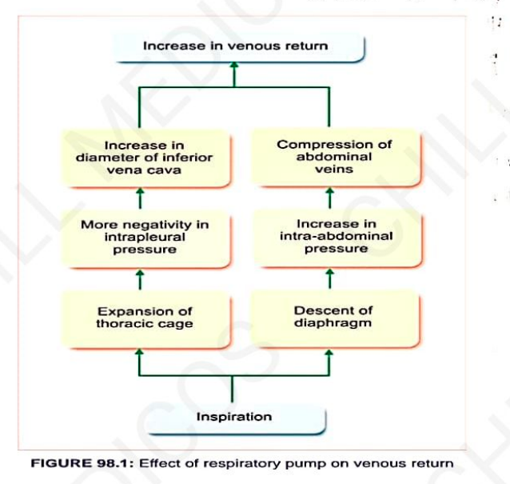
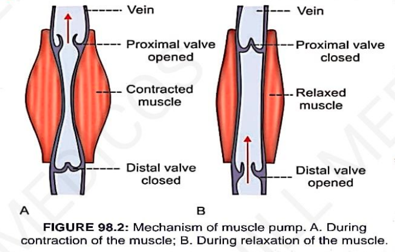

# CARDIAC OUTPUT

> ### Headings
> 

* **Definition :** Amount of blood pumped from each ventricle per unit time.
* Mainly refers to the **left ventricular output through the aorta**.
* Usually expressed in **3 ways**:
  * 1. Stroke Volume
  * 2. Minute Volume
  * 3. Cardiac Index

---

### EXPRESSIONS OF CARDIAC OUTPUT

* **1. Stroke Volume (SV) :—**
  * Amount of blood pumped out by each ventricle **during each beat**.
  * **Normal Value :** $70\text{ mL}$ (range: $60 - 80\text{ mL}$) when Heart Rate (HR) is $72/\text{min}$.

* **2. Minute Volume :—**
  * Amount of blood pumped out by each ventricle in **one minute**.
  * **Formula :**
    $$\text{Minute Volume} = \text{Stroke Volume} \times \text{Heart Rate}$$
  * **Normal Value :** $5\text{ L/ventricle/minute}$.

* **3. Cardiac Index :—**
  * Minute volume expressed in relation to **square meter ($m^2$) of body surface area**.
  * Amount of blood pumped out per ventricle / minute / square meter of body surface area.
  * **Normal Value :** $2.8 \pm 0.3\text{ L/m}^2/\text{min}$.

> **Cardiac Reserve :—**  
> Maximum amount of blood that can be pumped out by the heart above the normal resting value *(manifests as $\uparrow$ increasing cardiac output during heavy exercise)*.

---

## VARIATIONS IN CARDIAC OUTPUT

### 1. Physiological Variations

* a. **Age :** In children, cardiac output is $\downarrow$ lower than adults; in adults, it is $\uparrow$ higher.
* b. **Sex :** In females, cardiac output is less than males due to lower circulating blood volume.
* c. **Exercise :** $\uparrow$ Increases markedly due to an increase in both heart rate and force of contraction.
* d. **High Altitude :** $\uparrow$ Increases due to an $\uparrow$ increase in adrenaline secretion.
* e. **Hypoxia :** $\uparrow$ Increases cardiac output.
* f. **Posture :** Upright/erect posture $\downarrow$ decreases cardiac output due to pooling of blood in lower extremities.

---

### 2. Pathological Variations

<table>
  <thead>
    <tr>
      <th align="left">Conditions with Increased (↑) Cardiac Output</th>
      <th align="left">Conditions with Decreased (↓) Cardiac Output</th>
    </tr>
  </thead>
  <tbody>
    <tr>
      <td>
        • <b>Fever:</b> Due to accelerated oxidative / metabolic processes 
        • <b>Anemia:</b> Due to tissue hypoxia and compensatory vasodilation 
        • <b>Hyperthyroidism:</b> Due to elevated Basal Metabolic Rate (BMR)
      </td>
      <td>
        • <b>Hypothyroidism:</b> Due to decreased BMR 
        • <b>Shock:</b> Due to poor pumping efficiency and circulation failure 
        • <b>Hemorrhage:</b> Due to acute reduction in blood volume 
        • <b>Congestive Cardiac Failure (CCF):</b> Weak myocardial contractions
      </td>
    </tr>
  </tbody>
</table>

---

## FACTORS MAINTAINING / AFFECTING CARDIAC OUTPUT

Regulated by **4 primary determinants**:
* 1. Venous return
* 2. Force of contraction
* 3. Heart rate
* 4. Peripheral resistance

---

### 1. VENOUS RETURN

* **Definition :** Amount of blood returned to the heart from different parts of the body.
* **Relationship :** Cardiac output is **directly proportional** to venous return.
* **5 Key Determinants of Venous Return :—**

* a. **Sympathetic Tone :—**
  $$\text{Sympathetic / Vasomotor Tone} \longrightarrow \text{Venoconstriction} \longrightarrow \text{Pushes blood towards heart} \longrightarrow \uparrow \text{Venous Return}$$

* b. **Gravity :—**
  * Gravitational pull reduces venous return by causing **venous pooling in legs** when standing upright $\longrightarrow \downarrow$ blood returning to heart.

* c. **Venous Pressure :—**
  * Normal pressure in venules is **$12 - 18\text{ mmHg}$**.
  * The pressure gradient along the venous tree serves as the driving force for venous return.

* d. **Respiratory Pump (Abdominothoracic Pump) :—**
  * Respiratory movements facilitate venous return during **inspiration**.

> 

* e. **Muscle Pump :—**
* During muscular contraction, deep veins are **compressed / squeezed**.
* Due to the presence of **one-way semilunar valves**, blood is propelled unidirectionally towards the heart.
* During muscle relaxation, proximal valves close to prevent backflow while distal valves open to allow venous refilling.

> 

---

### 2. FORCE OF CONTRACTION (FOC)

* Cardiac output is **directly proportional** to the force of ventricular contraction.
* **Frank-Starling Law :**

$$\text{Force of Contraction of Heart} \propto \text{Initial Length of Muscle Fibers (End-Diastolic Volume)}$$

* Force of contraction depends upon **Preload** and **Afterload**:

#### A. Preload:

* Stretching of cardiac muscle fibers at the **end of diastole**, just before contraction.
* Caused by increased intraventricular filling during diastole $\longrightarrow \uparrow$ fiber length $\longrightarrow \uparrow$ Force of Contraction $\longrightarrow \uparrow$ Cardiac Output.
* **Directly proportional** to force of contraction and cardiac output.

#### B. Afterload:

* Force or resistance against which the ventricles must contract and eject blood *(primarily systemic vascular resistance / aortic pressure)*.
* **Inversely proportional** to force of contraction and cardiac output.

---

### 3. HEART RATE

* Cardiac output is **directly proportional** to heart rate under physiological limits.
* **Note :** Moderate changes in heart rate do not significantly alter cardiac output due to compensatory adjustments in stroke volume.

---

### 4. PERIPHERAL RESISTANCE

* **Definition :** Resistance offered to blood flow at the peripheral blood vessels; the load against which the heart pumps blood.
* **Relationship :** Cardiac output is **inversely proportional** to peripheral resistance.
* **Resistant Vessels :** Resistance is mainly offered at the **arterioles**.
* **Site of Maximum Resistance :** Maximum peripheral resistance is offered in the **splanchnic vascular bed**.
