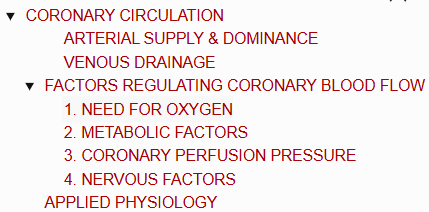
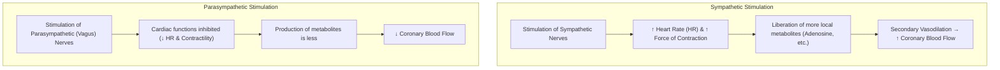

# CORONARY CIRCULATION

> ### Headings 
> 

* **Coronary Arteries :—**
  * Heart muscle is supplied by **2 coronary arteries** *(Right Coronary Artery and Left Coronary Artery)*.
  * Arteries encircle the heart in the manner of a crown, hence named **coronary arteries**.

---

### ARTERIAL SUPPLY & DOMINANCE

* a. **Right Coronary Artery (RCA) :** Supplies the whole of the right ventricle and the posterior portion of the left ventricle.
* b. **Left Coronary Artery (LCA) :** Supplies mainly the anterior and lateral parts of the left ventricle.

<table>
  <thead>
    <tr>
      <th align="left">Coronary Distribution Pattern</th>
      <th align="left">Prevalence in Humans</th>
    </tr>
  </thead>
  <tbody>
    <tr>
      <td><b>Right Coronary Artery Large</b> (Right Dominant)</td>
      <td>50 – 60% of humans</td>
    </tr>
    <tr>
      <td><b>Left Coronary Artery Large</b> (Left Dominant)</td>
      <td>15 – 20% of humans</td>
    </tr>
    <tr>
      <td><b>Both Arteries Almost Equal</b> (Balanced / Co-dominant)</td>
      <td>20 – 30% of humans</td>
    </tr>
  </tbody>
</table>

* **Branches of Coronary Arteries :—**
  $$\text{Coronary Arteries} \longrightarrow \text{Smaller branches: \textbf{Epicardiac Arteries}} \longrightarrow \text{Final branches: \textbf{Intramural Vessels}}$$

---

### VENOUS DRAINAGE

* Drainage occurs via **3 types of vessels**:
  * a. **Coronary Sinus :—** Large vein draining **75% of total coronary flow**. Drains blood from the left side and opens into the **right atrium** near the tricuspid valve.
  * b. **Anterior Coronary Veins :—** Drain blood from the right side and **open directly into the right atrium**.
  * c. **Thebesian Veins (Venae Cordis Minimae) :—** Drain deoxygenated blood from the myocardium **directly into the concerned chamber of the heart**.

> **Physiological Shunt :—**  
> The diverted route (diversion) through which venous (deoxygenated) blood is mixed directly with arterial blood *(e.g., drainage of deoxygenated blood from bronchial circulation and thebesian veins into pulmonary vein / left side of heart)*.

---

## FACTORS REGULATING CORONARY BLOOD FLOW

* **Autoregulation :** Capacity of the heart to regulate its own blood flow within a wide range of perfusion pressure.
* **Key Regulatory Factors :—**
  * a. Need for oxygen
  * b. Metabolic factors
  * c. Coronary perfusion pressure
  * d. Nervous factors

---

### 1. NEED FOR OXYGEN
* Amount of blood passing through the coronary circulation is **directly proportional to the consumption of oxygen** by cardiac muscle.
* **Mechanism :** Hypoxia immediately causes **coronary vasodilation** $\longrightarrow \uparrow$ increases blood flow.

---

### 2. METABOLIC FACTORS
* **Reactive Hyperemia :** $\uparrow$ Increase in coronary blood flow due to vasodilator effects of local metabolites.
* **Metabolic Products Causing Coronary Vasodilation :—**
  * a. **Adenosine** *(Most potent vasodilator)*
  * b. **Potassium ions ($\text{K}^+$)**
  * c. **Hydrogen ions ($\text{H}^+$)**
  * d. **Carbon dioxide ($\text{CO}_2$)**
  * e. **Adenosine phosphate compounds** (AMP, ADP)

---

### 3. CORONARY PERFUSION PRESSURE
* Determined by the balance between **Mean Arterial Pressure (MAP)** and **Venous Pressure**.

---

### 4. NERVOUS FACTORS
* Coronary blood vessels are innervated by both **parasympathetic and sympathetic divisions** of the Autonomic Nervous System (ANS).

---

## APPLIED PHYSIOLOGY

<table>
  <thead>
    <tr>
      <th align="left">Condition</th>
      <th align="left">Definition & Pathophysiology</th>
    </tr>
  </thead>
  <tbody>
    <tr>
      <td><b>1. Coronary Occlusion</b></td>
      <td>Partial or complete obstruction of a coronary artery.</td>
    </tr>
    <tr>
      <td><b>2. Myocardial Ischemia</b></td>
      <td>Reaction of a part of the myocardium in response to hypoxia (inadequate blood supply).</td>
    </tr>
    <tr>
      <td><b>3. Myocardial Infarction <i>(Heart Attack)</i></b></td>
      <td>Necrosis of the myocardium caused by insufficient blood flow due to an <b>embolus, thrombus, or vascular spasm</b>.</td>
    </tr>
    <tr>
      <td><b>4. Cardiac Pain <i>(Angina Pectoris)</i></b></td>
      <td>
        • Chest pain caused by myocardial ischemia. 
        • Common clinical manifestation of coronary artery disease.
      </td>
    </tr>
  </tbody>
</table>