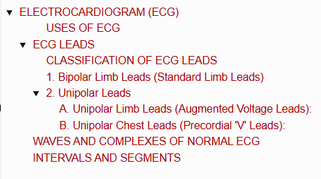
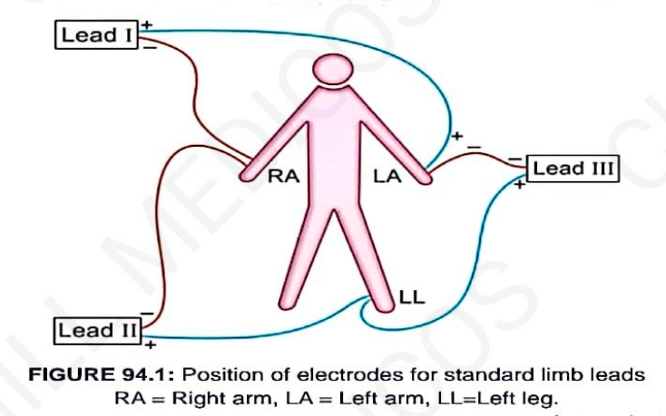
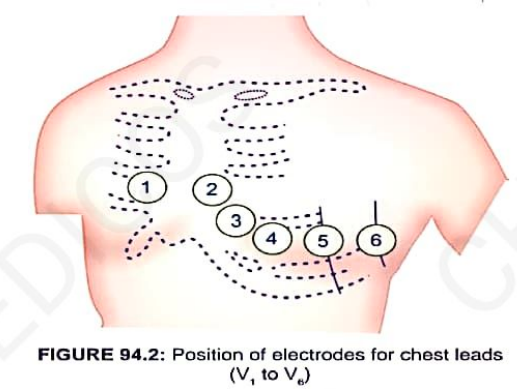
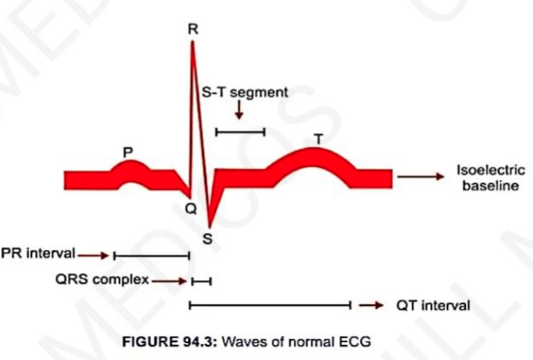
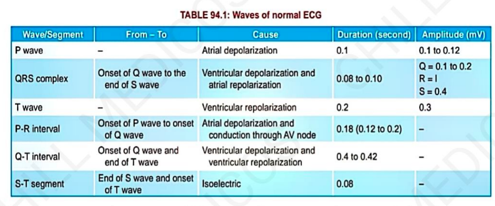

# ELECTROCARDIOGRAM (ECG)

> ### Headings
> 

* **Electrocardiography :** Technique by which electrical activities of the heart are studied.
* **Electrocardiograph :** Instrument (machine) by which electrical activities of the heart are recorded.
* **Electrocardiogram :** Record or graphical registration of electrical activities of the heart, which occur prior to the onset of mechanical activities.

---

### USES OF ECG

* Useful in determining and diagnosing:
  * a. Heart rate
  * b. Heart rhythm
  * c. Abnormal electrical conduction
  * d. Poor blood flow to heart muscle (Ischemia)
  * e. Heart attack (Myocardial infarction)
  * f. Coronary artery disease
  * g. Hypertrophy of heart chambers

---

## ECG LEADS

* A total of **12 leads** are used for recording the electrical activity of the heart.
* ECG is recorded by placing a series of electrodes on the surface of the body *(called ECG leads)*.
* **Einthoven's Triangle :** The heart is considered to be at the center of an imaginary equilateral triangle formed by connecting the roots of the **Right Arm (RA)**, **Left Arm (LA)**, and **Left Leg (LL)**.

> 

---

### CLASSIFICATION OF ECG LEADS

ECG leads are broadly classified into **2 categories**:
* a. Bipolar Leads (Standard Limb Leads)
* b. Unipolar Leads (Augmented Limb Leads & Chest Leads)

---

### 1. Bipolar Limb Leads (Standard Limb Leads)
* Both electrodes are **active recording electrodes**.

<table>
  <thead>
    <tr>
      <th align="left">Standard Lead</th>
      <th align="left">Negative Terminal (–)</th>
      <th align="left">Positive Terminal (+)</th>
    </tr>
  </thead>
  <tbody>
    <tr>
      <td><b>Lead I</b></td>
      <td>Right Arm (RA)</td>
      <td>Left Arm (LA)</td>
    </tr>
    <tr>
      <td><b>Lead II</b></td>
      <td>Right Arm (RA)</td>
      <td>Left Leg (LL)</td>
    </tr>
    <tr>
      <td><b>Lead III</b></td>
      <td>Left Arm (LA)</td>
      <td>Left Leg (LL)</td>
    </tr>
  </tbody>
</table>

---

### 2. Unipolar Leads
* Consist of one **active electrode (+ve)** and one **indifferent electrode** *(composite negative electrode)*.

#### A. Unipolar Limb Leads (Augmented Voltage Leads):
* a. **aVR :** Active electrode on **Right Arm**
* b. **aVL :** Active electrode on **Left Arm**
* c. **aVF :** Active electrode on **Left Leg (Foot)**

#### B. Unipolar Chest Leads (Precordial 'V' Leads):
* a. **$\text{V}_1$ :** Right 4ᵗʰ intercostal space at right sternal margin
* b. **$\text{V}_2$ :** Left 4ᵗʰ intercostal space at left sternal margin
* c. **$\text{V}_3$ :** Midpoint between $\text{V}_2$ and $\text{V}_4$
* d. **$\text{V}_4$ :** Left 5ᵗʰ intercostal space on midclavicular line
* e. **$\text{V}_5$ :** Left 5ᵗʰ intercostal space on anterior axillary line
* f. **$\text{V}_6$ :** Left 5ᵗʰ intercostal space on midaxillary line

> 

---

## WAVES AND COMPLEXES OF NORMAL ECG

> 
> 

*(Waves recorded in Limb Lead II are considered typical)*

<table>
  <thead>
    <tr>
      <th align="left">Wave / Complex</th>
      <th align="left">Physiological Event</th>
      <th align="left">Clinical Significance / Pathological Changes</th>
    </tr>
  </thead>
  <tbody>
    <tr>
      <td><b>P-Wave</b> <i>(Atrial Complex)</i></td>
      <td>Produced by <b>Atrial Depolarization</b></td>
      <td>
        • <b>Tall P-wave:</b> Right Atrial Hypertrophy 
        • <b>Small / Absent P-wave:</b> Hyperkalemia 
        • <b>Inverted P-wave:</b> Sinoatrial (SA) Block
      </td>
    </tr>
    <tr>
      <td><b>QRS Complex</b> <i>(Ventricular Depolarization)</i></td>
      <td>
        • <b>Q-wave:</b> Depolarization of basal portion of interventricular septum (IVS) 
        • <b>R-wave:</b> Depolarization of apical portion of IVS & ventricles 
        • <b>S-wave:</b> Depolarization of basal portion of ventricular muscle
      </td>
      <td>
        • <b>Prolonged QRS duration:</b> 
        &nbsp;&nbsp;– Hyperkalemia 
        &nbsp;&nbsp;– Bundle branch block (BBB)
      </td>
    </tr>
    <tr>
      <td><b>T-Wave</b> <i>(Ventricular Repolarization)</i></td>
      <td>Represents <b>Ventricular Repolarization</b></td>
      <td>
        • <b>Tall & Broad T-wave:</b> Acute Myocardial Ischemia 
        • <b>Tall & Tented (Peaked) T-wave:</b> Hyperkalemia 
        • <b>Small, Flat, or Inverted T-wave:</b> Hypokalemia
      </td>
    </tr>
    <tr>
      <td><b>U-Wave</b> <i>(Inconstant)</i></td>
      <td>Produced due to <b>repolarization of papillary muscles</b> <i>(not always seen)</i></td>
      <td>
        • <b>Prominent U-wave:</b> Hypercalcemia, Hypokalemia 
        • <b>Inverted U-wave:</b> Myocardial Ischemia
      </td>
    </tr>
  </tbody>
</table>

> **Note :** There is **no separate wave representing atrial repolarization** because it coincides with and is obscured by the much larger **QRS complex**.

---

## INTERVALS AND SEGMENTS

<table>
  <thead>
    <tr>
      <th align="left">Interval / Segment</th>
      <th align="left">Definition / Normal Features</th>
      <th align="left">Clinical Significance</th>
    </tr>
  </thead>
  <tbody>
    <tr>
      <td><b>1. P-R Interval</b></td>
      <td>Time taken from the start of atrial depolarization to the start of ventricular depolarization</td>
      <td>
        • <b>Prolonged P-R Interval:</b> Bradycardia, 1ˢᵗ Degree Heart Block 
        • <b>Shortened P-R Interval:</b> Tachycardia (or Wolff-Parkinson-White syndrome)
      </td>
    </tr>
    <tr>
      <td><b>2. Q-T Interval</b></td>
      <td>Represents electrical depolarization and repolarization of ventricles (ventricular systole)</td>
      <td>
        • <b>Prolonged Q-T Interval:</b> Myocardial Infarction, Myocarditis, Hypocalcemia 
        • <b>Shortened Q-T Interval:</b> Hypercalcemia
      </td>
    </tr>
    <tr>
      <td><b>3. S-T Segment</b></td>
      <td>Isoelectric line from end of S-wave to beginning of T-wave (plateau phase of ventricular AP)</td>
      <td>
        • <b>ST Elevation:</b> Acute Pericarditis, Acute Anterior / Inferior Myocardial Infarction (STEMI) 
        • <b>ST Depression:</b> Acute Myocardial Ischemia, Posterior MI, Hypokalemia
      </td>
    </tr>
    <tr>
      <td><b>4. R-R Interval</b></td>
      <td>
        • Time interval between two consecutive R-waves 
        • Normal duration = <b>0.8 seconds</b> 
        • Signifies the duration of <b>one complete cardiac cycle</b>
      </td>
      <td>
        • Used to calculate <b>Heart Rate</b>: $\text{HR} = \frac{60}{\text{R-R interval in seconds}}$ 
        • Evaluates <b>Heart Rate Variability (HRV)</b> and rhythm regularity
      </td>
    </tr>
  </tbody>
</table>
