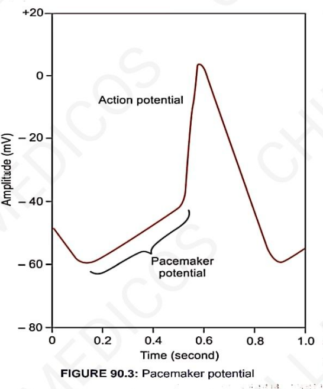
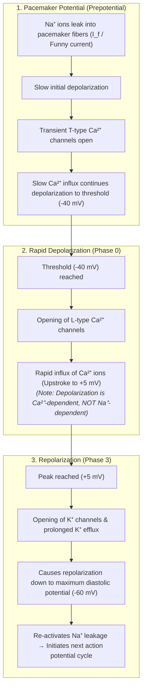

# ELECTRICAL POTENTIAL IN SA NODE (PACEMAKER POTENTIAL)

* **Resting Membrane Potential / Pacemaker Potential :—**
  * Pacemaker potential is an **unstable resting membrane potential** (also called **prepotential**).
  * In the SA node, **each impulse automatically triggers the next impulse**.
  * **RMP in SA Node :** $-55\text{ to } -60\text{ mV}$ *(compared to $-85\text{ to } -95\text{ mV}$ in ordinary cardiac muscle fibers)*.

* **Action Potential Characteristics :—**
  * Depolarization starts slowly until the **threshold level of $-40\text{ mV}$** is reached.
  * Rapid upstroke peaks up to **$+5\text{ mV}$ (rapid depolarization)**, followed by rapid repolarization.

> 

---

## IONIC BASIS OF ELECTRICAL ACTIVITY IN PACEMAKER

