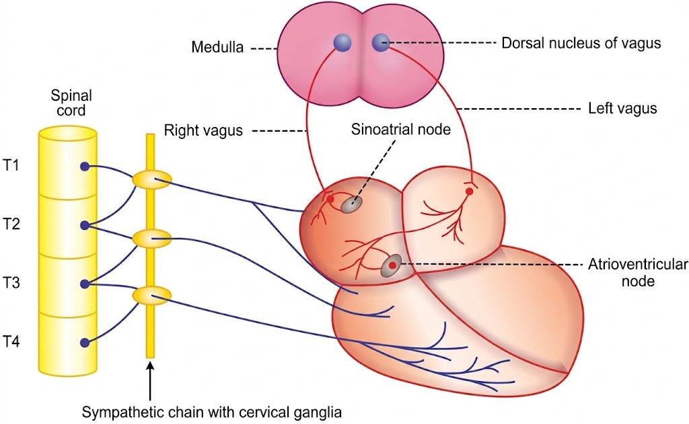
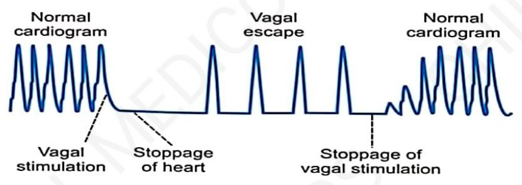

# Heart Rate & Its Regulation
### Headings 
* Definition
* Increase and Decrease in HR
* Regulation 
  * Vasomotor Centre
    * Vasoconstrictor Area
    * Vasodilator Area 
    * Sensory Area
  * Motor nerve fibres to heart (EFFERENT)
    * Parasympathetic Nerve Fibres
    * Sympathetic Nerve Fibres
  * Sensory nerver fibres from heart (AFFERENT)

## Definition

## Increase and Decrease in HR
### Tachycardia
 * ↑se in HR above 100/min

| Type          | Conditions                                                                       |
| ------------- | -------------------------------------------------------------------------------- |
| Physiological | 1. Childhood 2. Exercise 3. Pregnancy 4. Emotional conditions (anxiety) |
| Pathological  | 1. Fever 2. Anemia 3. Hypoxia 4. Hyperthyroidism 5. Cardiomyopathy   |

### Bradycardia
 * ↓se in HR below 100/min

| Type          | Conditions                                                                                                       |
| ------------- | ---------------------------------------------------------------------------------------------------------------- |
| Physiological | 1. Sleep 2. Athletes                                                                                          |
| Pathological  | 1. Heart attack 2. Congenital heart disease 3. Obstructive jaundice 4. Hypothermia 5. Hypothyroidism |
| Drug-induced  | 1. Beta blockers 2. Channel blockers 3. Anti-arrhythmic drugs                                              |

## Regulation 
 * HR is regulated by nervous mechanism, consists of 3 components:
   * Vasomotor centra
   * Motor nerve fibres to heart (EFFERENT)
   * Sensory nerve fibres from heart (AFFERENT)

### Vasomotor Center

- **Same center in brain**, which regulates blood pressure, also called **cardiac center**.
- **Bilaterally situated** in the **reticular formation** of:
  - **Medulla oblongata**
  - **Lower part of pons**

#### Areas of Vasomotor Center

1. **Vasoconstrictor area**
2. **Vasodilator area**
3. **Sensory area**

##### **1. Vasoconstrictor Area (Cardioaccelerator Center)**

- **Situation**
  - In the **reticular formation of medulla**, in the **floor of the IV ventricle**.
  - Forms the **lateral portion** of the vasomotor center.
  - Also called **pressor area** or **cardioaccelerator center**.

- **Function**
  - ↑ **Heart rate (HR)** by sending **accelerator impulses** to the heart.
  - Through **sympathetic nerves**.
  - Causes **constriction of blood vessels**.

- **Control**
  - Under the control of **hypothalamus** and **cerebral cortex**.

---

##### **2. Vasodilator Area (Cardioinhibitory Center)**

- **Situation**
  - In the **reticular formation of medulla**, in the **floor of the IV ventricle**.
  - Forms the **medial portion** of the vasomotor center.
  - Also called **depressor area** or **cardioinhibitory center**.

- **Function**
  - ↓ **Heart rate (HR)** by sending **inhibitory impulses** to the heart.
  - Through the **vagus nerve**.
  - Causes **dilation of blood vessels**.

- **Control**
  - Under **cerebral cortex** and **hypothalamus**.
  - Also controlled by impulses from **baroreceptors, chemoreceptors, and other sensory impulses** via **afferent nerves**.

---

##### **3. Sensory Area**

- **Situation**
  - In the **posterior part of the vasomotor center**.
  - Lies in the **nucleus of tractus solitarius** in the **medulla and pons**.

- **Function**
  - Receives **sensory impulses** via:
    - **Glossopharyngeal nerve**
    - **Vagus nerve**
  - From the periphery, mainly from **baroreceptors**.
  - Controls the **vasoconstrictor** and **vasodilator areas**.

## Motor nerve fibres to heart (EFFERENT)
 * Heart receives efferent fibres from both the divisions of ANS.
 * 
### **Parasympathetic Nerve Fibers**

* Are the **cardioinhibitory nerve fibers**.
* Reach the heart through the **cardiac branch of vagus nerve**.

##### **Origin**

* From the **dorsal nucleus of vagus**.
* Situated in the **floor of the 4th ventricle in medulla**, close to the **vasodilator area**.

##### **Distribution**

* **Preganglionic parasympathetic nerve fibers** (dorsal nucleus of vagus)
  ↓
* Reach the **heart** through the **cardiac branch of vagus**
  ↓
* Terminate on **postganglionic neurons**
  ↓
* Innervate **heart muscles**.

> **Note:** Ventricles do not receive vagus nerve supply.

##### **Function**

* **Vagus nerve is cardioinhibitory in function** and carries **inhibitory impulses from the vasodilator area to the heart**.

* ###### **Vagal Tone**

* The **continuous stream of inhibitory impulses from the vasodilator area**
  ↓

* Via the **vagus nerve**
  ↓

* Impulses reach the **heart** & exert an **inhibitory effect on heart**
  ↓

* **Heart rate is inversely proportional to vagal tone.**

* **Vagal tone dominates the sympathetic tone.**

* Also called **cardioinhibitory tone** or **parasympathetic tone**.

 ###### **Effects of Stimulation of Vagus Nerve**

###### **1. Right Vagus Nerve → Vagal Escape**

* **Stimulation of right vagus** with **weak stimulus**:

  * Depression of heart action.
  * Heart fails to continue its normal contraction.

* **Stimulation with stronger stimulus**:

  * Causes **stoppage of heart** due to inhibition of **SA node**.
  * **Ventricles continue to beat** due to **ventricular escape rhythm**.
  * This is called **vagal escape**.

###### **Cause for Vagal Escape**

* **Ventricles are not supplied by vagus nerve**.
* Hence, they are **not affected by vagal stimulation**.
* Ventricles continue to contract due to **sympathetic impulses**.

---

###### **2. Left Vagus Nerve → Heart Block**

* **Left vagus mainly supplies the AV node.**
* Stimulation of **left vagus** causes **partial heart block**.
* Continued stimulation causes **complete heart block**.
* **Atria continue to contract**, while **ventricular contraction stops**.
* Stoppage of ventricular contraction (**complete heart block**) is followed by **ventricular escape rhythm**.
* Ventricular escape rhythm is maintained by **sympathetic impulses**.

> **Vagus nerve supplies the heart by stimulating the inhibitory substance (Ach).**
### **SYMPATHETIC NERVE FIBERS**

#### **Origin**

* From the **lateral horn of T1–T4 thoracic spinal cord**.
* Preganglionic fibers enter the **sympathetic chain** through **white rami communicantes**.

#### **Preganglionic Fibers**

* Preganglionic fibers from **T1–T4**:

  * Ascend in the sympathetic chain.
  * Synapse in the **superior, middle and inferior cervical sympathetic ganglia**.

#### **Postganglionic Fibers**

Postganglionic sympathetic fibers arise from:

1. **Superior cervical sympathetic nerves** — innervate the **head and neck**.
2. **Middle cervical sympathetic nerves** — supply the **upper limb**.
3. **Inferior cervical sympathetic nerves** — supply the **heart and upper limb**.

---

#### **FUNCTION**

##### **Cardiovascular Function**

* **Increase heart rate** and **vasoconstriction**.
* Impulses arise from the **spinal cord** and pass through sympathetic nerves.

##### **Sympathetic Tone**

* Continuous stream of impulses produced by the **vasomotor area**.
* These impulses pass through **sympathetic nerves** and **accelerate heart rate**.
* When there is a **decrease in sympathetic tone**, there is **vasodilatation** and a **fall in heart rate**.

> **Stimulation of sympathetic nerves → increase in heart rate + vasoconstriction.**

## SENSORY (AFFERENT) NERVE FIBERS

* Pass through the **inferior cervical sympathetic nerve**.
* Carry sensations of **stretch and pain** from the **heart**.
* These sensations are carried to the **brain via the spinal cord**.
