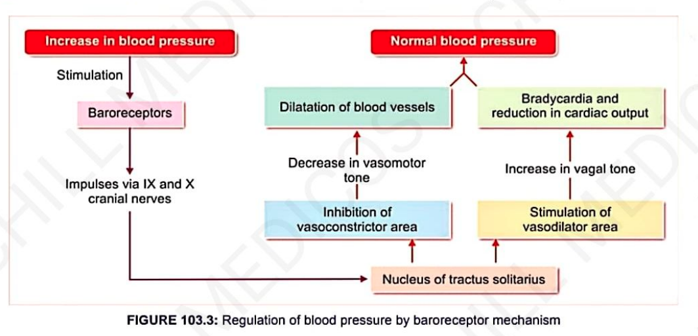

# Nervous Mechanism — Short-Term Regulation
### Headings 
- **Introduction**
  - **Vasomotor Centre**
    - **1. Vasoconstrictor Area**
    - **2. Vasodilator Area**
    - **3. Sensory Area**
  - **Vasoconstrictor Fibers**
    - **Vasomotor Tone**
  - **Vasodilator Fibers**
    - **1. Parasympathetic Vasodilator Fibers**
    - **2. Sympathetic Vasodilator Fibers**
      - **Pathway**
    - **3. Antidromic Vasodilator Fibers**

- **Mechanism of Action of Vasomotor Centre**
  - **1. Baroreceptor Mechanism**
    - **Situation**
    - **Functions**
      - **When BP increases**
      - **When BP decreases**
  - **2. Chemoreceptor Mechanism**
    - **Situation**
    - **Function**
  - **3. Higher Centers**
    - **a. Cerebral Cortex**
    - **b. Hypothalamus**
  - **4. Respiratory Centers**

## Introduction
* **Quick in action**
* Operates through the **nervous system**
* Involves:
  1. **Vasomotor Centre**
  2. **Vasoconstrictor fibres**
  3. **Vasodilator fibres**

### Vasomotor Centre

* Located in the **reticular formation of the medulla and lower pons**.
* The vasomotor centre consists of **4 areas**:
  * Vasoconstrictor Area
  * Vasodilator Area
  * Sensory Area
#### 1. Vasoconstrictor Area

* Also called the **pressor area**.
* Produces **generalized vasoconstriction**.
* Vasoconstrictor nerves are **sympathetic** in origin.
* There is a **continuous discharge of impulses** from this area.
* Stimulation causes:

  * **Vasoconstriction**
  * **Increase in arterial blood pressure**

#### 2. Vasodilator Area

* Also called the **depressor area**.
* Sends **inhibitory impulses to the vasoconstrictor centre**.
* Causes **vasodilation**.
* Vasodilation leads to a **decrease in arterial blood pressure**.

#### 3. Sensory Area

* The sensory area is located in the **nucleus of the tractus solitarius (NTS)** in the **posterolateral medulla**.
* It receives **sensory impulses through the glossopharyngeal and vagus nerves** from:

  * **Baroreceptors**
  * **Chemoreceptors**
* The sensory area controls the **vasoconstrictor and vasodilator areas**.

### Vasoconstrictor Fibers

* Vasoconstrictor fibers belong to the **sympathetic division of the autonomic nervous system**.
* They arise from the **thoracic and lumbar segments of the spinal cord**.
* These fibers are mainly **adrenergic**.
* They secrete **noradrenaline (norepinephrine)** as the neurotransmitter.
* Noradrenaline produces **vasoconstriction** in most blood vessels.

#### Vasomotor Tone

* **Vasomotor tone** is the **continuous discharge of impulses from the vasomotor centre** to the blood vessels through sympathetic fibers.
* Blood pressure is **directly proportional to vasomotor tone**.
* **Increase in vasomotor tone → Increase in blood pressure**
* **Decrease in vasomotor tone → Decrease in blood pressure**

### Vasodilator Fibers

There are **3 types** of vasodilator fibers:

1. **Parasympathetic vasodilator fibers**
2. **Sympathetic vasodilator fibers**
3. **Antidromic vasodilator fibers**

#### 1. Parasympathetic Vasodilator Fibers

* Cause **dilatation of blood vessels** by releasing **acetylcholine (ACh)**.

#### 2. Sympathetic Vasodilator Fibers

* These fibers cause **vasodilation in certain areas** by secreting **acetylcholine**.
* These fibers are called:

  * **Sympathetic vasodilator fibers**
  * **Sympathetic cholinergic fibers**

##### Pathway

* Signals for vasodilator fibers are generated in the **cerebral cortex**.
* They pass to the **lateral grey horn of the spinal cord** via the:

  * **Hypothalamus**
  * **Midbrain**
  * **Medulla**
* The impulses activate **preganglionic sympathetic fibers**.
* These, in turn, activate **postganglionic fibers**.
* The postganglionic fibers cause **dilatation of blood vessels** by secreting **acetylcholine**.

#### 3. Antidromic Vasodilator Fibers

* Normally, impulses produced by **cutaneous receptors (pain receptors)** pass through **sensory nerve fibers**.
* Some impulses pass through **other branches** and reach the **blood vessel**.
* The impulse then **dilates the blood vessel**.
* This is called the **antidromic or axon reflex**.
* These fibers are called **antidromic vasodilator fibers**.

### Mechanism of Action of Vasomotor Centre 
#### 1. Baroreceptor Mechanism
* Receptors give response to change in blood pressure.
* Also called pressoreceptors.
##### Situation
* Situated in carotid sinus and wall of aorta.
##### Functions
###### **When BP increases**

###### **When BP decreases**

- **BP ↓** due to occlusion of common carotid arteries  
  ↓  
- **↓se pressure in carotid sinus**  
  ↓  
- **Inactivation of baroreceptors**  
  ↓  
- **No inhibition of vasoconstrictor centre / excitation of vasodilator centre**  
  ↓  
- **BP rises**

- **Carotid baroreceptors** (50–200 mmHg)
- **Aortic baroreceptors** (100–200 mmHg)
- **Baroreceptor mechanism acts against rise in arterial blood pressure**
- **Baroreceptor pressure buffer mechanism**
- Nerves from baroreceptors called **buffer nerves**

#### 2. Chemoreceptor Mechanism

- Receptor response to change in **chemical constituents of blood**.

##### Situation

- Situated in **carotid body** and **aortic body**.

##### Function

- When **BP ↓**, blood flow to chemoreceptors ↓  
  ↓  
- **↓ O₂, ↑ CO₂, ↑ H⁺ ion**  
  ↓  
- **Stimulate chemoreceptors**  
  ↓  
- Send impulse to stimulate **vasoconstrictor centre**  
  ↓  
- **BP rises, blood flow ↑**

#### 3. Higher Centers

##### a. Cerebral Cortex

- **Area 13** concerned with **emotional reactions**  
  ↓  
- Send impulse to **vasomotor centre**  
  ↓  
- **Vasomotor tone ↑ & pressure ↑**

##### b. Hypothalamus

- **Stimulation of posterior & lateral nuclei**  
  ↓  
- **Vasoconstriction & ↑ in BP**

- **Stimulation of preoptic area**  
  ↓  
- **Vasodilation and ↓ in BP**

#### 4. Respiratory Centers

1. **Impulse from respiratory centers towards vasomotor center at different phases of respiratory cycle**
2. **Pressure changes in thoracic cavity**
   ↓
   **Alteration of venous return & cardiac output**
