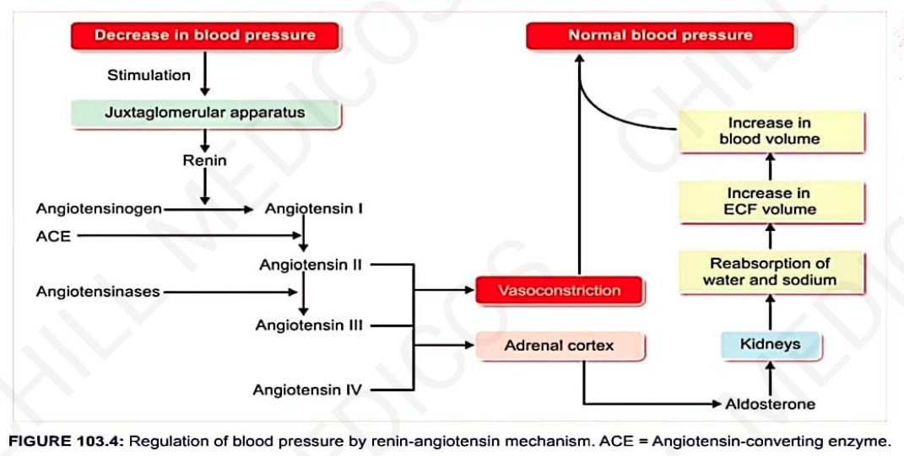

# Renal Regulation of BP (LONG-TERM REGULATION)

## Introduction
- **Kidney regulates BP by two ways** —
  1. By regulation of ECF volume
  2. By Renin-Angiotensin Mechanism

## By regulation of ECF volume 

When BP rises, kidneys excrete large amounts of water & salt  
↓  
By means of **pressure diuresis & pressure natriuresis**  
↓  
**Excretion of large quantity of water in urine**

- Even a slight rise in BP doubles the water excretion.
- **Pressure natriuresis** is excretion of large quantity of Na⁺ in urine.

↓  
Because of diuresis and natriuresis  
↓  
**↓ ECF volume and blood volume**  
↓  
**BP back to normal level**

- When BP rises, reabsorption of water from renal tubule is less  
  ↓  
  **↓ ECF volume, blood volume and cardiac output**  
  ↓  
  Result in restoration of BP.

## By Renin-Angiotensin Mechanism
* 
> **Angiotensins III and IV** also **↑se BP** by **stimulating Adrenal Cortex** to **release Aldosterone**

