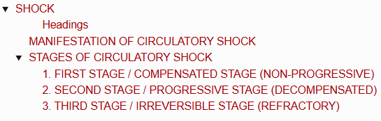
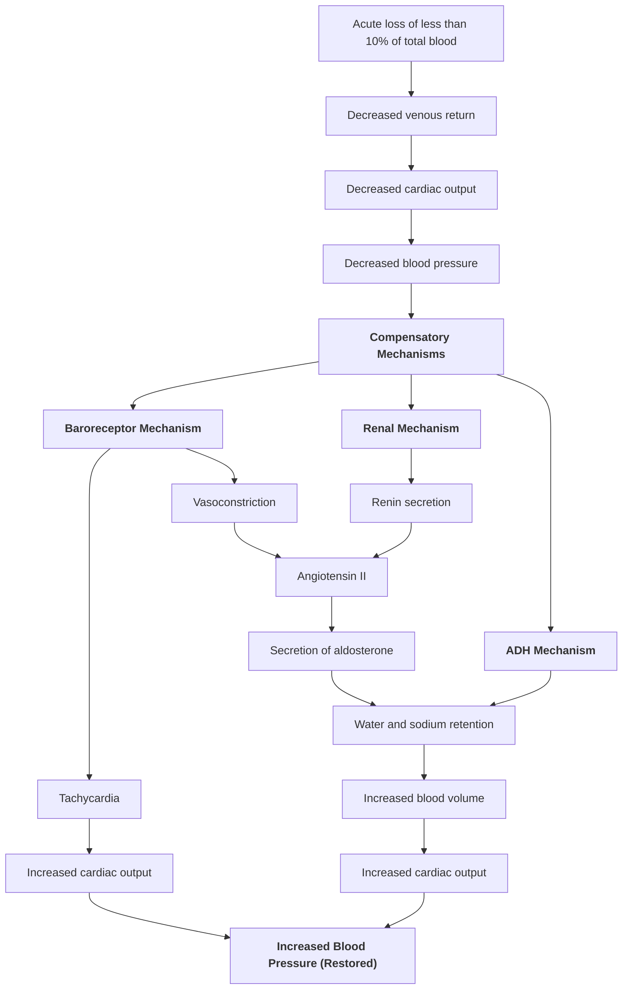
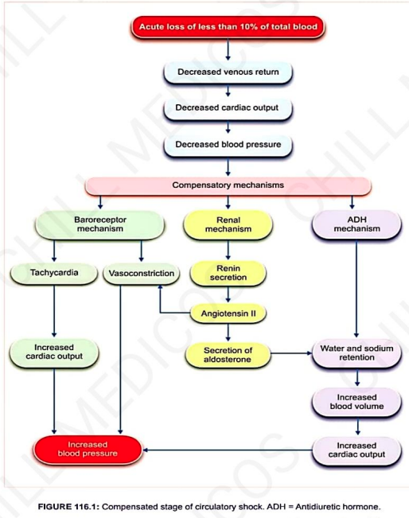
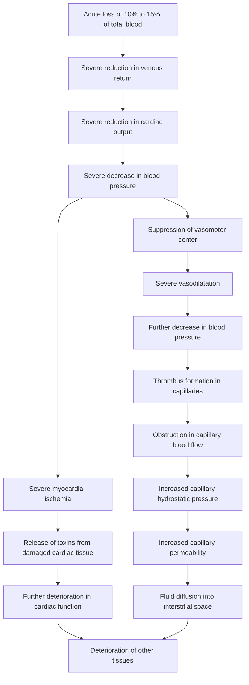
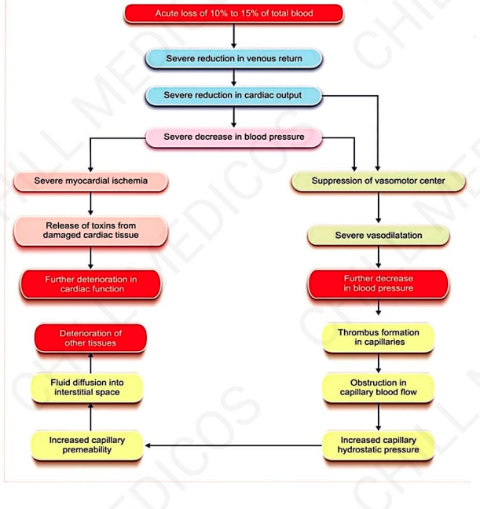
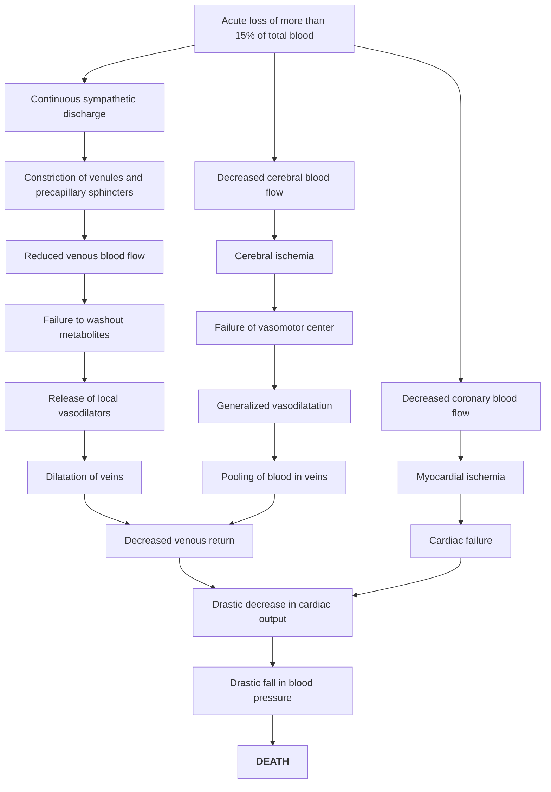
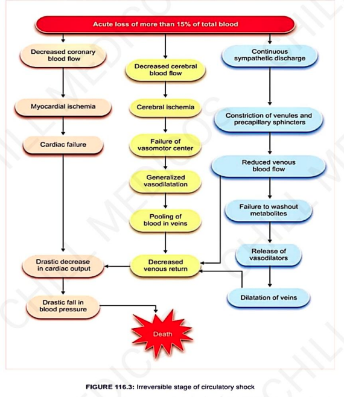

# SHOCK

> ### Headings
> 

* **Shock :** Refers to depression or suppression of body functions produced by any disorder.
* **Circulatory Shock :** Refers to shock developed by **inadequate blood flow throughout the body** *(a life-threatening condition)*.

---

## MANIFESTATION OF CIRCULATORY SHOCK

$$\text{Insufficient blood flow to tissues (particularly brain)}$$
$$\downarrow$$
$$\text{Due to severe reduction in Cardiac Output (CO)}$$

* a. **$\downarrow$ Cardiac Output (CO)** $\longrightarrow$ Arterial Blood Pressure (BP) drops down.
* b. **Low BP** $\longrightarrow$ Produces **reflex tachycardia** and **reflex vasoconstriction**.
* c. **Tachycardia** $\longrightarrow \downarrow$ Decreases diastolic period:
  $$\downarrow \text{ Diastolic Filling} \longrightarrow \downarrow \text{ Stroke Volume (SV) \& Systolic BP} \longrightarrow \downarrow \text{ Pulse Pressure } (< 20\text{ mmHg})$$
* d. **$\downarrow$ Velocity of blood flow** $\longrightarrow$ Causes **stagnant hypoxia**.
* e. **Skin becomes pale and cold** due to intense vasoconstriction.
* f. **Cyanosis develops** with worsening hypoxia *(especially visible on ear lobes and fingertips)*.
* g. **$\downarrow$ GFR and urinary output** due to profound fall in renal perfusion pressure.
* h. **Metabolic activities of myocardium accelerate** due to $\downarrow$ blood flow and $\uparrow$ heart rate:
  $$\text{Anaerobic glycolysis} \longrightarrow \text{Large amount of lactic acid formed} \longrightarrow \textbf{Metabolic Acidosis}$$

---

## STAGES OF CIRCULATORY SHOCK

Circulatory shock occurs in **3 distinct stages**:
* 1. **1ˢᵗ Stage / Compensated Stage** *(Non-progressive)*
* 2. **2ⁿᵈ Stage / Progressive Stage** *(Decompensated)*
* 3. **3ʳᵈ Stage / Irreversible Stage** *(Refractory)*

---

### 1. FIRST STAGE / COMPENSATED STAGE (NON-PROGRESSIVE)

* **Features :** Regulated by **negative (–ve) feedback control mechanisms**; corrects blood loss of $< 10\%$ of total blood volume.
* **Compensatory Mechanisms Involved :—**
  * a. **Baroreceptor Mechanism :** Initiates strong sympathetic stimulation $\longrightarrow$ Tachycardia, vasoconstriction $\longrightarrow \uparrow$ BP.
  * b. **Renin-Angiotensin-Aldosterone (Renal) Mechanism :** Restores blood volume through vasoconstriction and $\text{Na}^+$ / water retention.
  * c. **Antidiuretic Hormone (ADH) Mechanism :** Potent vasoconstriction and free water retention.

> 

---

### 2. SECOND STAGE / PROGRESSIVE STAGE (DECOMPENSATED)

* **Features :** Occurs with **$10\% - 15\%$ acute loss of total blood volume**.
* A **positive (+ve) feedback vicious cycle** develops, making normal regulatory mechanisms inadequate to compensate.
* Bacterial toxins (**Endotoxins**) worsen myocardial depression.

> 

---

### 3. THIRD STAGE / IRREVERSIBLE STAGE (REFRACTORY)

* **Features :** Occurs with **acute loss of $> 15\%$ of total blood volume**.
* Also called the **Refractory Stage**.
* Leads inevitably to **death** due to complete failure of vital organ perfusion, severe cerebral ischemia, and myocardial collapse.

> 