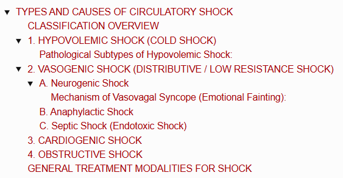
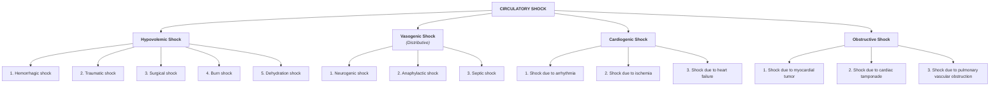
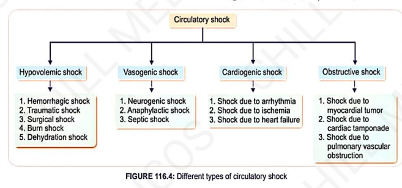
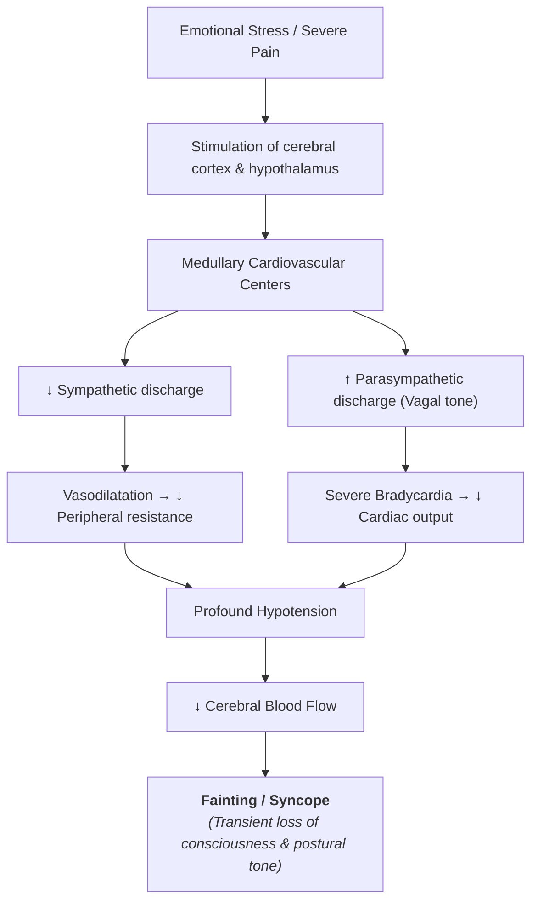
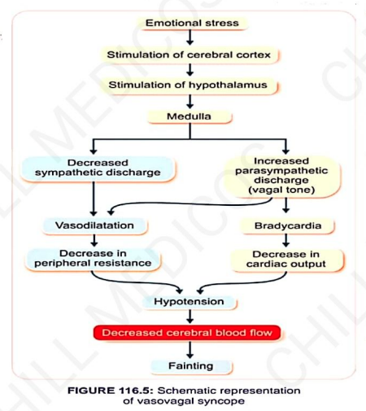

# TYPES AND CAUSES OF CIRCULATORY SHOCK

> ### Headings
> 

* Circulatory shock is classified into **4 major types**:
  * a. **Hypovolemic Shock** (Due to $\downarrow$ decreased blood volume)
  * b. **Vasogenic / Distributive Shock** (Due to $\uparrow$ increased vascular capacity)
  * c. **Cardiogenic Shock** (Due to cardiac disease)
  * d. **Obstructive Shock** (Due to obstruction of blood flow)

---

## CLASSIFICATION OVERVIEW

> 

---

## 1. HYPOVOLEMIC SHOCK (COLD SHOCK)

* **Definition :** Shock caused by a critical reduction in blood volume.
* **Threshold :** Occurs with an acute loss of at least **$10\% - 15\%$ of total blood volume**.
*(Loss $< 10\%$ does not cause shock due to immediate compensatory mechanisms)*.
* **Key Manifestations :—**
* $\downarrow$ Cardiac output
* Low blood pressure (Hypotension)
* Thin, thready, rapid pulse
* Pale, cold, clammy skin
* $\uparrow$ Increase in respiratory rate (Tachypnea)

---

### Pathological Subtypes of Hypovolemic Shock:

* **a. Hemorrhagic Shock :—**
* **Acute Hemorrhage :** Massive blood loss in accidents/trauma.
* **Chronic Hemorrhage :** Slow, persistent blood loss *(e.g., bleeding peptic ulcers)*.

* **b. Traumatic Shock :—**
* Caused by severe injury or wounds from external force (battlefields, major road accidents).
* **Crush Syndrome :** Acute renal failure developing when a limb is crushed/compressed; myoglobin and toxic metabolites released from injured muscle damage renal tubular cells, leading to tubular degeneration.
* **Reperfusion Injury :** Tissue dysfunction and cellular injury caused when blood supply returns to tissue after a period of ischemia.

* **c. Surgical Shock :—**
* Due to internal/external blood loss and fluid loss/dehydration during or after major operative procedures.

* **d. Burn Shock :—**

$$\text{Extensive burn injury} \longrightarrow \text{Massive loss of plasma through burnt surface}$$

$$\downarrow$$

$$\downarrow \text{ ECF volume \& plasma volume} \longrightarrow \textbf{Hemoconcentration} \longrightarrow \downarrow \text{ Cerebral blood flow}$$

* **e. Dehydration Shock :—**
* Caused by severe decrease in total body water content *(e.g., cholera, severe vomiting, prolonged diarrhea)*.

---

## 2. VASOGENIC SHOCK (DISTRIBUTIVE / LOW RESISTANCE SHOCK)

* **Definition :** Inadequate tissue perfusion caused by widespread, abnormal **vasodilation** that creates an enormous increase in the vascular bed capacity relative to normal blood volume.

---

### A. Neurogenic Shock

* Extensive vasodilation caused by the **sudden loss of vasomotor tone**.
* **Etiology :** Brain ischemia, general anesthesia, spinal anesthesia, extreme emotional trauma.

#### Mechanism of Vasovagal Syncope (Emotional Fainting):

> 

---

### B. Anaphylactic Shock

* Severe, life-threatening **systemic allergic reaction** triggered by exposure to an antigen/foreign protein to which the individual was previously sensitized *(massive release of histamine and leukotrienes)*.

---

### C. Septic Shock (Endotoxic Shock)

* Severe pathological state characterized by the presence of pathogenic microorganisms or their toxins (**endotoxins**) in blood or tissues (*blood poisoning*).
* **Common Causes :** Peritoneal infections, severe bacterial skin infections *(Staphylococcus / Streptococcus)*.
* *Has features overlapping vasogenic, cardiogenic, and hypovolemic shock.*

---

## 3. CARDIOGENIC SHOCK

* Shock originating from **primary intrinsic pump failure** of the heart.
* **Etiology :—**
* a. Congestive heart failure / advanced cardiac disease
* b. Severe arrhythmias (leading to $\downarrow$ cardiac output)
* c. Depressed myocardial contractility due to acute ischemia / infarction

---

## 4. OBSTRUCTIVE SHOCK

* Shock caused by physical or mechanical **obstruction to blood flow** through the central cardiovascular circuit.
* **Etiology :—**
* a. Intracardiac tumors *(e.g., atrial myxoma)*
* b. **Cardiac Tamponade** *(compression of heart by fluid in pericardial sac)*
* c. **Pulmonary Embolism** *(massive obstruction of pulmonary vessels)*

---

## GENERAL TREATMENT MODALITIES FOR SHOCK

* a. **Blood Transfusion :** Essential in acute hemorrhagic shock.
* b. **Plasma Transfusion :** Indicated in burn shock and severe hypoproteinemia.
* c. **Administration of Plasma Substitutes :** Dextran, gelatin solutions, or balanced crystalloids/colloids.
* d. **Sympathomimetic Drugs :** Inotropic agents and vasopressors (e.g., Norepinephrine, Dopamine, Epinephrine) to restore vascular tone and cardiac contractility.
* e. **Administration of Glucocorticoids :** High-dose steroids to stabilize lysosomal membranes, combat endotoxins, and reduce capillary permeability.
* f. **Oxygen Therapy :** Corrects systemic and tissue hypoxia.
* g. **Postural Adjustment :** Placing the patient in Trendelenburg position (head low, legs elevated) to improve venous return to the brain and heart.
