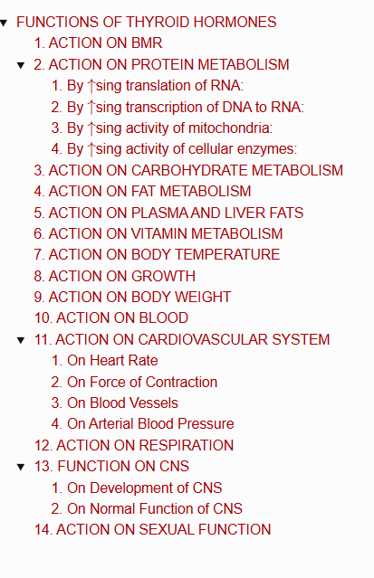

# FUNCTIONS OF THYROID HORMONES

> 

* **TH have 2 major effects on body:**
  1. To $\uparrow$se BMR
  2. To stimulate growth in children.

---

## 1. ACTION ON BMR

* **Thyroxine $\uparrow$ses BMR** in body tissues **except** brain, retina, spleen, testes, and lungs.
* **$\uparrow$ses BMR** by $\uparrow$sing oxygen consumption of tissues.
* **Calorigenic Action:** It is a calorigenic action ($\uparrow$ses BMR).

---

## 2. ACTION ON PROTEIN METABOLISM

* **$\uparrow$ses synthesis of protein in cells:**

### 1. By $\uparrow$sing translation of RNA:
$$\uparrow\text{ses translation of RNA}$$
$$\downarrow$$
$$\text{Ribosomes activated}$$
$$\downarrow$$
$$\text{More proteins synthesize}$$

### 2. By $\uparrow$sing transcription of DNA to RNA:
$$\text{TH stimulates transcription of DNA to RNA}$$
$$\downarrow$$
$$\text{Accelerates synthesis of proteins}$$

### 3. By $\uparrow$sing activity of mitochondria:
$$\text{TH } \uparrow\text{ses activity of mitochondria in most cells}$$
$$\downarrow$$
$$\uparrow\text{se production of ATP}$$
$$\downarrow$$
$$\text{Energy for cellular activities}$$

### 4. By $\uparrow$sing activity of cellular enzymes:
* **TH $\uparrow$ses activity of intracellular enzymes** such as $\alpha$-glycerophosphate dehydrogenase and oxidative enzymes.
* **These enzymes accelerate metabolism** of proteins & carbohydrates.

---

## 3. ACTION ON CARBOHYDRATE METABOLISM

1. **Thyroxine $\uparrow$ses absorption** of glucose from GI tract.
2. **Enhance glucose uptake** by cells *(accelerating transport of glucose through the cell membrane)*.
3. **$\uparrow$ses breakdown of glycogen** into glucose.
4. **Accelerates gluconeogenesis**.

---

## 4. ACTION ON FAT METABOLISM

* **Thyroxine $\downarrow$ses fat storage** by mobilizing it from adipose tissues and fat deposits.
* **Thyroxine $\uparrow$ses** free fatty acid level in blood.

---

## 5. ACTION ON PLASMA AND LIVER FATS

* **Thyroxine $\downarrow$ses cholesterol, phospholipids and triglyceride levels** in plasma.
* **Atherosclerosis:** Hyposecretion of thyroxine.
* **Fatty liver:** Thyroxine $\uparrow$se deposition of fats in liver.

---

## 6. ACTION ON VITAMIN METABOLISM

* **Thyroxine $\uparrow$ses formation** of many enzymes.
* **Vitamins may be utilized** during formation of enzymes:
  * $\downarrow$
  * Vitamin deficiency possible during **hypersecretion of thyroxine**.

---

## 7. ACTION ON BODY TEMPERATURE

* **TH $\uparrow$ses heat production in body** *(by accelerating various cellular metabolic processes & $\uparrow$sing BMR)*:
  * $\downarrow$
  * Called **Thyroid Hormone-Induced Thermogenesis**.
* **Hypersecretion of thyroxine:**
  * Body temperature $\uparrow$ses greatly
  * $\downarrow$
  * Resulting in **excess sweating**.

---

## 8. ACTION ON GROWTH

* **$\uparrow$se in thyroxine secretion** accelerates the growth of body, especially in growing children.
* **Lack of thyroxine** arrests growth *(same time causes early closure of epiphysis)*.
* **Thyroxine promotes growth and development of brain** during fetal life and first few years of postnatal life:
  * $\downarrow$
  * Leads to **mental retardation** *(if deficient)*.

---

## 9. ACTION ON BODY WEIGHT

* **$\uparrow$se in thyroxine secretion $\downarrow$ses the body weight** & fat storage.
* **$\downarrow$se in thyroxine secretion $\uparrow$se the body weight** becoz of fat deposition.

---

## 10. ACTION ON BLOOD

* **Thyroxine accelerates erythropoietic activity** & $\uparrow$se blood volume.
* **Hyperthyroidism:** Polycythemia is common.

---

## 11. ACTION ON CARDIOVASCULAR SYSTEM

* **Thyroxine $\uparrow$ses overall activity of CVS.**

### 1. On Heart Rate
* **Thyroxine $\uparrow$ses HR.**
* Important clinical investigation for diagnosis of **hypothyroidism & hyperthyroidism**.

### 2. On Force of Contraction
* **Thyroxine $\uparrow$ses force of contraction.**
* In **hyperthyroidism / thyrotoxicosis**, heart may become weak due to excess activity & protein catabolism:
  * $\downarrow$
  * Patient dies of **cardiac decompensation**
  * $\downarrow$
  * Failure of heart to maintain adequate circulation associated with **dyspnea, venous engorgement & edema**.

### 3. On Blood Vessels
* **Thyroxine causes vasodilation** by $\uparrow$sing metabolic activities:
  * $\downarrow$
  * Large quantity of metabolites produced
  * $\downarrow$
  * Cause **vasodilation**.

### 4. On Arterial Blood Pressure
* **$\uparrow$se in rate and force of contraction of heart** & $\uparrow$se in blood volume and blood flow by influence of thyroxine:
  * $\text{Cardiac output } \uparrow\text{ses}$
  * $\downarrow$
  * $\text{Systolic pressure } \uparrow\text{ses} \quad \& \quad \text{Diastolic pressure } \downarrow\text{ses}$
  * $\downarrow$
  * **So, only the pulse pressure $\uparrow$ses.**

---

## 12. ACTION ON RESPIRATION

* **Thyroxine $\uparrow$ses rate & force of respiration.**
* **$\uparrow$sed metabolic rate:**
  * $\downarrow$
  * $\uparrow$ses demand for oxygen & formation of excess $\text{CO}_2$
  * $\downarrow$
  * Stimulate respiratory centers to $\uparrow$se rate & force of respiration.

---

## 13. FUNCTION ON CNS

> **Essential for development and maintenance of CNS.**

### 1. On Development of CNS
* **Thyroxine promotes development of brain** during fetal life.
* **Thyroid deficiency results in:**
  * Mental retardation
  * Defective myelination & abnormal development of synapses.

### 2. On Normal Function of CNS
* **Thyroxine also $\uparrow$ses blood flow to brain.**
* **Hypersecretion of thyroxine** *(excess stimulation of CNS)*:
  * $\downarrow$
  * Person has **extreme nervousness**
  * $\downarrow$
  * Develop **psychoneurotic problems** *(anxiety complexes, excess worries or paranoid thoughts)*.
* **Hyposecretion of thyroxine** leads to **lethargy and somnolence**.

---

## 14. ACTION ON SEXUAL FUNCTION

* **In men:**
  * Hypothyroidism leads to **complete loss of libido** *(sexual drive)*.
  * Hyperthyroidism leads to **impotence**.
* **In women:**
  * Hypothyroidism causes **menorrhagia & polymenorrhea**.
  * Hyperthyroidism leads to **oligomenorrhea & sometimes amenorrhea**.

