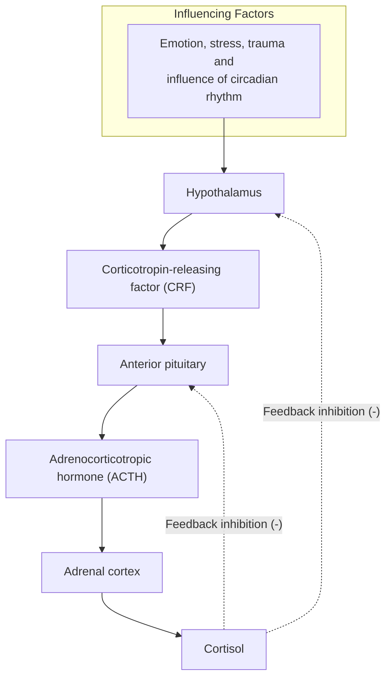
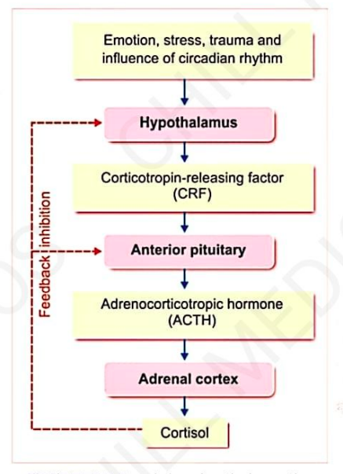

# GLUCOCORTICOIDS

* **Glucocorticoids act mainly on glucose metabolism.**
* **These are :—**
  * a. Cortisol
  * b. Corticosterone
  * c. Cortisone

---

### SOURCE OF SECRETION
* **Mainly by:** Zona fasciculata of adrenal cortex.
* **Small quantity by:** Zona reticularis.

---

### CHEMISTRY
* $\text{C}_{21}$ steroids having 21 carbon atoms.
* **Half-life:**
  * $70\text{ – }90\text{ minutes}$ *(Cortisol)*
  * $50\text{ minutes}$ *(Corticosterone)*

---

### DAILY OUTPUT
* **Plasma level :—**
  * a. Cortisol: $13.9\ \mu\text{g/dL}$
  * b. Corticosterone: $0.4\ \mu\text{g/dL}$
* **Daily output :—**
  * a. Cortisol: $10\ \mu\text{g}$
  * b. Corticosterone: $3\ \mu\text{g}$

---

### FUNCTIONS OF GLUCOCORTICOIDS

* **Cortisol / Hydrocortisone** is more potent and has **95% of glucocorticoid activity**, corticosterone (**4%**) & cortisone has **1%**.

> **LIFE-PROTECTING HORMONE :—**  
> Cortisol is a life-protecting hormone becoz it helps to withstand the stress and trauma in life.

---

## 1. ON CARBOHYDRATE METABOLISM

* **Glucocorticoids $\uparrow$se blood glucose level by 2 ways:**
  * a. **Promoting gluconeogenesis in liver from AA:**  
    $\hookrightarrow$ AA enter liver & get converted into glucose.
  * b. **Inhibiting uptake and utilization of glucose by peripheral cells:**  
    $\hookrightarrow$ *(Action called **Anti-Insulin Action**)*.

* **Clinical significance:**
  * **Hypersecretion of glucocorticoids:** Results in hyperglycemia, glycosuria & **adrenal diabetes**.
  * **Hyposecretion:** Causes **hypoglycemia**.

---

## 2. ON PROTEIN METABOLISM

* **Glucocorticoids promote catabolism of proteins:**
  * $\downarrow$
  * a. $\downarrow$se in cellular proteins
  * b. $\uparrow$se in plasma level of AA
  * c. $\uparrow$se in protein content in liver.

* **Glucocorticoids cause catabolism of proteins by :—**
  * a. Releasing AA from body cells *(except liver cells)* into blood.
  * b. $\uparrow$sing uptake of AA by hepatic cells from blood.

> **Hypersecretion of glucocorticoids** *(excess catabolism of proteins)*:  
> $\downarrow$  
> Result in **muscular wasting & -ve nitrogen balance**.

---

## 3. ON FAT METABOLISM

* **Glucocorticoids cause mobilization and redistribution of fats:**
  * a. Mobilization of FA from adipose tissue.
  * b. $\uparrow$sing the concentration of FA in blood.
  * c. $\uparrow$sing the utilization of fat for energy.
  * d. Glucocorticoids $\downarrow$se utilization of glucose:
    * $\downarrow$
    * **Ketogenic effect of glucocorticoids**
    * $\downarrow$
    * $\text{Glucose} \longrightarrow \text{FA} \longrightarrow \text{Large amount of ketone bodies}$

* **Hypersecretion of glucocorticoids causes:**  
  $\hookrightarrow$ **Obesity** *(deposition of fat at abdomen, chest, face)*.

---

## 4. ON WATER METABOLISM

* **Glucocorticoids maintain water balance**, by accelerating excretion of water.
* **Adrenal insufficiency:** Causes **water retention and water intoxication** after intake of large quantity of $\text{H}_2\text{O}$.

---

## 5. ON MINERAL METABOLISM

* **Glucocorticoids enhance retention of $\text{Na}^+$** and to lesser extent, $\uparrow$se the excretion of $\text{K}^+$.
* **Hypersecretion of glucocorticoids $\longrightarrow$ Causes:**
  * a. Edema
  * b. Hypertension
  * c. Hypokalemia
  * d. Muscular weakness
* **Glucocorticoids $\downarrow$se the blood $\text{Ca}^{2+}$** by inhibiting its absorption from intestine & $\uparrow$sing excretion through urine.

---

## 6. ON BONE

* **Stimulate bone resorption** *(osteoclastic activity)* and **inhibit bone formation and mineralization** *(osteoblastic activity)*.
* **Hypersecretion:** **Osteoporosis** occurs.

---

## 7. ON MUSCLES

* $\uparrow$se catabolism of proteins in muscle.
* **Hypersecretion causes:** Muscular weakness due to loss of proteins.

---

## 8. ON BLOOD CELLS

* **Glucocorticoids $\downarrow$se no. of circulating eosinophils** by $\uparrow$sing the destruction of eosinophils in reticuloendothelial cells.
* **Also $\downarrow$se** basophils & lymphocytes.
* **$\uparrow$se** neutrophils, RBC & platelets.

---

## 9. ON VASCULAR RESPONSE

* **Glucocorticoids essential for constrictor action** of adrenaline and noradrenaline.
* **In adrenal insufficiency:** Blood vessels fail to respond to adrenaline and noradrenaline:
  * $\downarrow$
  * Leads to **vascular collapse**.

---

## 10. ON CNS

* **Essential for normal functioning of nervous system.**
* **Insufficiency causes:** Personality changes like irritating & lack of concentration.

---

## 11. PERMISSIVE ACTION OF GLUCOCORTICOIDS

* **Refers to execution of actions of some hormones only in presence of glucocorticoids:**
  * a. Calorigenic effect of glucagon
  * b. Lipolytic effect of catecholamines
  * c. Vascular effects of catecholamines
  * d. Bronchodilator effect of catecholamines

---

## 12. ON RESISTANCE OF STRESS

$$\text{Exposure to any type of stress (physical / mental)}$$
$$\downarrow$$
$$\uparrow\text{ses secretion of adrenocorticotropic hormone (ACTH)}$$
$$\downarrow$$
$$\uparrow\text{ses glucocorticoid secretion}$$
$$\downarrow$$
$$\text{Immediate release and transport of AA from tissues to liver}$$
$$\downarrow$$
$$\text{For synthesis of new proteins}$$
$$\downarrow$$
$$\text{Essential to withstand stress}$$

---

## 13. ANTI-INFLAMMATORY EFFECTS
## 14. ANTI-ALLERGIC ACTIONS
## 15. IMMUNOSUPPRESSIVE EFFECTS

---

### REGULATION OF SECRETION

