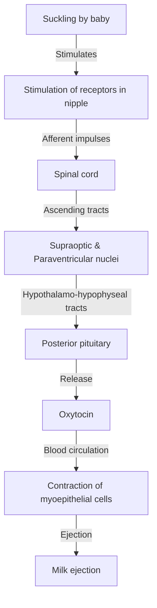
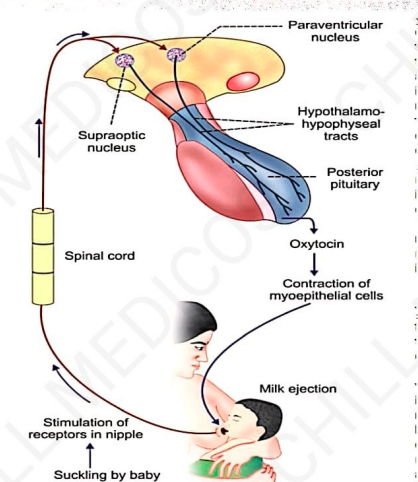

# MILK EJECTION REFLEX

### OXYTOCIN
* **Secreted by supraoptic nucleus** in small quantity.
* **Secreted by paraventricular nucleus** of hypothalamus.
* **Transported from hypothalamus to post. pituitary** through hypothalamo-hypophyseal tract.
* **Secreted in both** males & females.

---

### CHEMISTRY & HALF-LIFE
* **Polypeptide** (9 AA)
* **Half-life:** About 6 minutes

---

### ACTIONS IN FEMALES
* Acts on **mammary glands** and **uterus**.

---

## ACTION ON MAMMARY GLANDS

* **Oxytocin causes ejection of milk** from mammary glands.
* **Ducts of mammary glands** lined by myoepithelial cells:
  * $\downarrow$
  * Oxytocin causes contraction of myoepithelial cells
  * $\downarrow$
  * Flow of milk from alveoli to exterior, through
  * $\downarrow$
  * Duct system and nipple.

---

## MILK EJECTION REFLEX

$$\downarrow$$
$$\text{OR, MILK LETDOWN REFLEX (NEUROENDOCRINE REFLEX)}$$

* **Plenty of touch receptors** present on mammary glands *(around nipple)*.
* **Reflex is initiated by nervous factors & completed by hormonal action:**
  * $\downarrow$
  * Called a **NEUROENDOCRINE REFLEX**
  * $\downarrow$
  * Large amount of **oxytocin released** by
  * $\downarrow$
  * **+ve feedback mechanism**.

### MILK EJECTION REFLEX (PATHWAY)

---

## ACTION ON UTERUS

* **Oxytocin acts on pregnant uterus** & also non-pregnant uterus.

---

### 1. ON PREGNANT UTERUS

* **Throughout period of pregnancy:**
$\hookrightarrow$ Oxytocin secretion **inhibited by estrogen & progesterone**.
* **End of pregnancy:**
$\hookrightarrow$ Secretion of 2 hormones $\downarrow$es & **oxytocin $\uparrow$es**
* $\downarrow$
* **Cause contraction of uterus & helps in expulsion of fetus.**

* **Later stages of pregnancy:**
* Number of **receptors for oxytocin $\uparrow$es** in wall of uterus
* $\downarrow$
* **Uterus becomes more sensitive to oxytocin.**

* **During labor:**
* **Oxytocin $\uparrow$es** *(at onset of labor, cervix dilates & fetus descends through birth canal)*.

* **Throughout labor:**
* Large quantity of **oxytocin is released** by means of **+ve feedback mechanisms**.

* **Contraction of uterus is also a neuroendocrine reflex.**
* **Oxytocin also stimulates release of prostaglandins in placenta:**
  * $\downarrow$
  * Intensify uterine contraction induced by oxytocin.

---

### 2. ON NON-PREGNANT UTERUS

* **Oxytocin facilitates transport of sperms** through female genital tract up to fallopian tube:
  * $\downarrow$
  * By producing uterine contraction
  * $\downarrow$
  * During sexual intercourse
  * $\downarrow$
  * Receptors in vagina stimulated.

* **Oxytocin reaching female genital tract:**
  * $\downarrow$
  * Causes **antiperistaltic contractions of uterus**
  * $\downarrow$
  * Towards fallopian tube
  * $\downarrow$
  * Also a **neuroendocrine reflex**.

* **Sensitivity of uterus to oxytocin:**
  * $\uparrow$sed by **estrogen**
  * $\downarrow$sed by **progesterone**

---

## ACTION IN MALES

* **Oxytocin $\uparrow$ses during ejaculation:**
  * $\downarrow$
  * Facilitates release of sperm into urethra
  * $\downarrow$
  * By causing contraction of smooth muscle fibers in reproductive tract *(vas deferens)*.

---

### MODE OF ACTION
* Activating **G-protein coupled oxytocin receptor**.

