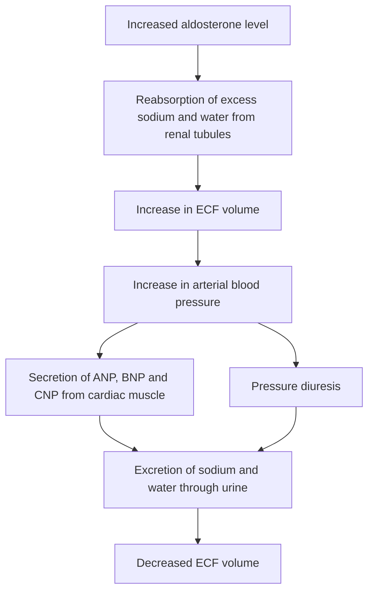
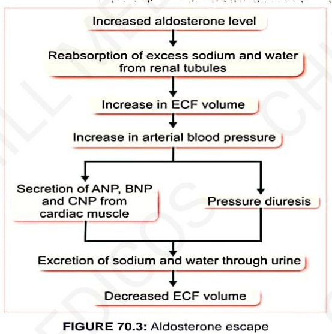
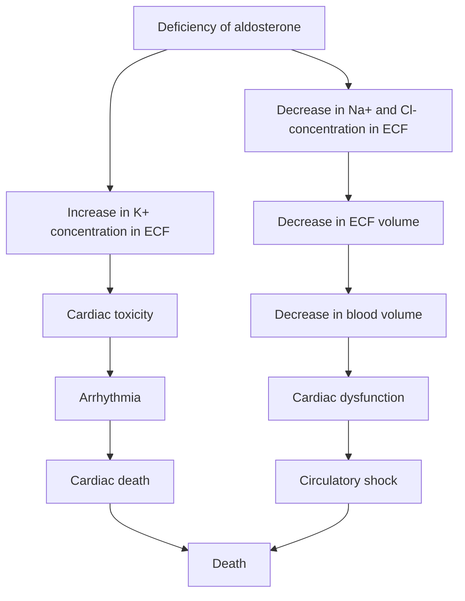
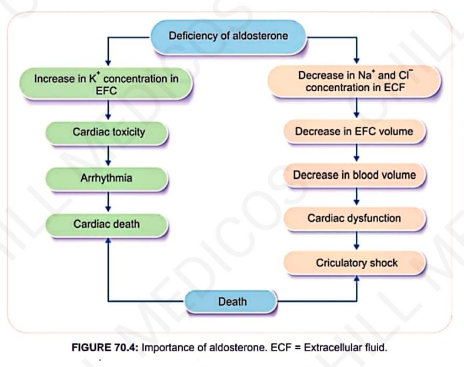
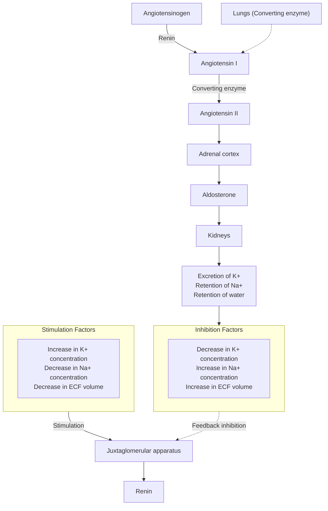
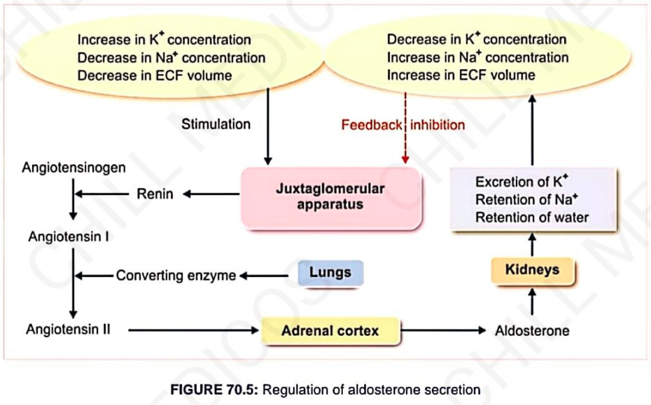

# MINERALOCORTICOIDS

* **Corticosteroids that can act on minerals (electrolytes)**, particularly $\text{Na}^+$ & $\text{K}^+$.
* **Mineralocorticoids $\longrightarrow$**
  * a. Aldosterone
  * b. 11-Deoxycorticosterone

---

### SOURCE OF SECRETION
* **Secreted by:** Zona glomerulosa of adrenal cortex.

---

### CHEMISTRY
* $\text{C}_{21}$ steroids ($21\text{ carbon atoms}$).
* **Half-life:** $20\text{ minutes}$.

---

### PLASMA LEVEL & DAILY OUTPUT
* **Plasma level :—**
  * a. Aldosterone: $0.006\ \mu\text{g/dL}$
  * b. 11-Deoxycorticosterone: $0.006\ \mu\text{g/dL}$
* **Daily output :—**
  * a. Aldosterone: $0.15\ \mu\text{g}$
  * b. 11-Deoxycorticosterone: $0.2\ \mu\text{g}$

---

### FUNCTIONS OF MINERALOCORTICOIDS
* **$90\%$ mineralocorticoid activity** provided by **aldosterone**.
* **Life-saving hormone:** Aldosterone maintains osmolarity and volume of ECF.

> **Aldosterone has 3 important functions :—**  
> a. Reabsorption of $\text{Na}^+$ from renal tubules.  
> b. Excretion of $\text{K}^+$ through renal tubules.  
> c. Secretion of $\text{H}^+$ ion into renal tubules.

---

## ACTIONS OF ALDOSTERONE

### 1. On Sodium Ions
* **Aldosterone acts on** DCT and collecting duct.
* **$\uparrow$se reabsorption** of $\text{Na}^+$.
* **Hyposecretion of aldosterone:**  
  $\hookrightarrow$ Loss of $\text{Na}^+$ through urine $\uparrow$es (**hypernatriuria**) up to about $20\text{ g/day}$.

### 2. On ECF
* When $\text{Na}^+$ are reabsorbed from renal tubules, **simultaneously water is also reabsorbed**:
  * $\downarrow$
  * So, net result is the **$\uparrow$se in ECF volume**.
* **Mild $\uparrow$se in concentration of $\text{Na}^+$ in blood (mild hypernatremia):**
  * $\downarrow$
  * Induce **thirst** $\longrightarrow$ again $\uparrow$ses ECF volume & blood volume.

### 3. On Blood Pressure
* $\uparrow$se in ECF volume and blood volume $\longrightarrow$ **leads to $\uparrow$se in BP**.

#### Aldosterone Escape / Escape Phenomenon
* **Aldosterone escape refers to** escape of kidney from salt-retaining effects of excess administration or secretion of aldosterone:
  * $\downarrow$
  * In case of **hyperaldosteronism**.
* **Because of aldosterone escape, edema does not occur.**

### 4. On $\text{K}^+$

* **Aldosterone $\uparrow$ses $\text{K}^+$ excretion** through renal tubules.
* **When aldosterone deficient:**
$\hookrightarrow$ $\text{K}^+$ concentration in ECF $\uparrow$ses leading to **hyperkalemia** $\rightarrow$ leads to development of **arrhythmia**.
* **When aldosterone secretion $\uparrow$ses:**
$\hookrightarrow$ Leads to **hypokalemia** and **muscular weakness**.

### 5. On $\text{H}^+$ Concentration

* While $\uparrow$sing $\text{Na}^+$ reabsorption from renal tubules, **aldosterone causes tubular secretion of hydrogen ions**.
* **Aldosterone maintains acid–base balance in body:**
* Hypersecretion $\longrightarrow$ Causes **alkalosis**
* Hyposecretion $\longrightarrow$ Causes **acidosis**

### 6. On Sweat Glands & Salivary Glands

* $\text{Na}^+$ reabsorbed from sweat glands under influence of aldosterone, **thus loss of $\text{Na}^+$ from body is prevented**.
* **Same effect on saliva also.**

### 7. On Intestine

* **Aldosterone $\uparrow$ses $\text{Na}^+$ absorption from intestine**, especially from colon:
* $\downarrow$
* Prevents loss of $\text{Na}^+$ through feces.

* **Aldosterone deficiency leads to diarrhea** *(with loss of $\text{Na}^+$ & $\text{H}_2\text{O}$)*.

---

### IMPORTANCE OF ALDOSTERONE

---

## REGULATION OF SECRETION

* **Regulated by 4 important factors :—**
* a. $\uparrow$se in $\text{K}^+$ concentration in ECF
* b. $\downarrow$se in $\text{Na}^+$ concentration in ECF
* c. $\downarrow$se in ECF volume
* d. Adrenocorticotropic hormone (ACTH)

