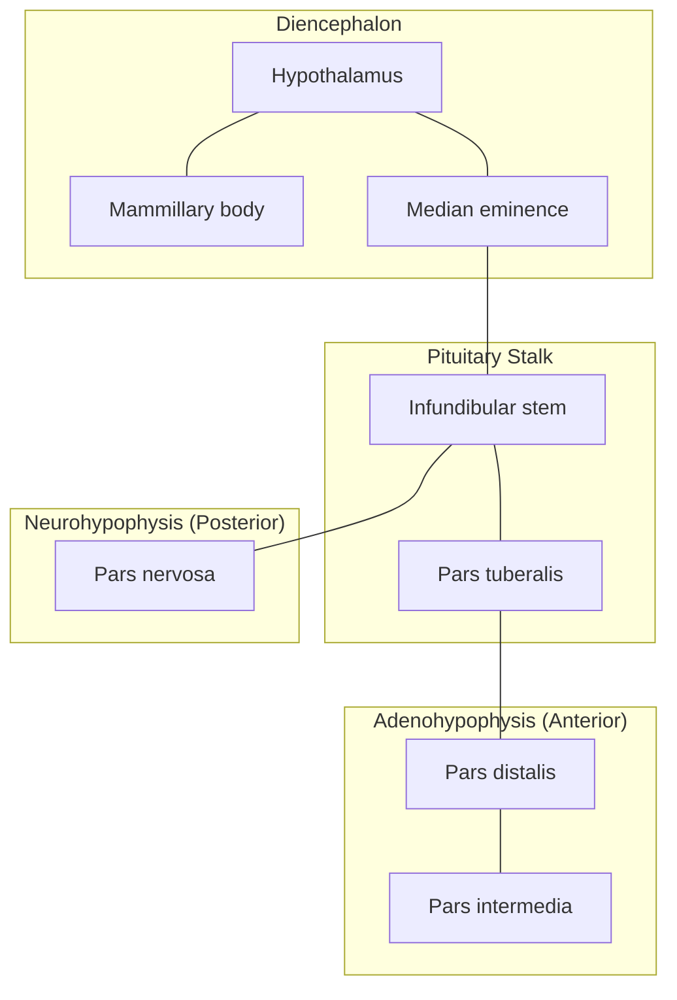
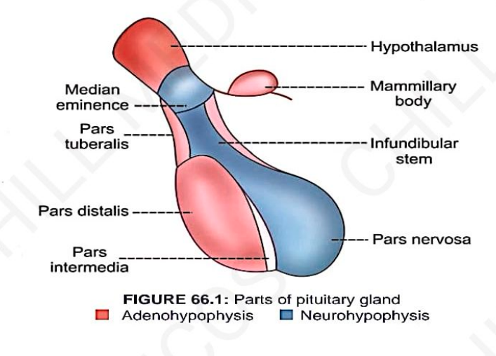

# PITUITARY GLAND

* **Pituitary gland (or hypophysis)** is a small endocrine gland with a diameter of $1\text{ cm}$.
* **Weight:** $0.5\text{ – }1\text{ g}$
* **Location:** Present in sphenoid bone *(Sella turcica)*.
* **Connection:** Connects with hypothalamus by the pituitary stalk or **hypophyseal stalk**.

---

### PARTS OF PITUITARY GLAND

---

## DIVISION OF PITUITARY GLAND

* a. **Anterior pituitary (Adenohypophysis)**
* b. **Posterior pituitary (Neurohypophysis)**

> **Pars Intermedia :—** Between the two divisions, there is a small and relatively avascular structure called **pars intermedia**.

---

# HORMONES SECRETED BY ANTERIOR PITUITARY

> **Six hormones are secreted from anterior pituitary :—**

### 1. Growth Hormone (GH)

* Also known as **Somatotropic hormone (STH)**.

### 2. Thyroid-Stimulating Hormone (TSH)

* **TSH necessary for the:**
* Growth of thyroid gland
* Secretory activity of thyroid gland

### 3. Adrenocorticotropic Hormone (ACTH)

* **ACTH necessary for the:**
* Structural integrity of adrenal cortex (AC)
* Secretory activity of adrenal cortex (AC)

### 4. Follicle-Stimulating Hormone (FSH)

* **FSH is a glycoprotein made up of:**
* $\alpha$-subunit: $92\text{ AA}$
* $\beta$-subunit: $118\text{ AA}$

* **Half-life:** About $3\text{ – }4\text{ hours}$.
* **Actions :—**
* **In Males:** $\text{FSH} + \text{Testosterone}$ accelerates **spermiogenesis**.
* **In Females:**
* a. Development of Graafian follicle.
* b. Secretion of estrogen.
* c. Promote aromatase activity *(granulosa cells)*:

$$\text{Androgens} \longrightarrow \text{Estrogens}$$

### 5. Luteinizing Hormone (LH)

* **LH glycoproteins made up of:**
* $\alpha$-subunit: $92\text{ A.A.}$
* $\beta$-subunit: $141\text{ A.A.}$

* **Half-life:** $60\text{ minutes}$.
* **Actions :—**
* **In Males:**
* Secretion of testosterone from Leydig cells.
* *(LH is also called **Interstitial Cell-Stimulating Hormone (ICSH)**)*.

* **In Females:**
* a. Responsible for ovulation.
* b. Formation of corpus luteum.
* c. Activates secretory functions of corpus luteum.

### 6. Prolactin

* **Single-chain polypeptide** ($199\text{ A.A.}$).
* **Half-life:** About $20\text{ minutes}$.
* **Action :—**
* Final preparation of mammary glands for:
* Production of milk
* Secretion of milk

---

# HORMONES FROM / OF POSTERIOR PITUITARY

* a. **Antidiuretic Hormone (ADH / Vasopressin)** $\longrightarrow$ *Secreted mainly by supraoptic nucleus.*
* b. **Oxytocin** $\longrightarrow$ *Secreted mainly by paraventricular nucleus.*

> **NOTE :—**
> Posterior pituitary **does not** synthesize any hormones.
> Both oxytocin & ADH are synthesized in the **hypothalamus** and transported to the posterior pituitary for storage and release.

