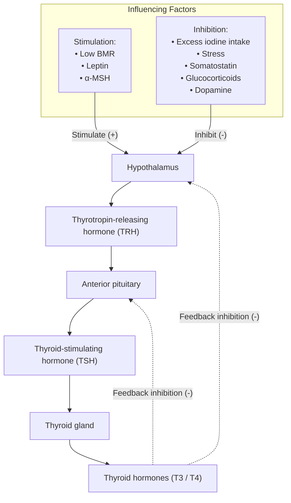
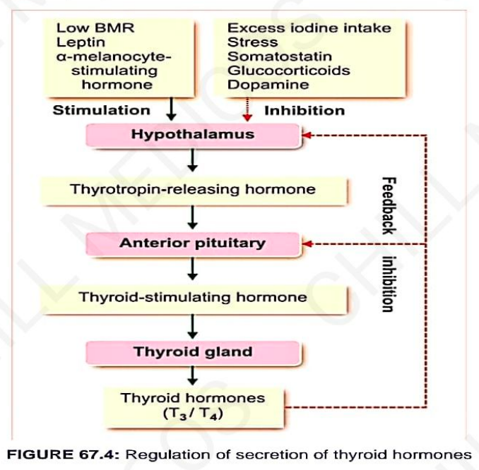

# REGULATION OF SECRETION OF TH

> **Secretion of thyroid hormones controlled by ant. pituitary and hypothalamus through feedback mechanism.**

---

## 1. ROLE OF PITUITARY GLAND

### Thyroid-Stimulating Hormone (TSH)
* **TSH secreted by ant. pituitary.**
* **Also necessary for growth and secretory activity** of thyroid gland.
* **TSH influences every stage** of formation & release of thyroid hormone.

* **Chemistry $\longrightarrow$** Peptide hormone with $1\ \alpha\text{-chain}$ & $1\ \beta\text{-chain}$.
* **Plasma Level $\longrightarrow$** Normal plasma level is approximately $2\ \mu\text{U/mL}$.
* **Half-life $\longrightarrow$** About $60\text{ minutes}$.

---

### Actions of TSH

* **TSH $\uparrow$ses:**
  * a. No. of follicular cells of thyroid.
  * b. Conversion of cuboidal cells into columnar cells in thyroid gland:
    * $\downarrow$
    * *Causes development of thyroid follicles.*
  * c. Size and secretory activity of follicular cells.
  * d. Iodide pump & iodide trapping in follicle cells.
  * e. Thyroglobulin secretion into follicles.
  * f. Iodination of tyrosine & coupling to form hormone.
  * g. Proteolysis of thyroglobulin.

* **Mode of Action of TSH $\longrightarrow$** Acts through cyclic AMP mechanism.

---

## 2. ROLE OF HYPOTHALAMUS

* **Hypothalamus regulates thyroid secretion** through **Thyrotropic-Releasing Hormone (TRH)**.
* **TRH transported through** hypothalamo-hypophyseal portal vessel:
  * $\downarrow$
  * To ant. pituitary
  * $\downarrow$
  * Cause release of TSH.

---

## 3. FEEDBACK CONTROL

* **Thyroid hormones regulate their own secretion** through **-ve feedback control**:
  * $\downarrow$
  * Inhibiting release of TRH from hypothalamus and TSH from anterior pituitary.

---

## 4. ROLE OF IODIDE

* **When iodine intake is high**, enzyme necessary for synthesis of thyroid hormones **inhibited by iodide itself**:
* $\downarrow$
* Result in **suppression of hormone synthesis**
* $\downarrow$
* Effect of iodide called **Wolff-Chaikoff effect**.

---

## 5. ROLE OF OTHER FACTORS

### Factors $\uparrow$sing Secretion of TH:

* a. Low BMR
* b. Leptin
* c. $\alpha$-Melanocyte stimulating hormone ($\alpha\text{-MSH}$)

> **Leptin** *(from adipose tissue)* and **$\alpha$-melanocyte stimulating hormone** *(from pituitary)*:
> $\downarrow$
> $\uparrow$se release of TRH & synthesis of $\text{T}_4$.

### Factors $\downarrow$sing Secretion of TH:

*(by inhibiting release of TRH)*

* a. Excess iodide intake
* b. Stress
* c. Somatostatin
* d. Glucocorticoids
* e. Dopamine
