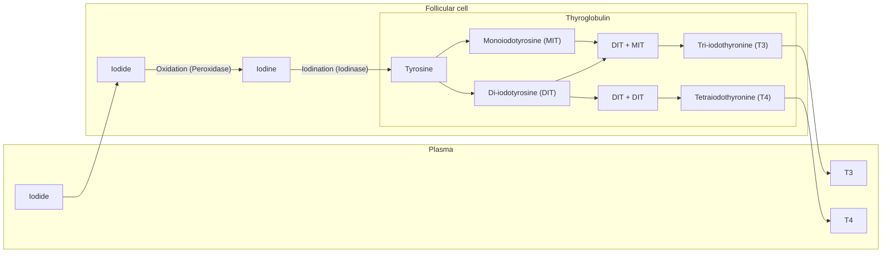
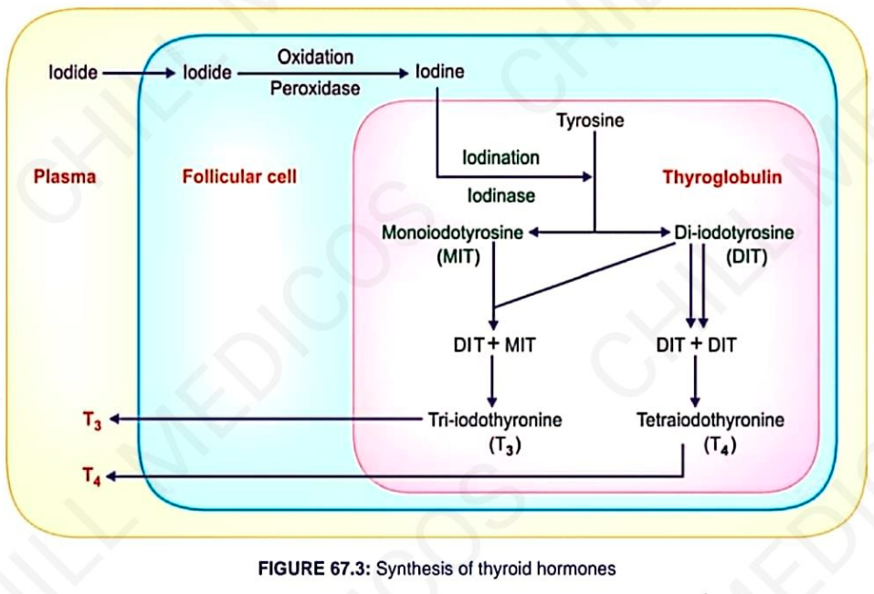

# SYNTHESIS OF THYROID HORMONE

* **Takes place in thyroglobulin**, present in **follicular cavity**.
* **Essential components :—**
  * **Iodine** $\longrightarrow$ *Converted into iodide* $\longrightarrow$ *Absorbed from GI tract*
  * **Tyrosine** *(also absorbed from GI tract)*

---

### STAGES OF SYNTHESIS OF THYROID HORMONE

**Occurs in 6 stages :—**
1. Thyroglobulin synthesis
2. Iodide trapping
3. Oxidation of iodide
4. Transport of iodine into follicular cavity
5. Iodination of tyrosine
6. Coupling reactions

---

#### SYNTHESIS OF THYROID HORMONES (PATHWAY)

---

### 1. THYROGLOBULIN SYNTHESIS

* **ER and Golgi apparatus** in follicular cells of thyroid gland synthesize and secrete thyroglobulin continuously:
* $\downarrow$
* **Large glycoprotein** *(140 molecules of AA tyrosine)*

### 2. IODINE TRAPPING

* **Iodide actively transported** from blood into follicular cell, against electrochemical gradient.
* **Iodide pump $\longrightarrow$** Iodide along with $\text{Na}^+$ transported into follicular cell by **$\text{Na}^+\text{–}\text{I}^-$ symport pump**.
* **Normally:** Iodide is $300\text{ times}$ greater concentrated in thyroid gland.  
  *(But during hyperactivity of thyroid gland, it $\uparrow$ses $200\text{ times}$ more).*

---

### 3. OXIDATION OF IODIDE

* **Iodide must be oxidized to iodine:**
  * $\downarrow$
  * Because only iodine is capable of combining with tyrosine to form thyroid hormones.
* **Occurs inside follicular cells** in presence of **thyroid peroxidase**.

---

### 4. TRANSPORT OF IODINE INTO FOLLICULAR CAVITY

* **Transported by an iodide–chloride pump** called **pendrin**.

---

### 5. IODINATION OF TYROSINE

* **Combination of iodine with tyrosine:**
  * Takes place in thyroglobulin.
* **Iodine binds with thyroglobulin** *(process called **organification of thyroglobulin**)*:
  * $\downarrow$
  * Then, **iodine ($\text{I}$) combines with tyrosine**
  * $\downarrow$
  * Accelerated by **enzyme iodinase** *(secreted by follicular cells)*.

---

### 6. COUPLING REACTIONS

* **Iodotyrosine residues (MIT & DIT) get coupled with one another:**

$$\begin{aligned}
\text{Tyrosine} + \text{I} &= \text{Monoiodotyrosine (MIT)} \\
\text{MIT} + \text{I} &= \text{Di-iodotyrosine (DIT)} \\
\text{DIT} + \text{MIT} &= \text{Tri-iodothyronine (T}_3\text{)} \\
\text{MIT} + \text{DIT} &= \text{Reverse T}_3 \\
\text{DIT} + \text{DIT} &= \text{Tetraiodothyronine OR Thyroxine (T}_4\text{)}
\end{aligned}$$

