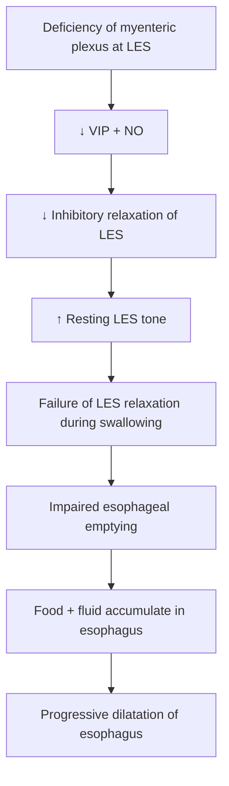

# Achalasia Cardia

### **5-Mark Answer — Physiology**

## 1. Definition

**Achalasia = failure of relaxation**

It is a disorder in which the **lower esophageal sphincter (LES) fails to relax adequately during deglutition**, causing impaired emptying of the esophagus.

---

## 2. Pathophysiology

### **Key point**

$$
\boxed{\text{↓ Myenteric inhibitory neurons} \rightarrow \text{↓ VIP + NO} \rightarrow \text{LES fails to relax}}
$$

---

## 3. Clinical / Diagnostic Features

| Feature               | Finding                                                             |
| --------------------- | ------------------------------------------------------------------- |
| **LES**               | High resting tone + incomplete relaxation                           |
| **Esophagus**         | Food and fluid accumulation                                         |
| **Result**            | Massive dilatation                                                  |
| **Barium meal X-ray** | Narrowed lower end with dilated esophagus → **rat-tail appearance** |
| **Esophagoscopy**     | Retained food and fluid                                             |

---

## 4. Treatment

### **Mechanical**

→ **Pneumatic dilatation** of LES

### **Severe cases**

→ **Myotomy** — surgical weakening/incision of esophageal muscle

### **Drug treatment**

→ **Botulinum toxin injection into LES**

$$
\text{Botulinum toxin}
\rightarrow
\downarrow \text{ACh release}
\rightarrow
\text{LES relaxation}
$$

---

### ⭐ One-line recall

$$
\boxed{
\begin{matrix}
\text{Achalasia}\\\
\text{↓ Myenteric plexus}
\rightarrow
\text{↓ VIP/NO}
\rightarrow
\text{LES fails to relax}
\rightarrow
\text{Esophageal dilatation}
\end{matrix}
}
$$

**Viva:** *“What is the characteristic X-ray appearance?”* → **Rat-tail appearance.**
