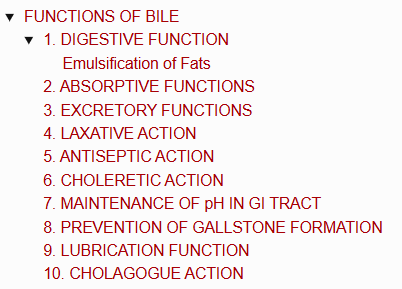
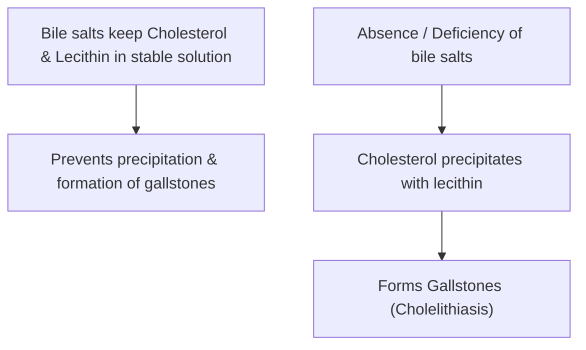

# FUNCTIONS OF BILE

> ### Headings 
> 

* Most of the functions of bile are due to **bile salts**.

---

## 1. DIGESTIVE FUNCTION

* Bile salts are required for the **digestion and absorption of fats** in the small intestine.

### Emulsification of Fats
* **Emulsification :** Fat globules are broken down into minute droplets in the form of a milky fluid called **emulsion** in the small intestine.
* **Mechanism :—**
  * Lipolytic enzymes of the GI tract cannot digest large fat globules because fats are insoluble in water due to high surface tension.
  * Bile salts emulsify fats by **reducing surface tension** due to their natural detergent action.
  * Emulsification by bile salts **requires the presence of lecithin**.
* **Clinical Significance :** Unemulsified fat passes through the intestine and is **eliminated in feces**.

---

## 2. ABSORPTIVE FUNCTIONS

* **Absorption of Fats :—**
  $$\text{Bile salts combine with digested fats}$$
  $$\downarrow$$
  $$\text{Form water-soluble complexes called \textbf{Micelles}}$$
  $$\downarrow$$
  $$\text{Fats in the form of micelles are easily absorbed across the intestinal mucosa}$$

---

## 3. EXCRETORY FUNCTIONS

* Bile serves as an important excretory route for:
  * a. **Bile pigments** (Bilirubin and Biliverdin)
  * b. **Heavy metals** ($\text{Cu}^{2+}$ and $\text{Fe}$)
  * c. **Bacteria** *(e.g., Typhoid bacilli)*
  * d. **Toxins**
  * e. **Cholesterol**
  * f. **Lecithin**
  * g. **Alkaline phosphatase (ALP)**

---

## 4. LAXATIVE ACTION

* **Laxative :** An agent that induces defecation.
* Bile salts act as mild laxatives by **stimulating peristaltic movements** of the intestine.

---

## 5. ANTISEPTIC ACTION

* Bile inhibits the growth of certain harmful bacteria in the lumen of the intestine by its **natural detergent action**.

---

## 6. CHOLERETIC ACTION

* Bile salts stimulate the liver cells (hepatocytes) to **increase the secretion of bile**.

---

## 7. MAINTENANCE OF pH IN GI TRACT

* Alkaline bile helps **neutralize acidic chyme** entering the duodenum from the stomach, maintaining an optimal alkaline pH for pancreatic and intestinal enzymes.

---

## 8. PREVENTION OF GALLSTONE FORMATION

---

## 9. LUBRICATION FUNCTION

* **Mucin present in bile** acts as a protective lubricant for chyme as it moves along the intestinal tract.

---

## 10. CHOLAGOGUE ACTION

* **Cholagogue :** An agent that causes contraction of the gallbladder and release of stored bile into the duodenum.
* **Mechanism :—**

$$\text{Bile salts act as cholagogues}$$

$$\downarrow$$

$$\text{Stimulate secretion of \textbf{Cholecystokinin (CCK)} from duodenal mucosa}$$

$$\downarrow$$

$$\text{Causes strong contraction of gallbladder and relaxation of Sphincter of Oddi}$$

