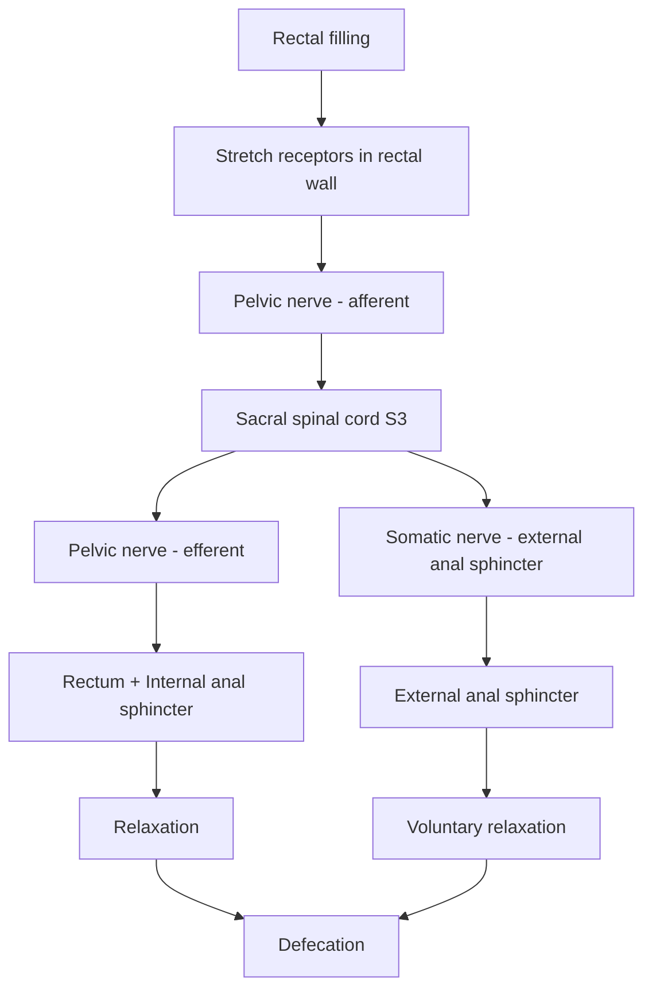
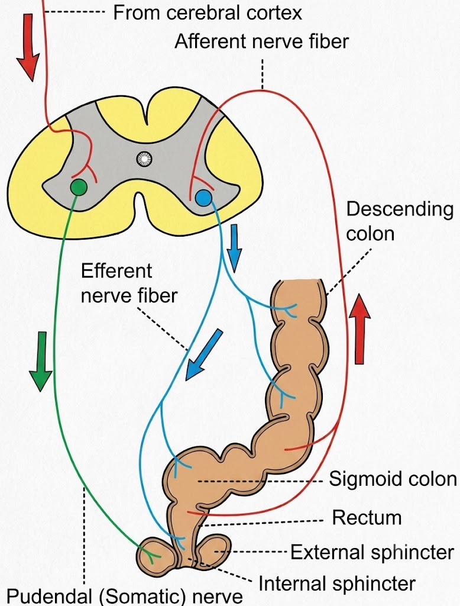
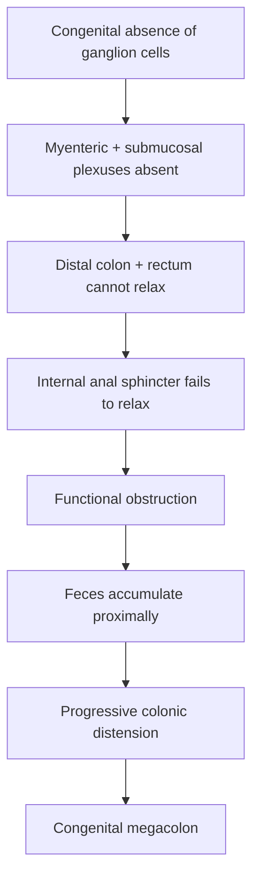

# Defecation Reflex + Hirschsprung Disease

### **5-Mark Answer — Physiology**

## 1. Defecation Reflex

> **Defecation = reflex phenomenon under voluntary control**

### **Stimulus**

$$
\boxed{\text{Mass peristalsis of descending + sigmoid colon}}
\rightarrow
\text{Rectal filling}
\rightarrow
\text{Stretch of rectal wall}
$$

### **Reflex pathway**

> 

### **Mechanism**

| Event                                    | Effect                              |
| ---------------------------------------- | ----------------------------------- |
| Rectal distension                        | Initiates defecation reflex         |
| Myenteric inhibitory signals             | **Relax internal anal sphincter**   |
| Voluntary cortical control               | **Relaxes external anal sphincter** |
| Puborectalis relaxation                  | **Decreases anorectal angle**       |
| Deep inspiration + diaphragm contraction | ↑ Intra-abdominal pressure          |
| Abdominal muscle contraction             | Further ↑ intra-abdominal pressure  |
| Straining                                | Forces feces through anal canal     |

$$
\boxed{\text{↑ Intra-abdominal pressure} ;+; \text{Sphincter relaxation}
\rightarrow \text{Defecation}}
$$

**Normal anorectal angle:** ~90°

**Applied:** Defecation is fundamentally a **spinal reflex**; higher centres, especially the cortex, exert voluntary control.

---

# 2. Hirschsprung Disease

### **Definition**

**Hirschsprung disease = congenital megacolon due to aganglionosis.**

### **Pathophysiology**

### **Clinical Features**

* **Abdominal distension**
* **Anorexia**
* **Lassitude**
* Severe cases → symptoms may appear in the **newborn period**

### **Treatment**

→ **Surgical treatment** to remove/bypass the aganglionic segment and restore bowel passage.

---

## ⭐ Last-minute recall

$$
\boxed{
\text{Rectal filling}
\rightarrow
\text{Stretch receptors}
\rightarrow
S_3
\rightarrow
\text{Pelvic nerve}
\rightarrow
\text{Internal sphincter relaxation}
}
$$

$$
\boxed{
\begin{matrix}
\text{Hirschsprung}\\\
\text{No ganglion cells}
\rightarrow
\text{No relaxation}
\rightarrow
\text{Obstruction}
\rightarrow
\text{Megacolon}
\end{matrix}
}
$$
