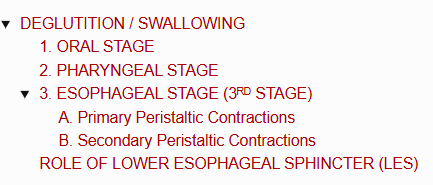
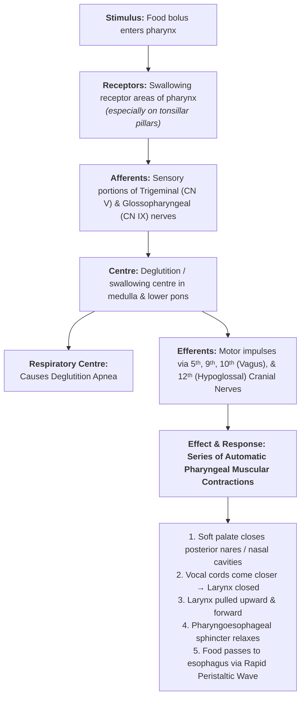
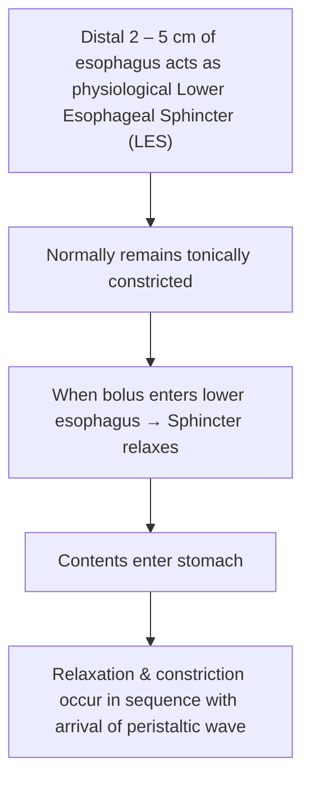

# DEGLUTITION / SWALLOWING

> ### Headings
> 

* **Definition :** Refers to the passage of food from the oral cavity to the stomach.
* **Comprises 3 Stages :—**
  * a. **Oral stage :** Mouth $\longrightarrow$ Pharynx
  * b. **Pharyngeal stage :** Pharynx $\longrightarrow$ Esophagus
  * c. **Esophageal stage :** Esophagus $\longrightarrow$ Stomach

---

## 1. ORAL STAGE

* **Nature :** Voluntary phase.
* **Mechanism :—**
  $$\text{Bolus of food formed after mastication}$$
  $$\downarrow$$
  $$\text{Placed over dorsum of tongue}$$
  $$\downarrow$$
  $$\text{Tongue forces bolus into the oropharynx by pushing up and back against hard palate}$$

---

## 2. PHARYNGEAL STAGE

* **Nature :** Involuntary phase caused by the swallowing reflex.
* **Duration :** Entire process takes about **$1 - 2\text{ seconds}$**.

---

## 3. ESOPHAGEAL STAGE (3ᴿᴰ STAGE)

* **Nature :** Involuntary stage.
* **Function :** Esophagus forms a passage for movement of the food bolus from the pharynx to the stomach.
* **Movement Type :** Peristaltic waves *(wave of contraction followed by wave of relaxation of muscle fibers traveling in an aboral direction)*.
* **2 Types of Peristaltic Contractions :—**
* a. Primary peristaltic contractions
* b. Secondary peristaltic contractions

---

### A. Primary Peristaltic Contractions

* When the bolus reaches the upper part of the esophagus, **primary ($1^\circ$) peristalsis starts**.
* Peristaltic contractions pass down through the rest of the esophagus, propelling the bolus towards the stomach.
* **Intraluminal Pressure Changes :—**
* **Initially :** Pressure becomes negative *(due to stretching of closed esophagus by elevation of larynx)*.
* **Immediately after :** Pressure becomes positive *($\uparrow$ increases up to $10 - 15\text{ cm of }\text{H}_2\text{O}$)* as the contractile wave sweeps through.

---

### B. Secondary Peristaltic Contractions

* If primary contractions are **unable to propel the bolus** into the stomach *(e.g., bolus gets lodged)*:

$$\text{Secondary peristaltic contractions appear}$$

$$\downarrow$$

$$\text{Induced by local distension of upper esophagus by lodged bolus}$$

$$\downarrow$$

$$\text{Contractions pass down, producing positive (+ve) pressure to clear the lumen}$$

---

## ROLE OF LOWER ESOPHAGEAL SPHINCTER (LES)

