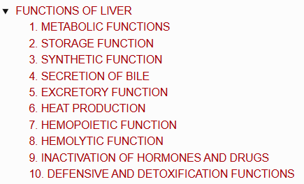
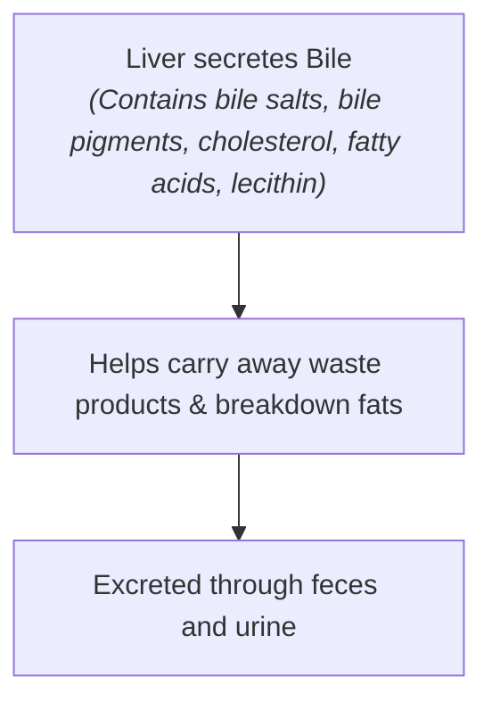

# FUNCTIONS OF LIVER

> ### Headings 
> 

* **Liver is the largest gland in the human body.**

---

## 1. METABOLIC FUNCTIONS

* Major site for metabolic reactions including the metabolism of:
  * a. **Carbohydrates**
  * b. **Proteins**
  * c. **Fats (Lipids)**
  * d. **Vitamins**

---

## 2. STORAGE FUNCTION

* Stores essential nutrients and vitamins:
  * a. **Glycogen**
  * b. **Amino acids (AA)**
  * c. **Iron**
  * d. **Folic acid**
  * e. **Vitamins:** Vitamin A, Vitamin $\text{B}_{12}$, and Vitamin D

---

## 3. SYNTHETIC FUNCTION

* a. **Glucose Production :** Via **gluconeogenesis**.
* b. **Plasma Proteins :** Synthesizes all plasma proteins & other proteins *(except Immunoglobulins)*:
  * Clotting factors
  * Complement factors
  * Hormone-binding proteins
* c. **Other Substances :** Synthesizes **steroids, heparin, and somatomedin (IGF-1)**.

---

## 4. SECRETION OF BILE

---

## 5. EXCRETORY FUNCTION

* Excretes various end products and foreign substances:
* a. **Cholesterol**
* b. **Bile pigments** (Bilirubin & Biliverdin)
* c. **Bacteria**
* d. **Heavy metals** ($\text{Pb}$, $\text{As}$, $\text{Bi}$)
* e. **Toxins**
* f. **Viruses** *(e.g., Yellow fever virus)*

---

## 6. HEAT PRODUCTION

* An **enormous amount of heat** is produced due to high metabolic activity *(site of maximum heat production in the body)*.

---

## 7. HEMOPOIETIC FUNCTION

* a. **In Fetus :** Produces blood cells during the **hepatic stage of fetal life**.
* b. **Storage :** Stores **Vitamin $\text{B}_{12}$** (necessary for erythropoiesis) and **Iron** (necessary for hemoglobin synthesis).
* c. **Thrombopoietin Production :** Produces **thrombopoietin**, which promotes thrombocyte (platelet) production.

---

## 8. HEMOLYTIC FUNCTION

* **Destruction of Senile RBCs :** Senile RBCs (after their lifespan of $\approx 120\text{ days}$) are destroyed by **reticuloendothelial cells (Kupffer cells)** of the liver.

---

## 9. INACTIVATION OF HORMONES AND DRUGS

* a. **Catabolism of Hormones :** Catabolizes Growth Hormone, Parathormone, Cortisol, Insulin, Glucagon, and Estrogen.
* b. **Inactivation of Drugs :**

$$\text{Fat-soluble drugs}$$

$$\downarrow$$

$$\text{Converted into water-soluble substances}$$

$$\downarrow$$

$$\text{Excreted through bile or urine}$$

---

## 10. DEFENSIVE AND DETOXIFICATION FUNCTIONS

* **Defensive Function :**
* **Kupffer cells** (reticuloendothelial cells) defend against infections via phagocytosis.

* **Detoxification of Foreign Bodies :**
* a. Foreign bodies (bacteria or antigens) are swallowed and digested by reticuloendothelial cells (**phagocytosis**).
* b. Reticuloendothelial cells produce cytokines like **interleukins** and **tumor necrosis factor (TNF)** to activate the immune system.
* c. Liver cells remove toxic properties of harmful agents (**detoxification**) via:
* Total destruction by means of **metabolic degradation**.
* Conversion of toxic substances into non-toxic materials by means of **conjugation**.

