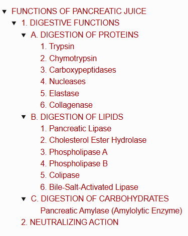
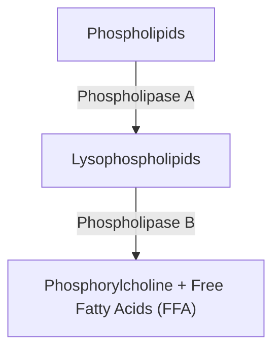
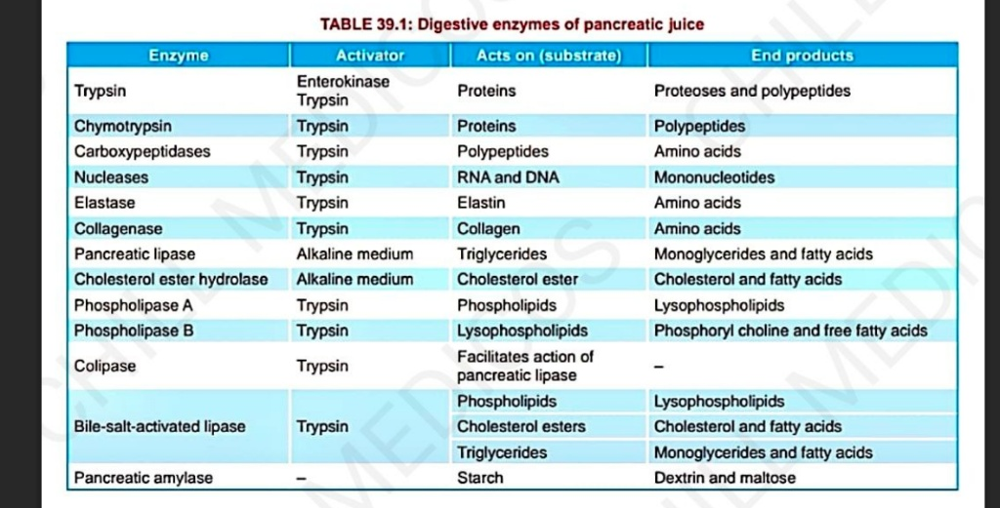

# FUNCTIONS OF PANCREATIC JUICE

> ### Headings 
> 

* **Pancreatic juice has :—**
  * a. Digestive functions
  * b. Neutralizing action

---

## 1. DIGESTIVE FUNCTIONS

* Digestion of **proteins & lipids**, and mild digestive action on **carbohydrates**.

---

### A. DIGESTION OF PROTEINS

* **Major proteolytic enzymes of pancreatic juice (PJ) :—**
  * Trypsin
  * Chymotrypsin
  * Carboxypeptidase
  * Nuclease
  * Elastase
  * Collagenase

---

#### 1. Trypsin
* Single polypeptide ($\text{MW} = 25{,}000$), contains 229 amino acids.
* **Activation :—**
  $$\text{Inactive Trypsinogen} \xrightarrow[\text{(Brush-bordered cells of duodenal mucosa)}]{\text{Enterokinase / Enteropeptidase}} \text{Active Trypsin}$$
  $$\downarrow$$
  $$\text{Autocatalytic / Autoactive action (itself activates trypsinogen)}$$

* **Trypsin Inhibitor :—**
  * If trypsin is activated inside the pancreas $\longrightarrow$ hydrolyzes pancreatic tissue proteins $\longrightarrow$ **pancreatic damage**.
  * Premature activation in secretory cells, acini & ducts is prevented by **Trypsin Inhibitor**.

* **Actions of Trypsin :—**
  * a. **Digestion of Proteins (Endopeptidase) :** Breaks interior bonds of proteins to convert them into **proteoses & polypeptides**.
  * b. **Curdling of Milk :** Converts caseinogen to casein.
  * c. **Blood Clotting :** Accelerates blood clotting.
  * d. **Activates Other Enzymes of Pancreatic Juice :**
    * $\text{Chymotrypsinogen} \longrightarrow \text{Chymotrypsin}$
    * $\text{Procarboxypeptidases} \longrightarrow \text{Carboxypeptidases}$
    * $\text{Proelastase} \longrightarrow \text{Elastase}$
    * $\text{Procolipase} \longrightarrow \text{Colipase}$
  * e. **Activates collagenase, phospholipase A & phospholipase B.**
  * f. **Autocatalytic action.**

---

#### 2. Chymotrypsin
* Polypeptide ($\text{MW} = 25{,}700$), contains 246 amino acids.
* Secreted as inactive **chymotrypsinogen** $\xrightarrow{\text{Trypsin}}$ **Active chymotrypsin**.

* **Actions of Chymotrypsin :—**
  * a. **Digestion of Proteins (Endopeptidase) :** Converts proteins $\longrightarrow$ polypeptides.
  * b. **Digestion of Milk :** Digests caseinogen faster than trypsin.
  * c. **On Blood Clotting :** No action.

---

#### 3. Carboxypeptidases
* **Types :** Carboxypeptidase A & Carboxypeptidase B *(both activated by Trypsin from precursors Procarboxypeptidase A & B)*.
* **Actions (Exopeptidases) :** Break terminal bonds of protein.
  * a. **Carboxypeptidase A :** Converts proteins to amino acids with **aromatic or aliphatic side chains**.
  * b. **Carboxypeptidase B :** Converts proteins to amino acids with **basic side chains**.

---

#### 4. Nucleases
* **Ribonuclease & Deoxyribonuclease :** Digestion of nucleic acids.
  $$\text{RNA } \& \text{ DNA} \longrightarrow \text{Mononucleotides}$$

---

#### 5. Elastase
* Secreted as inactive **proelastase** $\xrightarrow{\text{Trypsin}}$ **Active elastase**.
* **Action :** Digests elastic fibers.

---

#### 6. Collagenase
* Secreted as inactive **procollagenase** $\xrightarrow{\text{Trypsin}}$ **Active collagenase**.
* **Action :** Digests collagen.

---

### B. DIGESTION OF LIPIDS

* **Lipolytic enzymes in pancreatic juice :—**
  * Pancreatic lipase
  * Cholesterol ester hydrolase
  * Phospholipase A
  * Phospholipase B
  * Colipase
  * Bile-salt-activated lipase

---

#### 1. Pancreatic Lipase
* Powerful lipolytic enzyme.
* **Action :** Digests $\text{Triglycerides} \longrightarrow \text{Monoglycerides} + \text{Fatty Acids}$.
* **Optimum pH required :** 7 – 9.
* **Digestion of fat requires 2 factors :—**
  * a. **Bile salts :** For emulsification of fat prior to digestion.
  * b. **Colipase :** Coenzyme necessary for pancreatic lipase activity.

> **Steatorrhea :—**  
> Deficiency of this enzyme leads to **excretion of undigested fat in feces**.

---

#### 2. Cholesterol Ester Hydrolase
* Also known as cholesterol esterase.
  $$\text{Cholesterol Ester} \xrightarrow{\text{Hydrolysis}} \text{Free Cholesterol} + \text{Fatty Acid}$$

---

#### 3. Phospholipase A
* Activated by **trypsin**.
* Digests phospholipids:
  $$\text{Lecithin} \longrightarrow \text{Lysolecithin}$$
  $$\text{Cephalin} \longrightarrow \text{Lysocephalin}$$
  *(These products are lysophospholipids)*.

---

#### 4. Phospholipase B
* Activated by **trypsin**.
* Converts lysophospholipids into **phosphorylcholine & free fatty acids (FFA)**.

---

#### 5. Colipase

* Secreted as inactive **procolipase** $\xrightarrow{\text{Trypsin}}$ **Colipase**.
* **Action :** Facilitates the digestive action of pancreatic lipase on fats.

---

#### 6. Bile-Salt-Activated Lipase

* Lipolytic enzyme activated by bile salts *(also called carboxyl ester lipase / cholesterol esterase)*.
* **Action :** Hydrolyzes a variety of lipids (phospholipids, cholesterol esters & triglycerides).

---

### C. DIGESTION OF CARBOHYDRATES

#### Pancreatic Amylase (Amylolytic Enzyme)

$$\text{Starch} \xrightarrow{\text{Pancreatic Amylase}} \text{Dextrin} + \text{Maltose}$$

---

## 2. NEUTRALIZING ACTION

* **Alkaline pancreatic juice** *(due to presence of bicarbonate ions, $\text{HCO}_3^-$)* neutralizes the acidity of chyme entering the intestine.
* **Importance :** Protects the intestinal mucosa from the destructive erosive action of acid chyme.

> 
