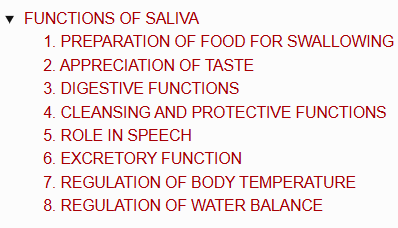
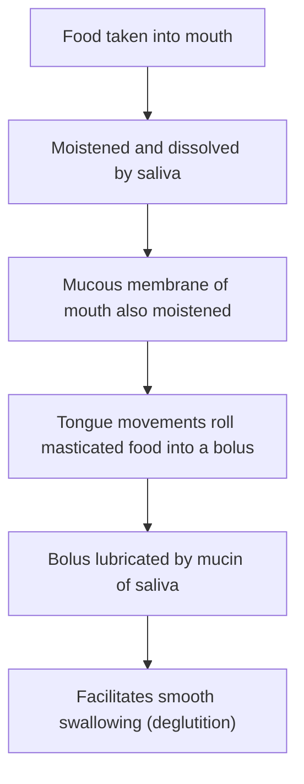
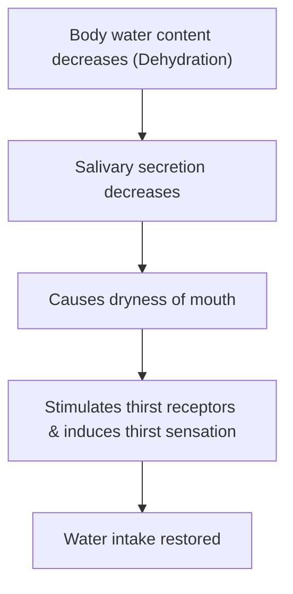

# FUNCTIONS OF SALIVA

> ### Headings
> 

* Saliva is an essential digestive juice involved in physical, chemical, defensive, and excretory functions.

---

## 1. PREPARATION OF FOOD FOR SWALLOWING

---

## 2. APPRECIATION OF TASTE

* **Taste is a chemical sensation.**
* **Mechanism :—**

$$\text{Saliva dissolves solid food substances via solvent action}$$

$$\downarrow$$

$$\text{Dissolved substances stimulate taste receptors on taste buds}$$

$$\downarrow$$

$$\text{Enables brain to recognize taste}$$

---

## 3. DIGESTIVE FUNCTIONS

* Saliva contains **3 digestive enzymes**:
* a. Salivary amylase (Ptyalin)
* b. Maltase
* c. Lingual lipase

---

## 4. CLEANSING AND PROTECTIVE FUNCTIONS

* a. **Mechanical Washing :** Constant secretion of saliva rinses the mouth and teeth, keeping them free of food debris, shed epithelial cells, and foreign particles $\longrightarrow$ **prevents bacterial growth**.
* b. **Lysozyme :** Kills bacteria such as *Staphylococcus*, *Streptococcus*, and *Brucella*.
* c. **Proline-Rich Proteins :** Possess antimicrobial properties and **neutralize toxic substances** *(e.g., tannins)*.
* d. **Lactoferrin :** Possesses antimicrobial / iron-chelating properties.
* e. **Enamel Protection :** Proline-rich proteins and lactoferrin protect teeth by **stimulating enamel formation**.
* f. **Immunoglobulin A (IgA) :** Provides **antibacterial and antiviral actions**.
* g. **Mucin :** Protects the mouth by **lubricating the oral mucous membrane**.

---

## 5. ROLE IN SPEECH

* Moistening and lubricating the soft parts of the mouth, tongue, and lips with saliva **facilitates speech articulation**.

---

## 6. EXCRETORY FUNCTION

* a. **Normal Excretory Products :** Excretes substances like **mercury, potassium iodide, lead, and thiocyanate**.
* b. **Viral Excretion :** Excretes certain viruses *(e.g., Rabies virus, Mumps virus)*.
* c. **Pathological Excretion :**
* **Glucose :** In Diabetes Mellitus
* **Excess Urea :** In Nephritis
* **Excess $\text{Ca}^{2+}$ :** In Hyperparathyroidism

---

## 7. REGULATION OF BODY TEMPERATURE

* **In Animals (Dogs & Cattle) :** Excessive dripping of saliva during **panting** helps in heat loss and body temperature regulation.
* **In Humans :** Sweat glands play the main role in temperature regulation; **saliva does not play a significant role**.

---

## 8. REGULATION OF WATER BALANCE

