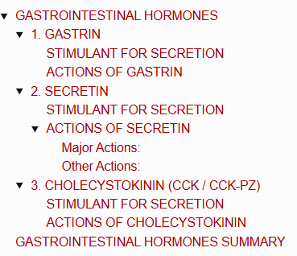

# GASTROINTESTINAL HORMONES

> ### Headings
> 

## 1. GASTRIN

* **Structure :** Peptide with **34 amino acid (AA) residues**.
* **Site of Secretion :—**
  * Secreted mainly by **G-cells** of pyloric glands of stomach.
  * Also secreted by **TG-cells** in stomach, duodenum & jejunum.
  * In fetus: Islets of Langerhans also secrete gastrin.
  * Secreted from stomach *(during gastric phase)* and from small intestine *(during intestinal phase)* of gastric secretion.

---

### STIMULANT FOR SECRETION

* a. Presence of food in stomach.
* b. Stimulation of local nervous plexus in stomach & small intestine (SI).
* c. **Vagovagal reflex** during gastric phase of gastric secretion:
  $$\text{Gastrin-Releasing Polypeptide (GRP) released at vagal nerve ending}$$
  $$\downarrow$$
  $$\text{Causes secretion of Gastrin by stimulating G-cells}$$

---

### ACTIONS OF GASTRIN

* a. **Stimulates gastric glands :** Secretes gastric juice rich in **$\text{HCl} + \text{pepsin}$**.
* b. **Accelerates gastric motility.**
* c. **Promotes growth of gastric mucosa.**
* d. **Stimulates secretion of pancreatic juice** *(rich in enzymes)*.
* e. **Stimulates islets of Langerhans** in pancreas to release pancreatic hormones.

---

## 2. SECRETIN

* **Discovery :** 1ˢᵗ ever hormone discovered *(by Starling & Bayliss, 1902)*.
* **Structure :** Peptide hormone with **27 AA residues**.
* **Site of Secretion :** Secreted by **S-cells** of duodenum, jejunum & ileum.
* **Activation :**
  $$\text{Prosecretin (Inactive)} \xrightarrow{\text{Acid Chyme (HCl)}} \text{Secretin (Active)}$$

---

### STIMULANT FOR SECRETION

* a. Release & activation of prosecretin by **acid chyme** entering duodenum from stomach.
* b. Products of protein digestion.

---

### ACTIONS OF SECRETIN

#### Major Actions:
* Stimulates **exocrine pancreatic secretion**:
$$
\begin {matrix}
  \text{Secretin acts on cells of pancreatic ductule}\\\
  \downarrow\\\
  \text{via \textbf{cyclic AMP (cAMP)} as second messenger}\\\
  \downarrow\\\
  \text{Causes secretion of large amount of \textbf{watery juice with high bicarbonate ion}}\\\
  (\text{HCO}_{\text{3}}^{\text{-}}) \text{ concentration}
  \end {matrix}
$$

#### Other Actions:
* a. **Inhibits secretion of gastric juice.**
* b. **Inhibits motility of stomach.**
* c. **Causes constriction of pyloric sphincter.**
* d. **Increases potency** of the action of cholecystokinin on pancreatic secretion.

---

## 3. CHOLECYSTOKININ (CCK / CCK-PZ)

* **Nomenclature :** Also called **Cholecystokinin–Pancreozymin (CCK-PZ)**.
* **Structure :** Made up of **39 AA residues**.
* **Site of Secretion :** Secreted by **I-cells** in mucosa of duodenum & jejunum, and small quantities in ileum.

---

### STIMULANT FOR SECRETION

* Presence of chyme containing digestive products of **fats & proteins** *(namely Fatty Acids [FA], Peptides, and Amino Acids [AA])* in upper part of small intestine.

---

### ACTIONS OF CHOLECYSTOKININ

* a. **Contracts gallbladder** to expel stored bile.
* b. **Stimulates exocrine pancreatic secretion** *(enzyme-rich juice)*.
* c. **Increases secretion of enterokinase.**
* d. **Inhibits gastric motility.**
* e. **Increases motility of intestine.**
* f. **Induces drug tolerance to opioids.**
* g. **Accelerates the activity of secretin** to produce alkaline pancreatic juice.

# GASTROINTESTINAL HORMONES SUMMARY

<table>
  <thead>
    <tr>
      <th align="left">Hormone</th>
      <th align="left">Source of Secretion</th>
      <th align="left">Actions</th>
    </tr>
  </thead>
  <tbody>
    <tr>
      <td><b>Gastrin</b></td>
      <td>
        • G cells in stomach 
        • TG cells in GI tract 
        • Islets in fetal pancreas 
        • Anterior pituitary 
        • Brain
      </td>
      <td>
        • Stimulates gastric secretion and motility 
        • Promotes growth of gastric mucosa 
        • Stimulates release of pancreatic hormones 
        • Stimulates secretion of pancreatic juice 
        • Stimulates secretion of pancreatic hormones
      </td>
    </tr>
    <tr>
      <td><b>Secretin</b></td>
      <td>• S cells of small intestine</td>
      <td>
        • Stimulates secretion of watery and alkaline pancreatic secretion 
        • Inhibits gastric secretion and motility 
        • Constricts pyloric sphincter 
        • Increases potency of cholecystokinin action
      </td>
    </tr>
    <tr>
      <td><b>Cholecystokinin (CCK)</b></td>
      <td>• I cells of small intestine</td>
      <td>
        • Contracts gallbladder 
        • Stimulates pancreatic secretion with enzymes 
        • Accelerates secretin activity 
        • Increases enterokinase secretion 
        • Inhibits gastric motility 
        • Increases intestinal motility 
        • Augments contraction of pyloric sphincter 
        • Suppresses hunger 
        • Induces drug tolerance to opioids
      </td>
    </tr>
    <tr>
      <td><b>Gastric Inhibitory Peptide (GIP)</b></td>
      <td>
        • K cells in duodenum and jejunum 
        • Antrum of stomach
      </td>
      <td>
        • Stimulates insulin secretion 
        • Inhibits gastric secretion and motility
      </td>
    </tr>
    <tr>
      <td><b>Vasoactive Intestinal Polypeptide (VIP)</b></td>
      <td>
        • Stomach 
        • Small and large intestines
      </td>
      <td>
        • Dilates splanchnic (peripheral) blood vessels 
        • Inhibits HCl secretion in gastric juice 
        • Stimulates secretion of succus entericus 
        • Relaxes smooth muscles of intestine 
        • Augments acetylcholine action on salivary glands 
        • Stimulates insulin secretion
      </td>
    </tr>
    <tr>
      <td><b>Glucagon</b></td>
      <td>
        • α-cells in pancreas 
        • A cells in stomach 
        • L cells in intestine
      </td>
      <td>• Increases blood sugar level</td>
    </tr>
    <tr>
      <td><b>Glicentin</b></td>
      <td>• L cells in duodenum and jejunum</td>
      <td>• Increases blood sugar level</td>
    </tr>
    <tr>
      <td><b>Glucagon-like Polypeptide-1 (GLP-1)</b></td>
      <td>
        • α-cells in pancreas 
        • Brain
      </td>
      <td>
        • Stimulates insulin secretion 
        • Inhibits gastric motility
      </td>
    </tr>
    <tr>
      <td><b>GLP-2</b></td>
      <td>• L cells in ileum and colon</td>
      <td>• Suppresses appetite</td>
    </tr>
    <tr>
      <td><b>Somatostatin</b></td>
      <td>
        • Hypothalamus 
        • D cells in pancreas 
        • D cells in stomach and small intestine
      </td>
      <td>
        • Inhibits secretion of growth hormone 
        • Inhibits gastric secretion and motility 
        • Inhibits secretion of pancreatic juice 
        • Inhibits secretion of GI hormones
      </td>
    </tr>
    <tr>
      <td><b>Pancreatic Polypeptide (PP)</b></td>
      <td>
        • PP cells in pancreas 
        • Small intestine
      </td>
      <td>
        • Increases secretion of glucagons 
        • Decreases pancreatic secretion
      </td>
    </tr>
    <tr>
      <td><b>Peptide YY</b></td>
      <td>• L cells of ileum and colon</td>
      <td>
        • Inhibits gastric secretion and motility 
        • Reduces secretion of pancreatic juice 
        • Inhibits intestinal motility and bowel passage 
        • Suppresses appetite and food intake
      </td>
    </tr>
    <tr>
      <td><b>Neuropeptide Y</b></td>
      <td>
        • Ileum and colon 
        • Brain and autonomic nervous system (ANS)
      </td>
      <td>• Increases blood flow in enteric blood vessels</td>
    </tr>
    <tr>
      <td><b>Motilin</b></td>
      <td>
        • Mo cells in stomach and intestine 
        • Enterochromaffin cells in intestine
      </td>
      <td>
        • Accelerates gastric emptying 
        • Increases movements of small intestine 
        • Increases peristalsis in colon
      </td>
    </tr>
    <tr>
      <td><b>Substance P</b></td>
      <td>
        • Brain 
        • Small intestine
      </td>
      <td>• Increases movements of small intestine</td>
    </tr>
    <tr>
      <td><b>Ghrelin</b></td>
      <td>
        • Stomach 
        • Hypothalamus 
        • Pituitary 
        • Kidney 
        • Placenta
      </td>
      <td>
        • Promotes growth hormone (GH) release 
        • Induces appetite and food intake 
        • Stimulates gastric emptying
      </td>
    </tr>
  </tbody>
</table>

