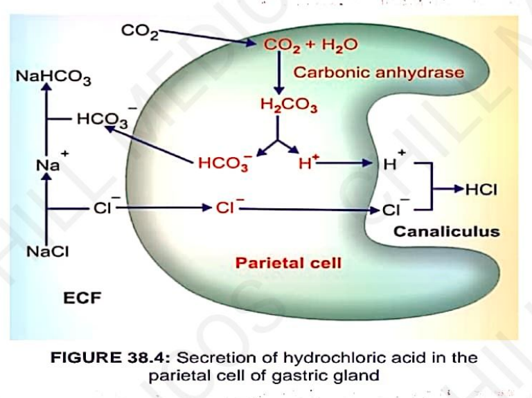
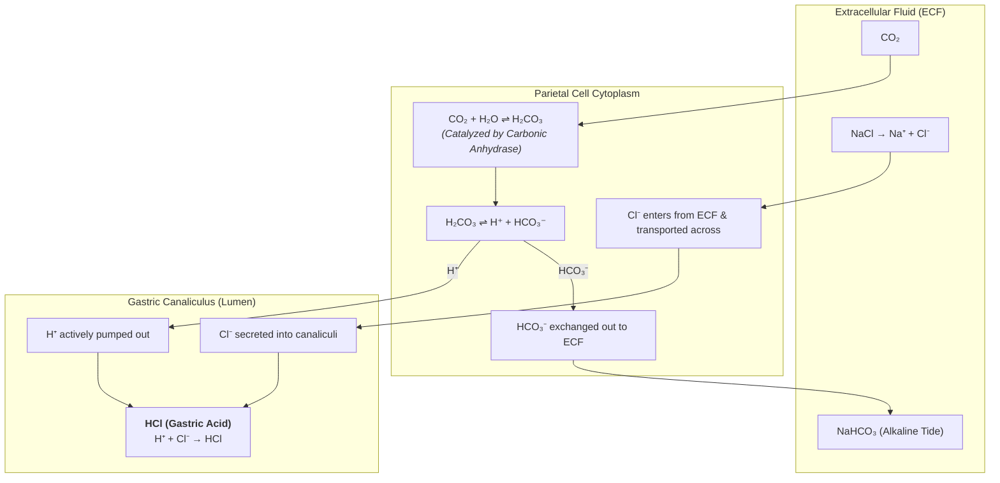

# MECHANISM OF SECRETION OF HCl

* **Davenport Theory :—**
  * $\text{HCl}$ secretion is an **active process**.
  * Takes place in the **canaliculi of parietal (oxyntic) cells** in gastric glands.
  * Energy is derived from the **oxidation of glucose**.
* $\text{CO}_2$ is derived from the metabolic activities of the parietal cell.
* Enzyme **Carbonic Anhydrase** is present in high concentration inside parietal cells.

---

### CELLULAR MECHANISM & FLOWCHART

> 

---

### OVERALL CHEMICAL REACTION

$$\text{CO}_2 + \text{H}_2\text{O} + \text{NaCl} \longrightarrow \text{HCl} + \text{NaHCO}_3$$

---

## REGULATION OF HCl SECRETION

<table>
  <thead>
    <tr>
      <th align="left">Stimulants of Secretion of HCl</th>
      <th align="left">Inhibitors of Secretion of HCl</th>
    </tr>
  </thead>
  <tbody>
    <tr>
      <td>
        • <b>Gastrin</b> 
        • <b>Histamine</b> 
        • <b>Vagal stimulation</b>
      </td>
      <td>
        • <b>Secretin</b> 
        • <b>Peptide YY</b> 
        • <b>Gastric Inhibitory Polypeptide (GIP)</b>
      </td>
    </tr>
  </tbody>
</table>

