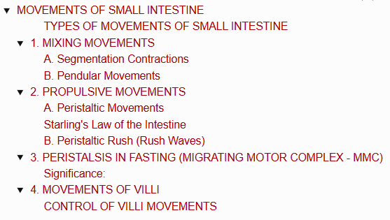
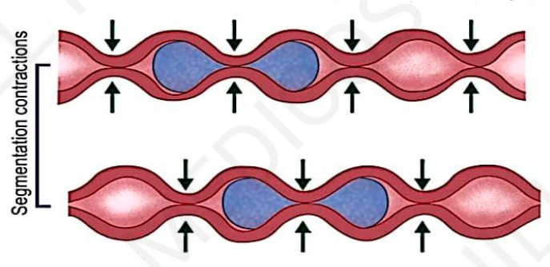
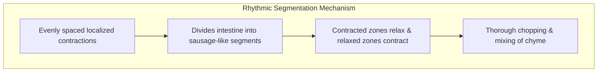
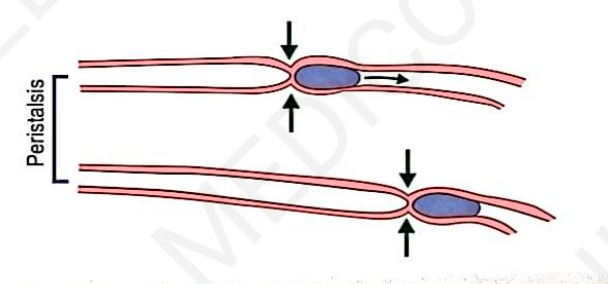
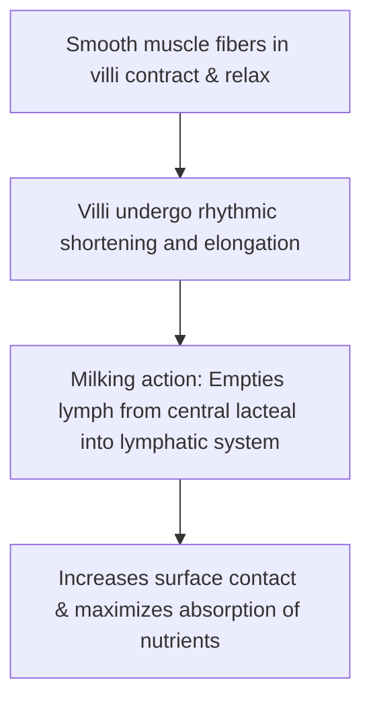

# MOVEMENTS OF SMALL INTESTINE

> ### Headings 
> 

* Movements are essential for **mixing chyme with digestive juices**, **propulsion of food**, and **absorption**.

---

### TYPES OF MOVEMENTS OF SMALL INTESTINE

* a. **Mixing Movements :**
  * Segmentation movements
  * Pendular movements
* b. **Propulsive Movements :**
  * Peristaltic movements
  * Peristaltic rush
* c. **Peristalsis in Fasting :** Migrating Motor Complex (MMC)
* d. **Movements of Villi**

---

## 1. MIXING MOVEMENTS

Responsible for proper mixing of chyme with digestive juices such as **pancreatic juice, bile, and intestinal juice (succus entericus)**.

### A. Segmentation Contractions
* Most common type of movement of the small intestine.
* Occur regularly or irregularly, but in a **rhythmic fashion** *(hence called rhythmic segmentation contractions)*.
* Contractions occur at regularly spaced intervals along a section of the intestine.
* Segments of intestine between contracted segments remain **relaxed**.
* Alternate segments of contraction and relaxation give the **appearance of rings resembling a chain of sausages**.
* After some time, the contracted segments relax while relaxed segments contract.
* **Function :** Chops chyme many times, facilitating thorough mixing with digestive secretions.

> 

---

### B. Pendular Movements

* **Sweeping to-and-fro movements** of the small intestine resembling the movement of a **clock pendulum**.
* Small portions (loops) of the intestine sweep forward & backward or upward & downward.
* **Function :** Helps in thorough mixing of chyme with digestive juices.

---

## 2. PROPULSIVE MOVEMENTS

Movements of the small intestine that push chyme in an **aboral direction** (towards the anus) through the intestinal tract.

### A. Peristaltic Movements

* A wave of contraction followed by a wave of relaxation of muscle fibers.
* **Direction :** Always travels in an **aboral direction**.
* **Initiation :** Stimulation of smooth muscles of intestine initiates peristalsis.
* Although impulses travel from the point of stimulation in both directions, progress in an oral direction is rapidly inhibited; **only contractions in the aboral direction persist**.

> 

---

### Starling's Law of the Intestine

* Formulated by **Ernest Starling** based on the direction of peristalsis.
* **Law Definition :** The response of the intestine to any local stimulus consists of a **contraction above (proximal to)** and a **relaxation below (distal to)** the stimulated area.
* **Characteristics of Waves :**
* Normal peristaltic contractions are weak and disappear after traveling a few centimeters.
* Chyme requires several hours to travel from the duodenum to the end of the small intestine.
* Peristaltic waves increase significantly after a meal due to the **gastroenteric reflex** *(initiated by distension of the stomach, transmitted via myenteric plexus)*.

---

### B. Peristaltic Rush (Rush Waves)

* Powerful, sweeping peristaltic contractions caused by **excessive irritation of the intestinal mucosa**.
* Begins in the duodenum and passes rapidly through the entire small intestine, reaching the **ileocecal valve within a few minutes**.
* **Function :** Sweeps the contents of the intestine into the colon, relieving the small intestine of harmful irritants or excessive distension.

---

## 3. PERISTALSIS IN FASTING (MIGRATING MOTOR COMPLEX - MMC)

* Type of peristaltic contraction occurring in the **stomach and small intestine** during prolonged periods of **fasting (interdigestive state)**.
* Also called **Migrating Myoelectric Complex**.
* **Pattern & Rhythm :**
* Involves large segments of the stomach and intestine (extends $20 - 30\text{ cm}$).
* Occurs cyclically once every **$1.5 - 2\text{ hours}$**.
* Starts as moderately active peristalsis in the body of the stomach and takes about **10 minutes to reach the colon**.

### Significance:

* Sweeps excess digestive secretions into the colon, preventing accumulation of secretions in the stomach and intestine.
* Sweeps residual, undigested material into the colon *(acts as an intestinal housekeeper)*.

---

## 4. MOVEMENTS OF VILLI

* Intestinal villi display individual movements simultaneously with overall intestinal motility.
* Occurs due to the **extension of smooth muscle fibers from the intestinal wall into the core of each villus**.

---

### CONTROL OF VILLI MOVEMENTS

* a. **Neural Control :** Caused and regulated by local enteric nervous reflexes.
* b. **Hormonal Control :** Regulated by the hormone **Villikinin**, secreted from the small intestinal mucosa to stimulate villus motility.
