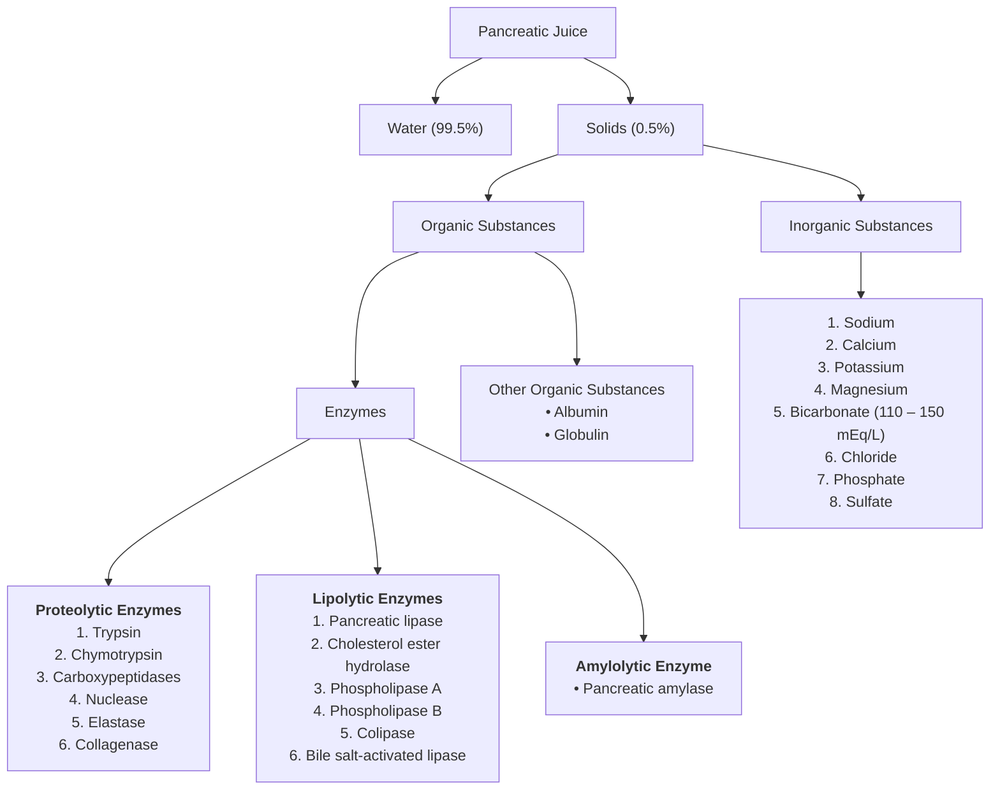
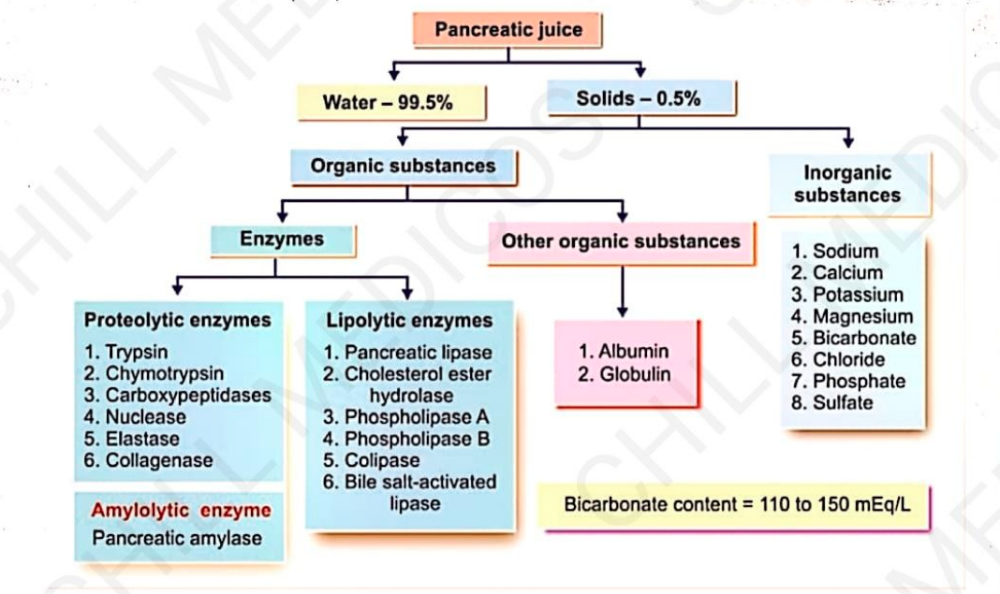

# COMPOSITION OF PANCREATIC JUICE

* **General Composition :—**
  * **Water :** 99.5%
  * **Solids :** 0.5% *(Organic and Inorganic substances)*

---

### STRUCTURAL BREAKDOWN

---

> 

## BICARBONATE CONTENT

* **Bicarbonate content is very high** in pancreatic juice:
* **In pancreatic juice :** $\approx 110 – 150\text{ mEq/L}$
* **In plasma :** $\approx 24\text{ mEq/L}$

* **High Bicarbonate Content is Important for 2 Reasons :—**
* a. **Makes the juice highly alkaline :** Protects the intestinal mucosa from acid chyme.
* b. **Provides optimal pH (7 – 9) :** Necessary for the activation and functioning of pancreatic enzymes.

