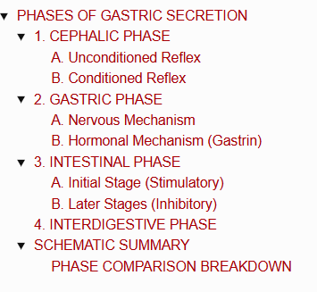
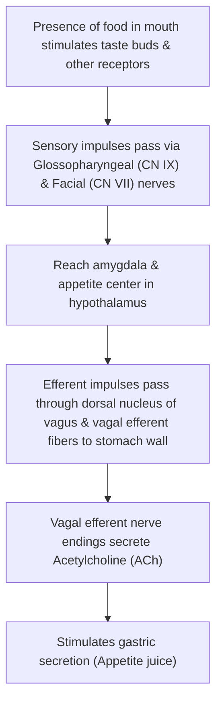
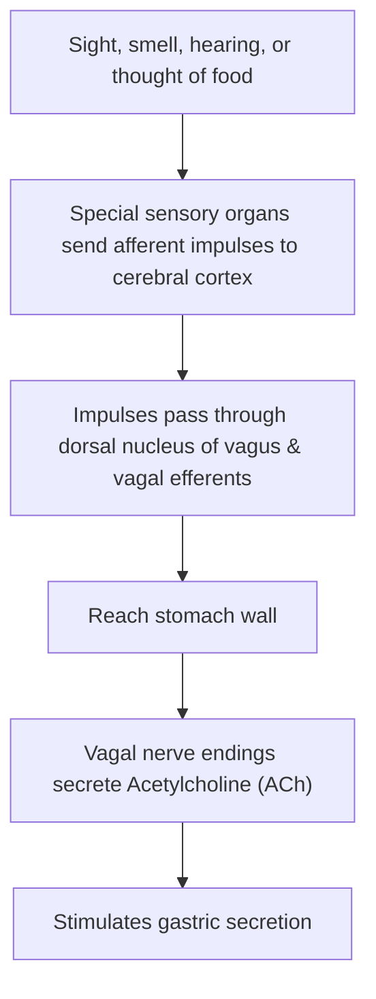
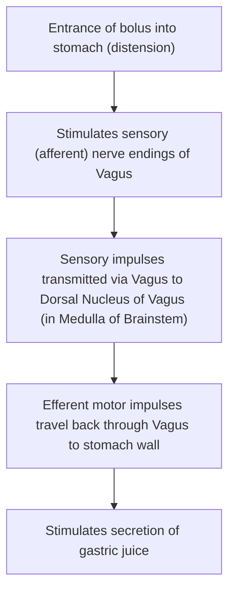
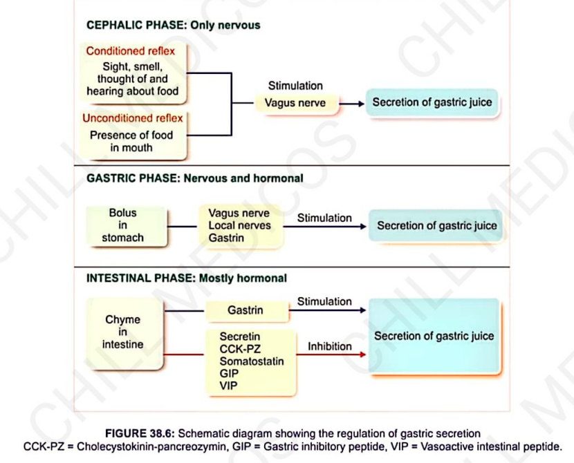
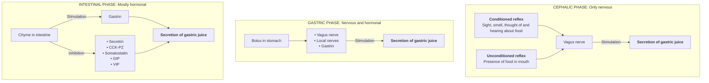

# PHASES OF GASTRIC SECRETION

> ### Headings
> 

* **Nature of Secretion :** Secretion of gastric juice is a continuous process.
* **4 Phases of Gastric Secretion :—**
  * a. **Cephalic phase** (Only nervous)
  * b. **Gastric phase** (Nervous and hormonal)
  * c. **Intestinal phase** (Mostly hormonal)
  * d. **Interdigestive phase** (In humans during fasting)

---

## 1. CEPHALIC PHASE

* **Definition :** Secretion of gastric juice elicited by stimuli arising from the head region (*cephalus*).
* **Regulation :** Purely regulated by **nervous mechanism** through reflex action.
* **Appetite Juice :** Gastric juice secreted during this phase is called **appetite juice** *(quantity is less, but rich in enzymes and $\text{HCl}$)*.

---

### A. Unconditioned Reflex
* **Mechanism :** Inborn reflex elicited by food in the oral cavity.

---

### B. Conditioned Reflex

* **Mechanism :** Acquired reflex from prior experience (sight, smell, hearing, or thought of food).

---

## 2. GASTRIC PHASE

* **Definition :** Secretion of gastric juice when food enters the stomach.
* **Regulation :** Regulated by both **nervous** and **hormonal** mechanisms.
* **Properties :** Secretes large volumes of gastric juice rich in **pepsinogen and $\text{HCl}$**.
* **Initiating Stimuli :—**
* a. Distension of stomach
* b. Mechanical stimulation of gastric mucosa (by bulk of food)
* c. Chemical stimulation of gastric mucosa (by food contents/peptides)

---

### A. Nervous Mechanism

* **1. Local Myenteric Reflex :—**
* Food particles stimulate the local myenteric (Auerbach's) nerve plexus in the stomach wall.
* Nerve fibers release **Acetylcholine (ACh)** $\longrightarrow$ stimulates gastric glands to secrete large volumes of juice.
* *Simultaneously*, acetylcholine stimulates **G-cells to secrete Gastrin**.

* **2. Vagovagal Reflex :—**

---

### B. Hormonal Mechanism (Gastrin)

* **Features of Gastrin :—**
* Polypeptide hormone secreted by **G-cells** in pyloric glands of stomach *(also in duodenum, jejunum, and fetal pancreatic islets)*.
* Exists in forms: $\text{G}_{14}$, $\text{G}_{17}$, and $\text{G}_{34}$ amino acids.

* **Release Mechanism :**

$$\text{Local nervous reflex / Vagovagal reflex}$$

$$\downarrow$$

$$\text{Vagal nerve endings release \textbf{Gastrin-Releasing Peptide (GRP)}}$$

$$\downarrow$$

$$\text{Stimulates G-cells to secrete \textbf{Gastrin} into circulation}$$

* **Action :** Stimulates parietal and chief cells to secrete **$\text{HCl}$ and pepsinogen**.

---

## 3. INTESTINAL PHASE

* **Definition :** Secretion of gastric juice when chyme enters the small intestine.
* **Pattern :** Initially, gastric secretion **increases**, but later it is **inhibited/stopped**.
* **Regulation :** Regulated by nervous and hormonal control.

---

### A. Initial Stage (Stimulatory)

$$\text{Chyme entering intestine} \longrightarrow \text{Stimulates duodenal mucosa to release Gastrin} \xrightarrow{\text{Blood}} \uparrow \text{Gastric secretion}$$

---

### B. Later Stages (Inhibitory)

* Gastric secretion is inhibited by **two mechanisms**:
* **1. Enterogastric Reflex :—**
  * Distension or chemical/osmotic irritation of intestinal mucosa by chyme.
  * Mediated by **myenteric plexus** and **vagus nerve** $\longrightarrow$ **inhibits gastric secretion & motility**.

* **2. Gastrointestinal Hormones (Inhibitory) :—**
  * a. **Gastric Inhibitory Peptide (GIP) :** Secreted in response to glucose & fats.
  * b. **Secretin :** Secreted in response to acid chyme.
  * c. **Cholecystokinin (CCK-PZ) :** Secreted in response to fats & amino acids.
  * d. **Vasoactive Intestinal Polypeptide (VIP) :** Secreted in response to acidic chyme.
  * e. **Peptide YY :** Secreted in response to fatty chyme.
  * f. **Somatostatin :** Secreted by pancreatic/intestinal D-cells $\longrightarrow$ strong inhibitor of gastric secretion.

---

## 4. INTERDIGESTIVE PHASE

* **Definition :** Secretion of gastric juice in between meals or during prolonged periods of fasting.
* **Regulation :** Mainly basal secretion controlled by low circulating basal levels of hormones like **Gastrin**.

> **Effect of Stimulants :—**
> **Alcohol and Caffeine** significantly $\uparrow$ increase gastric acid secretion by **directly stimulating the gastric mucosa**.

---

## SCHEMATIC SUMMARY

> 

---

### PHASE COMPARISON BREAKDOWN

> **Key Abbreviations :—**
> * **CCK-PZ :** Cholecystokinin-pancreozymin
> * **GIP :** Gastric inhibitory peptide
> * **VIP :** Vasoactive intestinal peptide
