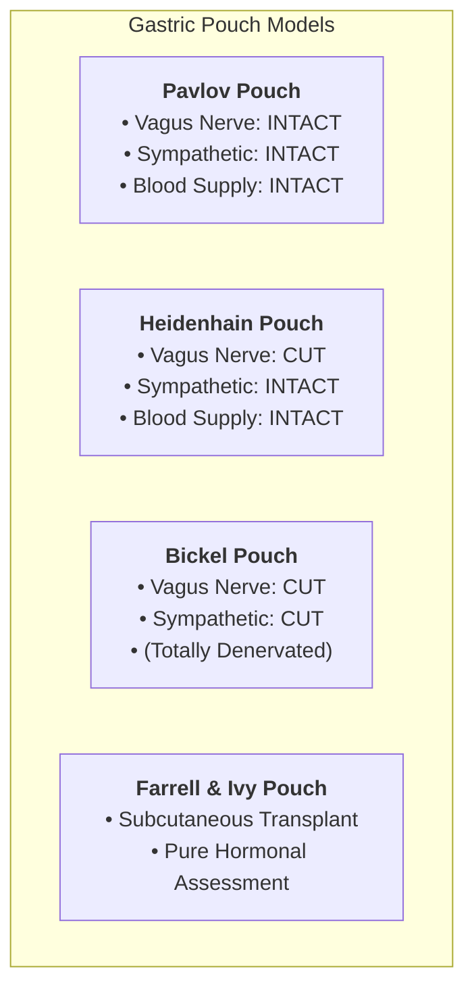
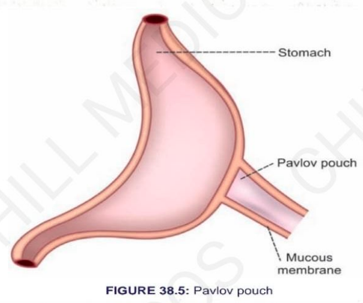

# REGULATION OF GASTRIC SECRETION (METHODS OF STUDY)

* Regulation of gastric secretion and intestinal secretion has been studied by various **experimental animal procedures**.

---

## EXPERIMENTAL METHODS OF STUDY

<table>
  <thead>
    <tr>
      <th align="left">Experimental Model</th>
      <th align="left">Preparation & Anatomy</th>
      <th align="left">Nerve & Vascular Supply</th>
      <th align="left">Experimental Uses</th>
    </tr>
  </thead>
  <tbody>
    <tr>
      <td><b>1. Pavlov Pouch</b></td>
      <td>
        • Designed by Russian scientist <b>Ivan Pavlov</b> (in a dog). 
        • A small bag-like pouch made from a part of the stomach. 
        • <b>Incompletely separated</b> from the main portion of the stomach. 
        • An <b>isthmus</b> connects the two parts (larger stomach and smaller pouch).
      </td>
      <td>
        • <b>Parasympathetic supply:</b> Intact (receives Vagus nerve fibers through the isthmus). 
        • <b>Sympathetic supply:</b> Intact (travels along blood vessels). 
        • <b>Blood supply:</b> Intact.
      </td>
      <td>
        • Used to demonstrate different phases of gastric secretion. 
        • Particularly useful in studying the <b>Cephalic Phase</b> to demonstrate the <b>role of the Vagus nerve</b> in gastric secretion.
      </td>
    </tr>
    <tr>
      <td><b>2. Heidenhain Pouch</b></td>
      <td>
        • Modified Pavlov pouch. 
        • <b>Completely separated</b> from the main portion of the stomach by cutting the isthmus without damaging blood vessels.
      </td>
      <td>
        • <b>Parasympathetic supply:</b> Absent (Vagal fibers severed). 
        • <b>Sympathetic supply:</b> Intact (remains through intact blood vessels). 
        • <b>Blood supply:</b> Intact.
      </td>
      <td>
        • Used to demonstrate the <b>role of sympathetic nerves</b>. 
        • Used to study the <b>hormonal regulation</b> of gastric secretion after <b>vagotomy</b> (cutting the vagus nerve).
      </td>
    </tr>
    <tr>
      <td><b>3. Bickel Pouch</b></td>
      <td>
        • Prepared by cutting sympathetic nerve fibers along with removing surrounding blood vessels. 
        • Results in a <b>totally denervated pouch</b>.
      </td>
      <td>
        • <b>Parasympathetic supply:</b> Absent. 
        • <b>Sympathetic supply:</b> Absent. 
        • <i>(Totally denervated)</i>.
      </td>
      <td>
        • Used to demonstrate the <b>pure role of hormones</b> in gastric secretion without any neural influence.
      </td>
    </tr>
    <tr>
      <td><b>4. Farrell and Ivy Pouch</b></td>
      <td>
        • Prepared by completely removing the Bickel pouch from the stomach. 
        • <b>Autotransplanted</b> into the subcutaneous tissue of the abdominal wall or thoracic wall in the same animal. 
        • New local blood vessels develop over time to supply the transplanted pouch.
      </td>
      <td>
        • <b>Nerve supply:</b> Completely absent (no neural connection to the gut). 
        • <b>Vascular supply:</b> Revascularized by new local blood vessels.
      </td>
      <td>
        • Used to study the <b>pure hormonal mechanisms</b> operating during the <b>Gastric and Intestinal phases</b> of gastric secretion.
      </td>
    </tr>
    <tr>
      <td><b>5. Sham Feeding</b></td>
      <td>
        • Experimental method involving <b>false feeding</b>. 
        • The esophagus is transected and the cut ends are brought out to the exterior of the neck. 
        • Food taken orally by the animal falls out through the upper esophageal fistula without reaching the stomach.
      </td>
      <td>• Intact neural pathways (Vagus nerve active during chewing/tasting).</td>
      <td>
        • Used to demonstrate the stimulation of gastric juice secretion during the <b>Cephalic Phase</b>. 
        • <i>Evidence:</i> After <b>vagotomy</b>, sham feeding fails to induce gastric secretion, confirming the critical role of the <b>Vagus nerve</b> in the cephalic phase.
      </td>
    </tr>
  </tbody>
</table>

---

### COMPARATIVE INNERVATION OVERVIEW

> 