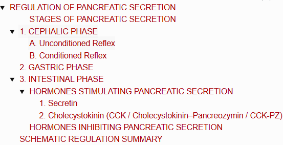
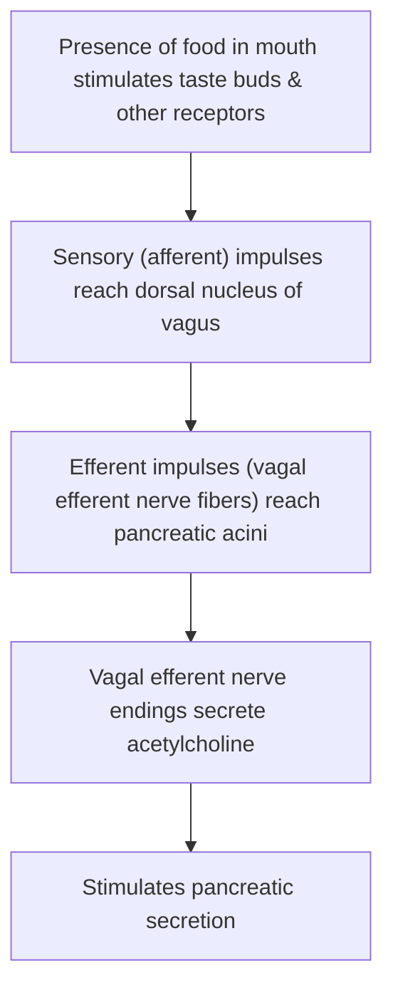
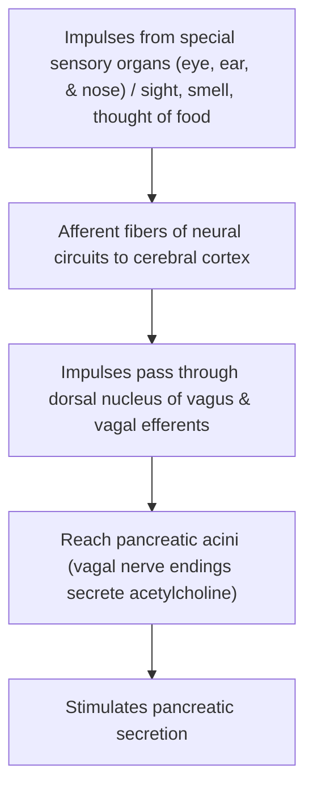
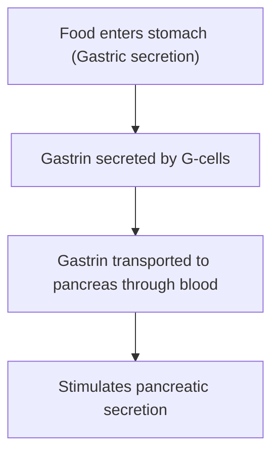
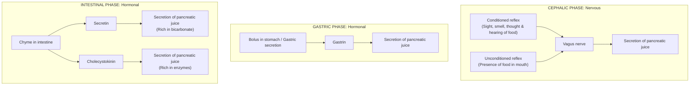
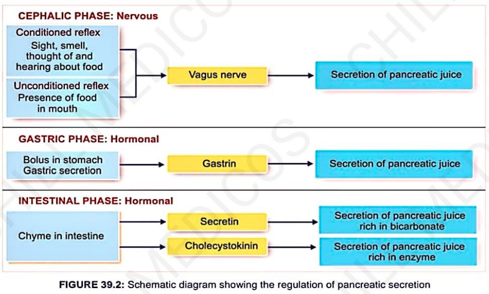

# REGULATION OF PANCREATIC SECRETION

> ### HEADINGS 
> 

* Secretion of pancreatic juice is regulated by both **nervous and hormonal factors**.

---

### STAGES OF PANCREATIC SECRETION

Occurs in **3 stages** *(corresponds with the 3 phases of gastric secretion)*:
* a. Cephalic phase
* b. Gastric phase
* c. Intestinal phase

---

## 1. CEPHALIC PHASE

* Regulated by **nervous mechanism through reflex action**.
* **2 Types :—**
  * a. Unconditioned reflex
  * b. Conditioned reflex

---

### A. Unconditioned Reflex

---

### B. Conditioned Reflex

---

## 2. GASTRIC PHASE

* **Secretion of pancreatic juice** when food enters the stomach.
* This phase is under **hormonal control (Gastrin)**.

---

## 3. INTESTINAL PHASE

* **Secretion of pancreatic juice** when chyme enters the intestine.
* This phase is also under **hormonal control**:
* Some hormones **stimulate** pancreatic secretion.
* Some hormones **inhibit** pancreatic secretion.

---

### HORMONES STIMULATING PANCREATIC SECRETION

* a. **Secretin**
* b. **Cholecystokinin (CCK / CCK-PZ)**

---

#### 1. Secretin

* **Production :** Produced by **S-cells** of mucous membrane in duodenum & jejunum.

$$\text{Inactive Prosecretin} \xrightarrow{\text{Acid chyme (HCl)}} \text{Secretin}$$

* **Actions of Secretin :—**
* a. Stimulates secretion of **watery juice** *(rich in bicarbonate ions and high in volume)*.
* b. Increases pancreatic secretion by acting on **pancreatic ductules** via **cyclic AMP (cAMP)** as second messenger.

---

#### 2. Cholecystokinin (CCK / Cholecystokinin–Pancreozymin / CCK-PZ)

* **Production :** Secreted by **I-cells** in duodenal & jejunal mucosa.
* **Stimulant for Release :** Chyme containing digestive products such as **fatty acids (FA), peptides, and amino acids (AA)**.
* **Actions of Cholecystokinin :—**
* a. Stimulates secretion of **pancreatic juice** *(rich in enzymes and very low in volume)*.
* b. Acts on **pancreatic acinar cells** via **Inositol Triphosphate ($\text{IP}_3$)** as second messenger.

---

### HORMONES INHIBITING PANCREATIC SECRETION

* a. **Pancreatic Polypeptide (PP) :—** Secreted by PP cells in islets of Langerhans of pancreas.
* b. **Somatostatin :—** Secreted by D-cells in islets of Langerhans of pancreas.
* c. **Peptide YY :—** Secreted by intestinal mucosa.
* d. **Other Peptides :—** Such as ghrelin & leptin.

---

## SCHEMATIC REGULATION SUMMARY

> 