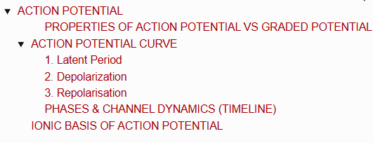
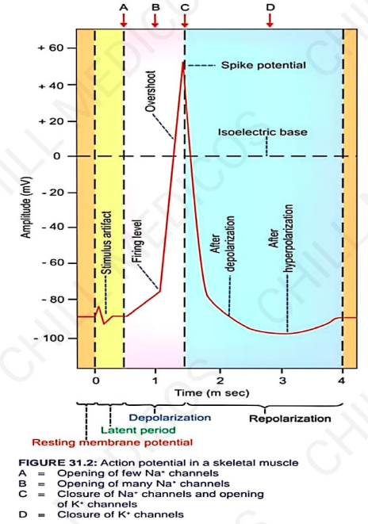
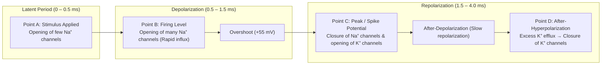
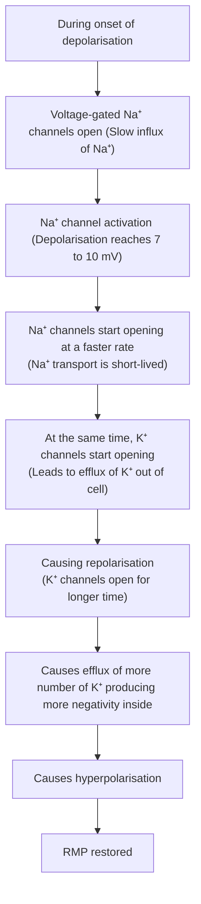

# ACTION POTENTIAL

> ### Headings
> 

* **Definition :** A series of electrical changes that occur in membrane potential when muscle / nerve is stimulated.
* **Action potential occurs in 2 phases :—**
  * a. **Depolarisation :** Initial phase of action potential in which inside becomes positive & outside becomes negative. Polarized state (RMP) is abolished, resulting in depolarisation.
  * b. **Repolarisation :** Phase of action potential which reverses back to RMP (inside becomes negative & outside becomes positive). Polarised state is re-established.

---

### PROPERTIES OF ACTION POTENTIAL VS GRADED POTENTIAL

| Action Potential | Graded Potential |
| :--- | :--- |
| • Propagative | • Non-propagative |
| • Long-distance signal | • Short-distance signal |
| • Both depolarization and repolarization | • Only depolarization or hyperpolarization |
| • Obeys all-or-none law | • Does not obey all-or-none law |
| • Summation is not possible | • Summation is possible |
| • Has refractory period | • No refractory period |

---

## ACTION POTENTIAL CURVE

* **Definition :** Graphical registration of electrical activity that occurs in an excitable tissue (muscle after excitation / stimulation).
* **3 Major Parts :—**
  * a. Latent period
  * b. Depolarisation
  * c. Repolarisation

---

### 1. Latent Period
* Period when no change occurs in electrical potential immediately after applying stimulus.
* **Duration :** 0.5 – 1 msec.

> **Stimulus Artifact :—**  
> When stimulus applied $\longrightarrow$ slight irregular deflection of baseline for very short period $\longrightarrow$ because of disturbance in muscle due to leakage of current from stimulating electrode to recording electrode.

---

### 2. Depolarization
* Muscle depolarized for about 15 mV (up to -75 mV).
* **Firing Level :** After initial slow depolarisation for 15 mV $\longrightarrow$ rate of depolarisation increases suddenly $\longrightarrow$ point at which depolarisation rate increases is the **firing level**.
* **Overshoot :** From firing level $\longrightarrow$ curve reaches isoelectric potential (0 potential) $\longrightarrow$ then shoots up (overshoots) beyond 0 potential up to **+55 mV**.

---

### 3. Repolarisation
* Initially, repolarization occurs rapidly and then becomes slow.

* **Spike Potential :** Rapid rise in depolarisation & rapid fall in repolarisation taken together.
  * **Duration :** 0.4 msec.
* **After-Depolarisation / Negative After-Potential :** Rapid fall in repolarisation followed by a slow repolarisation.
  * **Duration :** 2 – 4 msec.
* **After-Hyperpolarisation / Positive After-Potential :** After reaching resting level (-90 mV) $\longrightarrow$ becomes more negative beyond resting level $\longrightarrow$ after this, RMP is restored.
  * **Duration :** 50 msec.

> 

---

### PHASES & CHANNEL DYNAMICS (TIMELINE)

---

## IONIC BASIS OF ACTION POTENTIAL

